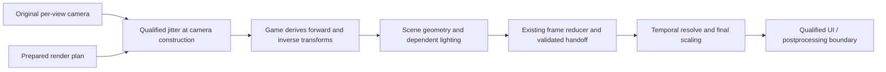

# Flat temporal AA through upstream camera construction

## Status

- **Retired 2026-09-29 (0fe90f09):** `camera_view.cpp/.h`, cited below as
  the external-camera reader and settings probe, are deleted (`0fe90f09^`).
- State 2026-09-29 (main c56e34df, FLOWN 14:58 on Epic, shimmer fixed): the
  camera path is on whenever a temporal mode is selected on the flat profile.
  `fix.temporal_aa_camera` and `fix.temporal_aa_camera_trace` are REMOVED
  (contract 239 -> 237); the per-call trace path is gone, the stand-down
  latches stay, and the draw-time row adapter is only the automatic fallback
  (no injectable camera, a prologue mismatch, 8 failed writes in a 5 s
  window). With Anti-aliasing off none of it runs and no `flat camera inject`
  line is written. The injector itself FLEW clean 2026-09-29 11:35 on Epic
  (main 856e72c2): 0 row-pair mismatches in 35,127 resolves, history valid in
  79 of 92 ticks, legacy never applied. The view/execution lineage is not joined.
- Krait main-menu shimmer, DIAGNOSED 2026-09-29 (last section): the dashed
  hull lines are the stale-slot rule refusing 22.5% of the frame, because the
  hull plating's pixel shader 66DE2CAD/235567BE is not keyed and overdraws
  keyed draws' engine slots. Built here, none flown: 1A keys that pair for
  flat; 1B, in the 3D main menu only, a stale slot takes the camera term
  (`static-scene-frames=K` on the menu HDR copy line; Sean accepted its risk);
  1C a census of unkeyed pairs; F2 the replay unjitters rows; F3 no reset
  frame is an F10 sample. Still unkeyed, for later: CAD1F585 (EDHM-patched),
  BBE58E40/7311054A (SV_Position input).
- ruled out: an unjittered hull draw as the cause, because the three traced
  frames' scene rows carry the log's phase to 1e-7 and all 340 camera-bearing
  scene draws of frame 67592 bind them, the hull pairs are b1-only, and the one
  other camera serves 9 UI/output draws, none a ship's.
- ruled out: wrong or zero ship motion at the menu, because the emitted motion
  is 0.016 px median and 0.028 px at most, the replay matches it to 6e-4 px,
  and the camera term is valid at 1822 of 1822 sampled stale pixels
  (0.013 px); the hangar has no turntable.
- ruled out: a shader fault behind the replay's 0.609 px "error", because it
  equals |current phase - previous phase| and is 1e-4 px once the rows are
  unjittered: a tool defect (F2).
- ruled out: sub-pixel content as the cause of the dashes, because the same
  seams are continuous lines in DLSS's raw output and dashes in the final
  image, which equals raw on accepted pixels (110 of 6.4M differ).
- corrected: the eight `off -> upstream` switches in that session's log were
  not ships: session start, one resize and six F8 AA toggles. The log holds
  two menu visits (Cobra Mk V, Krait Mk II); the carrier swap view between
  them is not the menu contract.
- Decision: jitter the game's per-view camera construction before it derives
  raster/lighting data; preserve frame discovery, size negotiation, temporal
  backends and resource isolation. The 09-28 zero-renderer-calls log that
  motivated it, the five crashes (root cause: the stubs' missing 32-byte
  shadow space, fixed, flown clean) and what was ruled out: Status detail.
- Next: flown and passed (flight 145851 entry at the end): Sean "shimmer
  fixed"; static-scene-frames 2,480 of 2,481 accepted menu frames; the
  unkeyed census empty in all 60 ticks; row-pair mismatches 0. Open:
  main-versus-auxiliary camera grouping; c2_coexist C7's unbounded loop
  (a mutation hangs the rig instead of failing it).
- Environment: Windows x64, D3D11 flat mono; headset/runtime N/A. VR
  comparison: EDVR's OpenVR/OpenXR route. Record GPU/driver, executable and
  build identities, backend versions, dimensions, formats and mod chain.
- Extends the [flat AA design](design-flat-temporal-aa-2026-09-23.md) and
  [architecture review](review-flat-temporal-aa-2026-09-26.md); the camera
  milestones below supplement, rather than renumber, their gates.

## Status detail (moved out of Status 2026-09-29)

- corrected (evidence): 085700.log, 08:59:01 / 08:59:06 / 08:59:11: `flat
  jitter: ... phase=(-0.125,-0.27778) ... state=live history-valid=1` (and
  (0,-0.16667), (-0.25,0.16667)); `flat runtime: last=treated-jittered ...
  accepted-history-5s=320` (419, 425); the same seconds' `flat camera inject
  5s: ... owner=upstream history=invalid`. The tick's history= mirrored an
  ownership close nobody called; the gaps were G1-G4 (wiring addendum).
- ruled out (evidence): the jittered bound pair breaking the ownership
  classifier's exact encoding (this doc's out[0][2] = 2*dbx*s8), because the
  bound pair enters only slots [i][0] and [i][1] and c2_derive_test A8 finds
  [i][2], the depth row and rows 273/274 bit-identical over 16 phases at 3
  sizes.

- The 09-28 motivation and its ruled-out line, moved out of Status 2026-09-29, text unchanged:
  - Motivation: the build-verified 20260928_025912 user log reports zero
    renderer calls; three recurring unknown projection pairs keep every frame
    in observation. Sean reproduced non-activation with another ship.
  - Ruled out for that session: a backend evaluation failure as the immediate
    cause, because no backend initialized. Missing shader coverage is proven;
    whether quality settings or a mod produced those variants is not.

- The five crash bullets, moved out of Status 2026-09-29, text unchanged:
  - Ruled out (the five C3 crashes, 2026-09-28): a compiled C detour at the
    mid-function hook site; the relay enters by jmp with the game's live
    stack, so a C prologue's spills land on its saved registers. The transfer
    is generated code (stubA, a return-address redirection to stubB, TLS
    state); see the header of src/d3d11/flat_camera_inject.cpp.
  - Root cause of the 20:09, 03:50 and 04:23 crashes (shadow-space addendum):
    the stubs called C with no 32-byte ABI home area reserved, so refreshPre
    homed rcx and rdx on stubA's saved r15 and r14 and the pops handed the
    game r15 = R0 (all three dumps: rdx = r14 = r15 = R0, read +0x4C83379).
  - ruled out: the relay's scratch register (r11 vs rax) as the 20:09/03:50/
    04:23 crash cause, because the r11-preserving relay (905bddd0) crashed
    identically; the cause is stubA's missing shadow space.
  - ruled out: call-path log I/O as the crash cause, because the 03:50 flight
    with per-call logging gated off crashed identically.
  - Corrected and fixed (flown clean): the pass-through was not "memory-
    identical to unhooked"; the property is every register and stack byte at
    and above S unchanged at the trampoline (tools/flat_camera_stub_test gates
    it). Both stubs now reserve the home area (flat_camera_stubs.h).

## 1. Problem and acceptance requirements

VR supplies Elite's eye projection through a runtime interface. EDVR applies
jitter there and Elite derives rendering data from that camera. See
`native_temporal.cpp`'s tangent-shift publication and
`openxr/openvr_system.cpp::GetProjectionMatrix/GetProjectionRaw`.

Flat's current adapter instead discovers a scene through D3D11 observations and
patches private constant buffers at draw/dispatch boundaries. It must recognize
each relevant projection consumer. At `418e5231`, unknown recipes call
`refuseDraw`; observation ends only after a completely covered frame. One
unfamiliar pair every frame therefore prevents all temporal treatment.

The user log shows 704/704 frames refused, `calls=0 init=0` and `partial=on
observing=1`. Retrieve its already-saved six stage bytecode files and
`flat_trace_13562.bin`, omitted by the support ZIP, before another flight.
Captures must not become a permanent requirement to authorize each ship.

The replacement must satisfy:

1. Support device/backend resolutions, including odd extents, crops and
   supersampling, using actual dimensions without hidden quality reduction.
2. Reconfigure and resume after supported quality/size changes without a
   restart. Indefinite warming is a failed qualification.
3. Support compatible EDHM/ReShade chains; name incompatible contracts.
4. Admit ships/materials through camera lineage, without per-ship allowlists.
5. Preserve disabled behavior and VR scheduling. Object-motion coverage is
   separate: camera-only motion may limit quality while valid AA continues.

This change does not automatically solve scene/depth discovery, DoF/HDR
handoffs, UI composition or moving-object motion. Those contracts remain.

## 2. Target boundary and ownership

Proposed flow; the upstream producer box is not yet located:

Prefer a per-view finalization boundary before projection-dependent matrices,
view rays and screen-to-world constants are derived. Change raster projection,
not world pose or simulation. Preserve the original camera and let the game
produce coherent derivatives from the modified input.

There must be one jitter owner for each scene phase group. A group contains all
passes sharing the scene's sampling grid/depth: it may include a main camera
plus cockpit or weapon cameras with different near planes. They must receive
compatible pixel offsets, not necessarily identical matrices.

Shadow, reflection, cube-map and UI cameras are not main-camera candidates
merely because their matrices or constant-buffer addresses look similar. Leave
independent domains unchanged. A secondary camera that contributes to the
shared scene must be explicitly related to its phase group or block that group.
Composite-only UI can remain outside it at a validated boundary.

Keep CPU visibility/culling stable and conservative over the jitter envelope.
If the candidate also builds culling data, prove how stable/conservative
culling coexists with jittered raster data; do not accept phase-dependent
visibility popping as AA. Preserve reversed-Z, depth range, FOV, asymmetric
frusta, viewport/crop and matrix storage conventions.

Unknown material hashes cease to be an admission barrier only for work whose
camera derivation is covered by this contract. A different shader hash is not
itself a violation; a new camera source or rewritten projection is.

## 3. Find the producer without assuming one exists

Existing anchors identify consumers, not a canonical constructor:

- `flat_temporal_model.h` observes scene b1[270..275]; `flat_runtime.cpp` and
  `vscreen.cpp` observe CPU writes before Unmap.
- `flat_camera_probe.h` samples an exact-pair conflict; `camera_view.h` reads
  external-camera mode. Neither provides an upstream projection API.
- Kinematic records are object poses. [Camera-row carry
  evidence](camera-rows-carry-2026-09-25.md) shows why latest/plausible rows
  cannot distinguish auxiliary views. The VR row layout is not a flat camera
  ABI.

Walk measured upload callers backward to their source objects and derivation
order. Compare these hypotheses in the same investigation:

| Candidate | Evidence required | Disqualifying result |
| --- | --- | --- |
| Per-view camera finalizer | Stable view identity; proposed mutation point precedes all relevant derived reads/writes | Some derivatives escape that point, or identity is ambiguous |
| Scene-constant packer | Proves every dependent product is built/rebuilt here | Merely copies already-derived matrices; other packs escape |
| Render-context/view-table builder | Joins camera domain and generation to subsequent scene traversal/uploads | It identifies only culling/auxiliary views or runs after consumers |

Record executable fingerprint, caller locations, source object/generation,
matrix values, destination range/write epoch, thread/context, view/pass and
downstream lineage. Frequency alone cannot select a producer. Do not invent
RVAs, calling conventions or a global camera pointer.

Before patching, validate the unique locator, instruction boundaries, ABI,
forwarding and lifetime against the executable and structural/callsite/store
checks. Unknown builds, ambiguous matches and conflicting patches disable the
integration. Reuse the existing hook mechanisms after this proof.

## 4. Passive evidence and bounded probes

First replay existing data and inspect exact bytecode. Then instrument all
plausible causes together. Sample still view, a deliberate pan, main/secondary
camera transitions and one scale change in a single prepared session.

Join producer entry/mutation/return, derived writes/uploads, bindings,
scene/depth writes and handoff by view, generation and execution order. Pointer
equality or Present alone is insufficient. Distinguish command-list recording
from replay, including repeated execution.

Initial capture limits: 240 metadata/small-matrix frames per segment, two
full-payload frames, four segments, 4,096 events/frame and 64 MiB total. These
are diagnostic budgets, not lifetime admission limits. Log caps, drops and
incomplete joins; overflow invalidates proof. Adjust from measured counts.

Discriminators: shared upstream sources support a common finalizer; derivatives
preceding the proposed mutation point refute that point; auxiliary views refute
a global-camera model; record/replay mismatches refute immediate-only lifetime.
Derivation inside the original constructor is valid when injection precedes it,
for example at its entry.

Emit armed/hook-hit/producer/join/overflow/completion counts, including zero.
Persist replayable evidence; include referenced trace/shaders and truncation
reasons in the support bundle. A silent hook is not a successful probe.

## 5. Proposed camera contract and early preparation

The existing `FlatFrameContract` is produced at output-copy time. It cannot
authorize an earlier camera mutation. Add a separate immutable early plan and
compare it with the completed frame contract; do not create a second scene
selector. The following are proposed records, not current APIs:

| Record | Required contents |
| --- | --- |
| Early render plan | Game/hook/device generations; view and phase-group identity; input/output resource generations and descriptors; R/E/D extents; crop/viewport mappings; backend/model; prepared-resource lease; expected derivation epoch |
| Camera application | Original camera snapshot; actual jitter in render pixels; derived-producer identities; view/recording/execution epochs; one-shot application result; reason on decline |
| Frame closure | Join to actual color/depth/handoff; all relevant camera derivations accounted for; actual sizes and phase; temporal accepted or recovery result; history commit/reset reason |

R is scene rendering, E backend evaluation, D display output. Convert jitter
using R and the viewport, never D/E. Preserve current negotiation: trained
backends normally use E=D for upscaling and E=R for supersampling, followed by
final scaling to D, subject to backend limits. Current TAA evaluates and stores
history at D; render-grid TAA is a separate deferred change. Include negotiated
E, formats, subresources and mappings in resource/history identity.

Bootstrap from zero-jitter observation and the reducer's scene/depth/handoff
selection, even while legacy shader coverage refuses. Upstream admission needs
separately counted producer/derivation proof; legacy refusal must not reset its
warm-up or history. Existing source selection also uses pool-family and
camera-row assumptions: extend it to proven producer/target association where
needed, never bypass scene selection wholesale.

On the render owner, prepare for the next eligible construction. Revalidate
identity, generations, sizes and readiness before mutation. A previous frame is
a prediction, not authority. Changed/unprepared plans remain stock.

Worker hooks must not call D3D, initialize backends or wait on GPUs. Publish
owned immutable records through a bounded thread-safe channel; overflow is a
named refusal. Never retain mapped/stack pointers. Preserve nested caller
attribution; quiesce in-flight users before reclamation without lock deadlock.

Apply jitter to an original/private camera copy with proven consumer lifetime.
Repeated construction uses the same phase without accumulating offsets.
Deferred consumers retain their generation through execution. Separate applied
phase from accepted history; failures cannot replay old evidence as fresh.

Publish both original and rendered camera records. Feed certified unjittered
rows to `FlatMonoResolveFrame.camera/previousCamera` and original scene
snapshots to engine motion's `sceneNow/scenePrev`, with actual raster jitter
carried separately. Upstream-modified uploads cannot silently become those raw
inputs. Prove provenance rather than guessing de-jitter transforms for unknown
layouts. Test normal, disabled, failed and history-reset paths for double
correction and preservation of raw motion inputs.

## 6. Transaction, transitions and recovery

Normal states are Observing -> Prepared -> Active. A violated contract moves to
Recovery and subsequent zero-jitter observation. Each state has a reason,
current generations and counters; stable supported scenes must progress.

Before first consumption, failure means no camera mutation. After camera data
is consumed, do not switch phase, turn on legacy per-draw patches or pretend
restoring a CPU matrix undoes drawn geometry.

At handoff compare resources, derivation identity, sizes and phase with the
plan. Only matching closure authorizes temporal history. Reject camera cuts,
missing/late writers, overrides and replay mismatches.

`flatMonoResolvePreflight` proves renderer/fallback resources and backend
availability, not size-specific vendor feature creation. Late backend failure
can use preallocated spatial recovery only for *proven coherent* jitter and
valid inputs, leaving history invalid. Unknown/mixed phase instead declines
EDVR replacement, invalidates history and stops subsequent jitter; acknowledge
the possible one-frame artifact. Device/allocation failure may prevent
recovery. No re-render or perfect rollback of mixed pixels is assumed.

Quality/ship/camera/size/fullscreen/device/backend/model changes invalidate
affected generations. Reprepare, reseed and release retired resources after
outstanding users finish. Prohibit ever-growing maps and steady allocations.
Exhaustion is a named unavailable state, not an endless per-draw retry.

## 7. Existing adapter and mod compatibility

Retain reducer, depth/color provenance, negotiation, motion, retirement and
state restoration. Version replay's new producer evidence; old traces cannot
certify an upstream hook they never recorded.

First run both observers without upstream writes. At activation select one
injector per group: legacy patches OR upstream construction. Suppress legacy
projection mutation under upstream ownership; retain observations and motion.
Switch only after outstanding work closes and history resets. Keep the legacy
route for environments it qualifies; never switch injectors mid-frame.

EDHM color/material variants consuming certified camera data should need no new
hashes. Camera/inverse/depth/composition changes require explicit contracts.
Detect post-construction writers by changed derivation/resource lineage.

For ReShade, verify loader/hook and AA/UI/effect order; preserve forwarding and
D3D state. Test each mod alone and together. Depth/projection replacement or
another temporal reconstruction may need integration or remain unsupported.

Keep user-facing AA settings unchanged. Report selected versus effective
treatment and a useful blocked reason instead of perpetual "warming". No
feature/config removal or rename is authorized by this design.

## 8. Delivery milestones and stop conditions

| Milestone | Required evidence before proceeding |
| --- | --- |
| C0: baseline | Reproduce logged classifier refusals; obtain saved bytes/trace; enumerate domains and candidate callers; no mutation |
| C1: producer discovery | Passive trace identifies domain/lifetime/ABI and proves ordering for all relevant derivatives; a counterexample rejects that boundary |
| C2: offline implementation proof | Pure event/reducer tests plus WARP geometry/lighting tests validate matrices, ownership, generations and recovery; existing suites remain green |
| C3: controlled activation | Full validation build; one bounded game session verifies actual producer -> derived data -> scene/depth -> accepted history with no duplicate jitter or uncovered domain |
| C4: qualification and promotion | Different ships/cameras, supported quality/size/backend changes and mod combinations work without new admission hashes; bounded resources and measured overhead; VR regression checks pass |

If no complete upstream boundary exists, publish the missing dependencies and
retain the existing adapter. A packer hook is acceptable only if it satisfies
the same complete-derivation proof, not as an undocumented partial substitute.

Desktop tests: forward/inverse/depth/ray consistency; raw motion preservation;
storage/reversed-Z/asymmetric projection; R/E/D routes and crops/odd sizes;
interleaved views; nested/worker calls; partial uploads; pointer reuse;
delayed/repeated replay; mid-job disable; late writers; duplicate jitter;
post-application backend failure; unrepairable mixed phase.

Live matrix: working/failing ships and distinct cockpits/canopies; on-foot/
weapon views; camera/menu/docking/flight transitions; presets/effects;
below/native/above-1.0 SS; resize and mod chains. Ship/camera-family diversity
is regression coverage, not a production allowlist or proof of arbitrary mods.

Counters: producer/derivation epochs, injector, applied jitter, closure,
treatment/history streaks and reset reasons. No persistent observation, mixed
phase, stale generation or hidden steady fallback. Compare CPU/GPU cost with
the existing adapter at the same scene/size. Steady state allocates nothing,
does no blocking readbacks/captures; resolve regressions before promotion.

## C2 test plan addendum, 2026-09-28: reducer, WARP and coexistence

C2 is an offline gate: no game session is required or sufficient. Every
test names its discriminating signature and its stop condition up front,
because a failed proof here retains the existing adapter unchanged.
Revised per the C2-plan review: the field schema is the camera-relative
typed table in the cache-helper addendum; the ray basis is modeled from
its resolved typed writer; phase, rollback, ownership, lighting and the
size matrix follow the production policies they must eventually exercise.

### C2-A: the derive reducer (pure event/matrix rig)

A new rig under `tools/` reimplements ONLY the semantics read out of the
decompiles -- the projection builder (FUN_1404f2ff0, all five kind
branches: 1 ortho, 3 trigonometric, 4/5 custom-matrix from +0x2D0..+0x30C,
default), the view/VP/ray finalizers (FUN_1404f4910 / FUN_1404f49f0 /
FUN_1404f3770) and the composers (FUN_140596830, FUN_1405964c0) -- each
reduction cited to its decompile file and line. A divergence between rig
and decompile is a rig bug, never papered over with a fudge factor.

| Test | Signature that passes | Stop condition |
| --- | --- | --- |
| A1 exactly-once | Jitter at the frustum params; derive twice through the protocol; both VP products identical, and the resulting raster-pixel shift (after the final projection, per kind branch) equals the phase -- raw matrix coefficients are NOT assumed to survive unscaled through every branch | Any double-scaled, missing, or branch-dependent-untracked term |
| A2 bit protocol (negative control) | Mutate without raising bits: downstream reads stay STALE, matching the decompile's guard behaviour. With bits raised, the CORRESPONDING blocks re-derive: cached matrices (projection, VP) via 4/8; directly-read parameters are never cached at all; the +0x870/+0x8B0 snapshots are modeled as independently supplied state (FUN_1406be790's semantics), and a stale-snapshot input is a required negative case. Masks 4, 8, C and D are exercised through the observed call sequence | Re-derivation without the bits; staleness with them; a block claimed to re-derive that the sequence never touches |
| A3 canonical mutation form | Frustum-param mutation and direct projection-matrix mutation produce identical VP within float tolerance across kinds 1, 3 and the default branch; kinds 4/5 (custom-matrix) are either proven equal or explicitly REFUSED by name before mutation | A divergent branch left unnamed, or mutation allowed against an unproven kind |
| A4 override composition | The ACTUAL setter sequence is modeled: per-item pokes to +0x25C (compound-near) and +0x280 (angular) applied after jitter, then the section refresh; the composed projection carries the override and the jitter term survives in raster-pixel shift | Jitter scaled, lost, or applied to the pre-override values; a test that only pokes near/far (which the real setters do not do) |
| A5 phase, generation and replay (five cases, replacing source-generation keying) | 1) Repeat derivation within one phase-group execution: same phase, no accumulated offset. 2) New eligible execution with unchanged source bytes (a stationary camera): the sampling sequence CAN advance. 3) Per-item source revision within that execution: affected derivatives rebuild, the group's pixel phase is preserved. 4) Pointer reuse or resource/hook generation change: stale ownership/history rejected even with numerically identical matrices. 5) Deferred recording/replay: recorded phase and identity retained; late/repeated execution cannot masquerade as a fresh derivation or history sample; incompatible reuse is refused by name | Any case answered by wall-frame index or by source-byte freshness alone |
| A6 failure and disable, split at the consumption boundary | Before any consumer: no camera mutation may reach rendering (clean refusal). After mutation but before consumption: abandon without publishing. After the first consumer: retain the committed phase for the frame's remaining work, forbid legacy takeover, invalidate temporal history, and stop subsequent jitter -- no perfect-rollback claim. Covered at: before preparation, after mutation before consumption, after the first consumer, at backend evaluation, and at handoff | Any mixed-phase frame; any "rollback" that changes already-consumed pixels; legacy path taking over a failed upstream frame |

### C2-B: WARP geometry and lighting harness

A minimal user-mode D3D11 renderer (WARP device, no game, no EDVR) draws
known geometry through shaders consuming a 336-row scene CB with camera
rows 270..275 plus the frustum-ray and depth blocks in the refresh's own
layout. The derive math runs on CPU per the reducer. Conventions are
stated up front: pixel-center, depth and matrix conventions, and every
tolerance.

| Test | Signature that passes | Stop condition |
| --- | --- | --- |
| W1 raster shift across the size matrix | Centroid shift of a known grid equals the phase in ACTUAL R pixels, at 0.5x, 1.0x, 1.5x and 2.0x, including odd dimensions, asymmetric viewport/crop, and independent R/E/D changes. Supersampled paths (DLSS/DLAA/FSR evaluating at E=R and scaling to D) and TAA (evaluating at D) each follow their negotiated agreement: one final scaling to D, no hidden quality reduction | A size-dependent shift; a path evaluated at the wrong extent; two scalings |
| W2 forward/inverse/ray | Per-pixel unproject through the frustum-ray path and reproject through VP round-trips within stated tolerance, jitter on and off, including the stale-snapshot negative case (a view-stale +0x870 must be detected, not absorbed) | VP and ray path disagree anywhere; stale basis passing as fresh |
| W3 lighting at corresponding surface points | Position, normal, view direction and shading compared at CORRESPONDING surface points with explicit tolerances and separate coverage checks (silhouettes legitimately move under jitter); spatially varying lighting, a specular highlight and nonzero translation expose stale rays; authoritative pose/light inputs preserved | Shading divergence beyond tolerance at corresponding points; the scene engineered uniform enough to hide stale reconstruction |
| W4 reversed-Z / asymmetric | W1 and W2 repeated under reversed depth and an asymmetric (projection-adjust) frustum | Any failure specific to either convention |
| W5 motion preservation | Two-frame synthetic pan: the camera-only term from VP_prev^-1 x VP_curr equals the pan after the backend's own jitter accounting; per-pixel motion matches analytic reprojection | Motion term polluted by jitter in the backend's own convention |
| W6 reconfiguration between preparation and consumption | Size, target generation, backend/model or a projection-affecting quality change lands between preparation and handoff: the stale plan is refused by name, no stale history is accepted, resources retire after outstanding users, and resumption on the stable supported replacement is bounded | Any accepted stale plan/history; unbounded re-warming |

### C2-C: coexistence, ownership and closure with the legacy path

These tests exercise the PRODUCTION selector, ownership, phase and
closure logic with the game-camera model as input -- not an abstract XOR
of booleans, and not the legacy adapter's admitted subset as the
universe of frames.

| Test | Signature that passes | Stop condition |
| --- | --- | --- |
| C1 single owner | A known legacy pair eligible for both routes gets exactly one selected owner before mutation; legacy graphics AND compute mutations are suppressed under upstream ownership (both paths' scope mutation is covered) | Any frame mutated by both, or ownership assigned after mutation |
| C2 unknown shaders cannot veto certified lineage | A certified upstream lineage with an unknown or color-only shader variant reaches accepted history WITHOUT legacy admission hashes; legacy observation continues, its refusal does not veto upstream work | The old shader allowlist remaining the effective gate |
| C3 named safe outcomes | A true late projection rewrite or an uncovered secondary camera invalidates closure/history and produces a NAMED safe outcome (observing, unprepared, unsupported, recovery) -- all valid states, but a stable supported scene must make bounded progress out of them | Silence, or a stable scene parked in observation |
| C4 interleaved views | Interleaved main/cockpit/auxiliary views and near-plane variants retain group-level ownership; frame-wide counts cannot hide one path jittering a different view | A count that sums over views with mixed ownership |
| C5 ownership switch | Switching ownership waits for outstanding work, resets history, and preserves original camera inputs for motion reconstruction | A switch that strands in-flight work or poisons the motion inputs |
| C6 steady-state cost | CPU/GPU cost of the injector vs the adapter at equal scene/size, measured offline; steady state allocates nothing, performs no blocking readback. (Equal-scene GAME cost is C3/C4, not claimed here) | A regression the counters cannot explain |

### What C2 does not decide

Live activation, live hook cadence, mod loader order, game performance,
per-shader consumption in the real scene, per-ship coverage and
mod-chain qualification remain C3 (one bounded session: producer ->
derived data -> scene/depth -> accepted history, no duplicate jitter, no
uncovered domain) and C4 (qualification matrix). The injector's config
surface is designed here but defaults off; live mutation stays disabled
until these gates pass; no feature removal or rename is authorized.

## C3 wiring plan addendum, 2026-09-28: the injector's integration

Everything below is design against the mapped chain, not built code. C2's
proofs hold for this exact integration shape; a change to the detour
point, mutation form or ownership call sites re-opens the relevant tests.

### Detour point and form

One CodeHook on FUN_1405921f0, installed with the producer probe's
discipline (prologue verification against the Ghidra bytes, gate-first
relay, hold-open for process lifetime, no uninstall on disable). The
refresh is the only mutation point: it runs after the setters in each
section, and every projection-dependent consumer derives inside it.

Per detour call, when the ownership policy names Upstream for the call's
view-group:

1. Read the camera struct pointer (the refresh's third argument; the
   view+0x158 vs view+0x250 vs auxiliary distinction the setter map
   established) and its projection kind at camera+0x264. **Kind 3 only:**
   proceed. Every other branch is named upstreamUnsupported with no
   mutation -- the A7 fixtures prove the bound pair is a no-op on the
   ortho and default branches, so "treated" there would mean a requested
   phase that never reached rasterization. A separately proven mutation
   form can re-admit a branch later; kinds 4/5 stay refused meanwhile.
2. Apply the phase in the bound pair, ABSOLUTELY and TRANSIENTLY, on the
   values read at entry: boundX = entryX + jx/R_w, boundY = entryY - jy/R_h
   (the D3D sign convention W1 proved), then raise dirty bits 4 and 8.
   **R is the actual scene sampling viewport in RENDER pixels** (from the
   validated early plan's render dimensions -- not the negotiated
   evaluation extent E, which differs during upscaling and supersampled
   TAA; E is preserved independently for the backend's allocation and
   evaluation). The phase comes from the production temporalJitter
   sequence at the existing FlatLivePhase machine's phaseSequence, and
   the backend is told the same phase in E terms independently. The
   end-to-end check (W1 plus the C3 session): measured raster
   displacement equals the phase in RENDER pixels whenever R differs
   from E, including crop/origin and E-only changes.
3. Call the original refresh through the trampoline. Its finalizers
   re-derive the projection, the cached VP, the scene CB and the depth
   CBs from the mutated parameters in the same call.
4. **Restore the entry values immediately after the original returns**
   (the restore-after-call protocol, replacing the earlier base-capture
   design, which accumulated prior phases across sequences and left the
   last write behind on disable). The entry values ARE the authoritative
   originals: no bookkeeping survives the call, nothing distinguishes
   EDVR's last write from a game rewrite, a mid-frame setter's poke is
   naturally next call's entry value (A4's composition), and disable
   leaves nothing to clean up -- the last treated frame keeps its
   committed phase (A6's boundary semantics) and the next frame derives
   from pristine sources.
5. Bits 2/1 are never raised: a projection-only jitter leaves the view
   rows and the ray snapshots legitimately unchanged (the
   consumer-lineage addendum).

### Ownership integration points

flatCameraOwnerSelect (src/d3d11/flat_camera_ownership.h, the policy the
C2-C rig proves) is consulted once per view-group per frame BEFORE any
mutation, at the two existing decision points in flat_runtime.cpp:

- In the draw path, where projection plans apply private rows today
  (flat_runtime.cpp:1820-1823, and its compute siblings at :1615-1618):
  under Upstream ownership the legacy scope mutation is skipped by name
  (a counter, not silence); under Legacy ownership it runs exactly as
  today.
- **Admission is rewired, not left unchanged**: refuseDraw (:970-986,
  :1795-1800) consults the ownership decision BEFORE failing the phase
  or entering observation. Under Upstream ownership with a certified
  camera lineage, an unknown or color-only shader recipe does not fail
  the frame's phase and does not enter observation -- the camera lineage
  is the admission, and the frame proceeds to resolve acceptance and a
  history streak. Legacy observation keeps collecting its own evidence
  (its exit predicate and logs are unchanged), but its refusal holds no
  veto over the certified route. A true late camera rewrite or an
  uncovered secondary camera still refuses, by name. The later draw
  cannot retroactively authorize a mutation: the decision is made from a
  prepared, validated record before the refresh mutates anything.
- The detour consults the same decision: it mutates only when the
  decision named Upstream for this group.

**Original-camera provenance.** The injector publishes the phase applied
at each refresh (per camera struct, per phaseSequence). The uploaded
scene CB carries jittered rows, so the camera-table consumers that need
ORIGINAL rows -- FlatMonoResolveFrame.camera/previousCamera, engine
motion's original scene snapshots (flat_runtime.cpp:1811-1819,
1981-1991) -- subtract the published phase to recover them, the same
subtraction the reprojection already performs with the phase machine's
own numbers, now sourced upstream. The classifier's encoding question
below is the one deliberate exception to publishing.

The per-frame close follows the production discipline: the detour marks
"mutated at refresh N"; flat_runtime's scene-draw evidence notes applied
when a treated CB binds to an eligible draw (the noteApplied discipline
of flat_live_phase.h:49-52); the ownership close then records the owner,
and the FlatLivePhase machine's fail/finish paths keep their A6 boundary
semantics untouched.

### The classifier's jittered encoding

The production projection ownership classifier's measured encoding
requires camera[i][2] == 0 exactly (flat_projection_ownership.h:75-80).
The composed scene rows carry p8*s8 + p2*s0 + p6*s4 in those slots; with
an injected nonzero bound pair and a rotated view, out[0][2] = 2*dbx*s8
is small but nonzero, and the check returns Unavailable. C3 must not
silently break the legacy evidence path: either the classifier's caller
subtracts the applied phase before classification under Upstream
ownership, or the encoding check accepts the off-center terms within the
phase bound. Choose when wiring; the discriminating check is the C6 rig
re-run against a jittered composed block (it currently certifies only
the unjittered encoding). Record the choice in the commit that lands it.

Settled 2026-09-29 (C3 ownership wiring addendum): the slot analysis above was
wrong. The bound pair enters composeSceneCb only through p8/p9, which land in
slots [i][0] and [i][1]; slot [i][2] has no bound dependence, so the encoding
check survives the injection and nothing is subtracted or loosened.

### Config surface

**Superseded 2026-09-29: the key below and its trace key were removed** (the
camera path flew clean, so it is on whenever the flat profile has a temporal
mode selected; the draw-time adapter is only the automatic fallback; config
contract 239 -> 237). The text that follows is the design as first written,
and later sections that say "with the key on" describe the flights as flown.

One new key, default off, named for what the user gets (the config
contract gate documents it): `fix.temporal_aa_camera = off | on`. `on`
permits upstream camera jitter for the temporal backends when the frame
is certified; `off` is today's behavior with zero detour activity (the
hook may still be installed for the producer probe's evidence, per its
own key). The injector's activation also requires a temporal backend
selected (fix.temporal_aa) and the flat profile.

### Counters and log lines

Per-5s, one line: injected-frames, applied (treated CB bound to eligible
draws), refused with reasons, base-rewrites, unsupported-kinds, ownership
(per group), duplicate-jitter refusals (any frame both routes would have
mutated, refused by name), treated-streak, accepted-history, backend
reset reasons. No per-frame logging; a new event logs once per cause.

### Session acceptance (the C3 gate)

One bounded game session, EDHM disabled for the cleanest evidence (the
mod-chain matrix is C4): F8 selects each backend (TAA, DLSS, FSR) in
turn with fix.temporal_aa_camera = on. Required before proceeding to C4:

- Producer -> derived data -> scene/depth -> accepted history, in the
  log: injected frames land, treated CBs bind, backends accept history
  (accepted-history-5s grows, treated-streak runs).
- Zero duplicate-jitter refusals after startup; zero frames both routes
  mutated (the ownership counters say so by name).
- No uncovered domain: auxiliary cameras (shadow/reflection/env) are
  named unsupported or owned, never silently jittered (per-group lines).
- SS changes (0.5/1.0/1.5) requalify bounded; F8 off disables jitter
  exactly (next frame zero, named); menu open/close and a docking
  transition show no new refusal causes.
- The existing gates stay green: flat runtime refusal census no new
  causes, DLSS resets no increase over the legacy baseline, frame time
  within the existing adapter's envelope at the same scene/size.
- The injector off-key flight immediately before shows the same scene
  with zero injected frames (the off state is observable, not assumed).

Stop conditions: any mixed-phase frame, any double-scaled jitter term,
any stale-cache read under the protocol, any unexplained backend history
regression -- land, disable, retain the adapter, publish the failing
dependency.

Implementing C++ changes requires the full absolute-path `build.bat` and its
green receipt before commit. Install/verify/log operations use the sanctioned
tools. After promotion, retain an independent stand-down path for unknown
executables, conflicting hooks and unsupported camera domains.

## C0 addendum, 2026-09-28: the existing anchors, mapped

What the installed adapter already proves about the per-view camera, before
any producer probe exists:

- The mono scene constants are a VS b1 CB of 336 float4s (observed bound at
  `VSb1`, e.g. 000001EB2E751E20 in the 203919 Caspian session); the
  per-view forward camera is its rows 270..275
  (`flat_temporal_model.h`'s kFlatCameraOffset). A per-frame camera hash
  (flatCameraHash) changes every frame in flight.
- Write paths are both shadowed at the API: hookedUpdateSubresource ->
  flatRuntimeUpdate -> camera table capture (complete CPU writes), and
  Map/Unmap -> flatRuntimeMap/Unmap -> capture at Unmap. The table holds
  up to 64 camera-shaped CBs (any CB of at least 4416 bytes — rows
  270..275 need 270*16 + 6*16 — with BIND_CONSTANT_BUFFER); each draw's
  bound b1 is matched against it and contributes its rows, write epoch
  and sequence to the draw's contract.
- Auxiliary per-view cameras exist and share the block shape: the VR
  arc's carry evidence (camera-rows-carry-2026-09-25.md) convicts parked
  auxiliary passes writing into the same block as the view, so a global
  single-camera model is refuted before probing. The camera settings
  probe (camera_view.cpp, the 6ad.x records) covers FOV/planes, not
  per-frame matrices.
- The producer gap, precisely: EDVR observes the uploaded bytes, their
  epochs and their consumers, but not WHO computed rows 270..275, from
  what source object, at what point in the frame. Existing stack/owner
  utilities (captureWriterStack's guarded unwind, ownerModuleBrief's
  module+offset naming, isExecutableAddress) make that gap closable
  without inventing RVAs or a global camera pointer.

C1 probe design (bounded, passive, no mutation): the camera producer
witness. Where the existing camera table already captures a write
(UpdateSubresource full-buffer, or Unmap of a mapped camera CB), also
capture the writer's stack (bounded frames, CaptureStackBackTrace),
name each frame module+offset, and keep one stack per unique first
non-EDVR frame (the game's upload call site), deduped to 16 sites.
Every write logs buffer, width, box/full, epoch, sequence, thread and
frame; per-5s counters report writes, unique sites and dedup drops;
overflow is a named "later writers counted without stacks" line, never
silence. Discriminators it buys for the section-3 hypotheses: one or
two shared outermost call sites across camera-table writes supports a
common per-view finalizer; a generic upload helper on every write
supports a packer; distinct call sites per camera domain supports a
view-table builder; multiple call sites writing ONE buffer means shared
staging. Deferred-context writes stay tagged by thread for the
record/replay distinction the doc requires.

## C1/C2 addendum, 2026-09-28: the producer is named

The two-step producer probe (flat_camera_producer_probe.cpp, gated by
`advanced.flat_camera_producer_probe`) hooked the Ghidra-validated upload
helper and armed one hardware write watch on the staging block's camera-row
span. Two bugs cost three flights — a 40-byte relay that swallowed the
upload (fixed 57bb2138: exact 44-byte pose_reader_watch relay plus
forward-and-return), and a hardware disarm lost to the kernel's
context-restore, leaving an orphaned watch whose unclaimed single-steps
killed the process (fixed 8af85423: the VEH claims its own hits armed or
not, clears Dr6, and disarms only through ep->ContextRecord). The clean
flight then answered the finalizer question in 30 ms:

- Writer trap RIP: `EliteDangerous64.exe+0x596A54`, inside
  **FUN_140596830** (0x596830..0x596AAA). A data watchpoint traps after the
  store executes, so this is the post-access RIP, not proof of which exact
  store fired. All eight named hits came from ONE staging block through
  three call sites (0x594E13 / 0x594EAB / 0x594FE1); a second block's watch
  recorded one further hit, logged only as budget exhaustion with no RIP —
  consistent with the same writer, not proof of it.
- **FUN_140596830(viewCbSlot, poolWriteCtx, cameraStruct+0x20)** composes
  view·projection: a twelve-float camera input (camera+0x20..+0x4C read
  through the argument; origin is NOT established there — the explicit
  origin-shaped copies in the refresh read camera +0x50/+0x54/+0x58) times
  the projection 4x4 at camera **+0x1D0..+0x20C** (uint indices 0x6C..0x7B
  from camera+0x20), sixteen float products stored into staging rows
  270..273 through a pointer FUN_1404fc580 hands back into the block. No
  static writer exists because the write goes through a computed pointer,
  and the rows change every frame because this runs ~30 times a frame.
- **FUN_1405921f0(viewConstCtx, , cameraStruct)** is the view-constant
  refresh: copies camera +0x210..+0x24C into the context +0x40..+0x7C,
  camera axes and the negated origin triple (the 0x80000000 sign mask on
  +0x50/+0x54/+0x58), near/far (+0x254/+0x258) and viewport terms, then
  invokes the composer when the slot at +0x70 is present. The refresh's
  context copy and the composer's camera read are NOT the same source:
  the composer reads the original camera struct through camera+0x20, so
  mutating only the context copy can miss the composer. Called at pass
  start (camera from view+0x158), at the first rendered object (camera
  from view+0x250), and at pass end (view+0x158).
- **FUN_140594d90(viewCtx, renderItem)** is the per-view render update:
  visibility-masked walk of the object list (item+0x30 & view+0x270),
  per-object vtable +0x70/+0x78 updates, with the refresh calls at
  0x594E0E / 0x594EA6 / 0x594FDC. Its only code caller is FUN_14058ef90
  (call at 0x58F2EF), itself not yet decompiled. The composer's other
  callers (FUN_143654ff0, FUN_14365d3c0, FUN_1436db5f0, FUN_1436dd650)
  are cross-references only; that they are shadow/reflection/env domains
  sharing the staging block remains a hypothesis to prove from their
  behavior, not a finding.
- Decompiles: analysis/decomp/flash/camera/camera_producer.txt (script
  analysis/ghidra_scripts/CameraProducerName.java).

Candidate-hook hypothesis for section 5's camera contract — a hypothesis,
not a satisfaction of acceptance requirement 4: the mutable, per-view,
per-frame input is likely the camera STRUCT consumed by FUN_1405921f0,
not the uploaded bytes. Whether jittering the projection there reaches
every raster/lighting consumer is unproven, and the two candidate
mutation points are not equivalent (the refresh copies into the context;
the composer reads the original camera). The decompile also shows three
conditional re-derivation gates on the camera flag word at +0x250 —
FUN_1404f49f0 before the +0x210 copy (bit 8), FUN_1404f2ff0 before the
composer reads its matrix (bit 4), FUN_1404f4910 before another upload
consumes products at +0x190/+0x870/+0x8B0 (bit 2). Those helpers and
their invalidation rules are undecompiled; changing one matrix could
leave inverse/ray data stale. Identify the authoritative inputs, dirty
flags, regeneration order and any earlier consumers before choosing a
mutation point; whether the camera pointer distinguishes domains and
recording/mutation epochs likewise remains to be joined.

## Cache-helper addendum, 2026-09-28: the dirty-flag protocol

The three gate helpers are decompiled
(analysis/decomp/flash/camera/camera_cache_helpers.txt, script
CameraCacheHelpers.java). All take **camera+0x20** and finalize one derived
block from the struct's authoritative inputs; the dirty bits live in the
flag word at camera+0x250. Offsets below are camera-relative, with the
helper-relative evidence named explicitly -- the helpers' base is
camera+0x20, so helper+X is camera+(X+0x20):

| Region (camera-relative) | Content | Built from | Finalizer | Dirty bit |
| --- | --- | --- | --- | --- |
| +0x20..+0x4C | source 3x4 view axes | authoritative input | -- | -- |
| +0x50/+0x54/+0x58 | source camera origin (stored negated) | authoritative input | -- | -- |
| +0x190..+0x1CC | view rows (axes + translation row) | axes + origin | FUN_1404f4910 (or inline inside FUN_1404f49f0) | bit 2 |
| +0x1D0..+0x20C | projection 4x4 | frustum parameters below | FUN_1404f2ff0 | bit 4 |
| +0x210..+0x24C | view-projection 4x4 (cached) | view rows x projection | FUN_1404f49f0 | bit 8 |

The frustum parameters the projection builder reads (helper-relative
evidence in parentheses; camera+0x244 is inside the cached VP, NOT the
kind field, and camera+0x2A0/+0x2A4 are float parameters the refresh
reads directly, NOT the builder's adjust flag):

| Field | Camera-relative | Evidence (helper-relative) |
| --- | --- | --- |
| near input | +0x254 | +0x234 (camera_cache_helpers.txt:293) |
| far input | +0x258 | +0x238 (:306) |
| compound-near adjustment | +0x25C | +0x23C (:293) |
| projection kind | +0x264 | +0x244 (:294) |
| angular input | +0x280 | +0x260 (:404-445) |
| projection-adjust enable | +0x2C0 | +0x2A0 (:458) |
| custom matrix data (kinds 4/5) | +0x2D0..+0x30C | +0x2B0..+0x2EC (:313-376) |

The kind selector has FIVE branches, not three: 1 (ortho), 3 (the
trigonometric branch), 4 and 5 (custom matrix data at +0x2D0..+0x30C,
kind 5 adding near/far depth terms), and the default identity-ish fallthrough.
Kinds 4 and 5 are not yet proven and must be included or explicitly
refused before any mutation.

Chaining: FUN_1404f49f0 calls FUN_1404f2ff0 first when bit 4 is set and
rebuilds the view rows inline when bit 2 is set, then always recomputes
the cached view-projection and clears bit 8. The composer FUN_140596830
itself checks bit 4 and calls FUN_1404f2ff0 before reading the
projection. The refresh FUN_1405921f0 checks bit 8 before copying the
cached VP into the view-constant context, and the FUN_1405964c0 path
checks bit 2 before consuming the view rows (+0x190), the origin and the
+0x870/+0x8B0 blocks. The dirty-bit protocol is therefore load-bearing:
a consumer whose bit is clear reads the cache as-is.

Mutation-protocol consequence for the candidate hook: editing the
projection 4x4 alone is not enough -- the refresh copies the CACHED VP
when bit 8 is clear, so a direct projection edit must also set bit 8,
and editing the frustum parameters must set bits 4 and 8 (plus 2 when
axes or origin move) or downstream readers consume stale caches. The
authoritative inputs for jitter are the frustum parameters (the table
above) and the axes/origin; the projection, view rows and VP are all
re-derivable through the game's own finalizers.

## Setter-map addendum, 2026-09-28: who dirties the camera, and when

A flag-bit scan (OR/AND immediates on the flag word through both base
conventions; analysis/decomp/flash/camera/camera_flag_bits.txt) finds 41
operations, and decompiling the raisers
(analysis/decomp/flash/camera/camera_setters_decomp.txt) completes the
dirty-bit table with a fourth block: mask 1 is cleared by FUN_1404f3770,
a 4.5 KB ray/frustum builder that reads near/far (+0x254/+0x258) and has
27 callers across the render code -- the ray-data finalizer whose output
the FUN_1405964c0 path consumes (the +0x870/+0x8B0 blocks remain to be
read field-by-field).

The setters, by cadence:

- Per item class, mid-pass: FUN_14058ef90 (the per-view frame walk) and
  FUN_140591f30 (per-item prep) poke frustum slots +0x25C (the
  compound-near adjustment) and +0x280 (the angular input) with per-item
  values and raise 0xC (projection + VP dirty) or 0xD (ray + projection +
  VP dirty). The actual near/far inputs (+0x254/+0x258) are not what these
  pokes touch. This is why the refresh runs three times a pass -- the
  camera's frustum parameters legitimately change between sections -- and
  why the composer re-flushes ~30 times a frame.
- Camera translation: FUN_1404f2ac0 takes a new origin float4, deltas it
  against the stored origin (camera+0x50), applies it through a helper
  and raises 0xF (everything). Called from FUN_1428a4d30.
- Auxiliary domains: the shadow/reflection/env composer callers
  (FUN_143654ff0, FUN_1436597f0, FUN_1436dd650) raise 0xF/0xD on their
  own camera structs per pass -- full source rewrites, corroborating
  that each auxiliary domain owns and re-dirties its own camera.

Hook-cadence consequence: the camera's frustum parameters are NOT
write-once-per-frame -- they are re-poked per item class between refresh
calls, so a jitter applied once per frame would fight the game's own
overrides. The refresh FUN_1405921f0 runs after the setters in each
section and re-derives through the finalizers, which keeps it the
natural injection point: mutate inside its detour, before its finalizer
calls, and every downstream consumer in that section derives from the
jittered values through the game's own path, with the per-item overrides
composing afterwards in the game's own order. Domain separation falls
out of which camera struct arrives (view+0x158 vs view+0x250).

## Consumer-lineage addendum, 2026-09-28: everything the refresh feeds

The refresh's remaining consumers are decompiled
(analysis/decomp/flash/camera/camera_ray_consumer.txt), which closes the
function-level lineage from the camera struct to every constant block it
reaches in a pass:

- Scene CB rows 270..273 (view-projection): FUN_140596830 composes from
  the source axes (+0x20..+0x4C) and the projection (+0x1D0..+0x20C),
  gated on dirty bit 4.
- View-constant context +0x40..+0x7C: copied from the cached
  view-projection (+0x210..+0x24C), gated on bit 8.
- Frustum-ray CB (slot +0x78): FUN_1405964c0 composes from the +0x870
  basis, the view rows (+0x190), the origin (+0x50) and its delta against
  the +0x8B0 reference point, gated on bit 2. The +0x870/+0x8B0 blocks
  are now RESOLVED (camera_ray_writers2.txt): FUN_1406be790, called from
  FUN_140594b60, finalizes the view rows via bit 2 and then copies them
  inline -- +0x870..+0x8A8 is a view-matrix snapshot (+0x190..+0x1C8) and
  +0x8B0..+0x8B8 is an origin snapshot (+0x50..+0x58). They carry NO
  projection dependency, so a projection-only jitter legitimately leaves
  them unchanged, and the refresh does not regenerate them -- they are
  refresh-adjacent pass snapshots, not refresh outputs. The separately
  heap-allocated ray blocks behind camera+0x90/+0x98 are FUN_1404f3770's
  output (dirty bit 1); the offset scan of other +0x870/+0x8B0 writers
  stays on file (camera_ray_writers.txt).
- Depth-parameter CBs (slots +0x60/+0x68): near/far (+0x254/+0x258),
  the fVar22/fVar23 viewport pair (+0x2A0/+0x2A4) and the
  resolution-derived terms.
- Origin copies (slots +0x20/+0x28/+0x30) and the misc blocks
  (+0x40/+0x48/+0x50/+0x58) from camera +0x50/+0x40/+0x20/+0x30.
- A screen-size CB (slot +0x80), a further upload (slot +0x178,
  FUN_140597af0) and a one-byte flag (slot +0x180, FUN_140596ab0).

Lineage verdict for the candidate hook, narrowed by the C2-plan review:
every PROJECTION-dependent constant block the pass consumes derives
inside FUN_1405921f0 from the camera struct through the dirty-flag
finalizers. The view-side snapshots (+0x870/+0x8B0) are written
alongside by FUN_1406be790 and carry no projection terms; their
consistency requirement is view-row freshness (the same bit-2 gate), not
projection regeneration. A mutation of the frustum parameters or the
source axes/origin inside the refresh detour, with bits 4 and 8 (and
2/1 as applicable) raised, propagates to the scene CB, the view-constant
context, the frustum-ray CB and the depth CBs in the same call, through
the game's own code. What remains unproven is per-shader consumption
(which draws bind these blocks, and whether legacy CB jitter can
coexist) -- that is the C2 runtime evidence, not more statics.

## Shadow-space addendum, 2026-09-29: why the stub build crashed

The three crashes of the stub build (20:09 with a7d026af, 03:50 with
436ed3c5, 04:23 with 905bddd0) have one cause: stubA called refreshPre, and
stubB called refreshPost, with no 32-byte ABI home area reserved.

Evidence:

- The records (the Epic install's edvr_breadcrumbs.txt, lines 1177-1201,
  1218-1242, 1250-1274): read of address 0x1D0 at EliteDangerous64.exe
  +0x4C83379 with rbx = 0 (mov rcx,[rbx+0x1D0], rbx = [arg2+0x1A0]), on the
  Present thread, the same eight-frame chain (+0x4C83379, +0x4C82CDE,
  +0x594ED5, +0x58F2F4, +0x58F9CF, +0x58AF82, +0x6BF929, +0x594C3E) and the
  same stale return addresses on the stack (+0x4ED8A4, +0x597B43,
  +0x592755). Frame 2 (+0x594ED5) lies in FUN_140594d90 between its second
  and third refresh returns (+0x594EAB, +0x594FE1), most likely the node
  loop's vtable+0x78 call, which passes the view-constant context (uVar5,
  analysis/decomp/flash/camera/camera_producer.txt lines 414-430) that the
  caller keeps in a callee-saved register across the refresh. That use is
  read from the decompile, not disassembled.
- In all three, rdx = r14 = r15 = R0 (0x3A3C7FED98, 0x7C6E8FECF8,
  0x4018FF0F8): the refresh call's return-address slot, one qword below
  frame 2's rsp, and the first argument stubA passes refreshPre
  (lea rcx,[rsp+0x88]). An unhooked call leaves no stack address in r15.
- stubA pushes fifteen registers (r15 at [S-0x78] up to r12 at [S-0x60]),
  loads the arguments and calls with nothing reserved, so the callee's four
  home slots ([entry rsp+8, +0x28)) are exactly those four saved slots. The
  pops restore whatever the callee left there, and the trampoline's stolen
  push r15 then stores the popped r15 in the game's frame for the game's
  epilogue to hand back to its caller. r14 and r13 come back from the game's
  own earlier pushes, so only r15 escapes.
- refreshPre does write its home slots. The shipped d3d11.dll (build
  6ABB9147, 905bddd0; refreshPre at RVA 0x701F0, one match in the file) and
  the compiler listing of flat_camera_inject.cpp at 8fee57c2 with build.bat's
  flags agree:

      48 8B C4         mov rax,rsp
      48 89 50 10      mov [rax+10h],rdx    home slot 2 = stubA's saved r14
      48 89 48 08      mov [rax+8],rcx      home slot 1 = stubA's saved r15
      55 53 56 57 41 54 41 55 41 56 41 57   push rbp rbx rsi rdi r12-r15

  The prologue does not write slots 3 and 4. refreshPost (RVA 0x70120) opens
  with mov [rsp+8],rbx; mov [rsp+10h],rsi, which land on stubB's saved xmm0
  (movaps [rsp],xmm0 with only 0x18 reserved).
- The r11 theory of 905bddd0 was a coincidence: the 20:09 crash's r11
  (0x210654F6CA0) is the camera argument the log printed, left by the
  refresh body, not an inherited frame base.
- Control: the 03:32 flight had no hook (TLS-index refusal) and ran the same
  FUN_140594d90 path for 68 s (the producer probe logged the refresh call
  sites +0x594E13, +0x594EAB and +0x594FE1 under +0x58F2F4).

ruled out: the relay's scratch register (r11 vs rax) as the 20:09/03:50/04:23 crash cause, because the r11-preserving relay (905bddd0) crashed identically; the cause is stubA's missing shadow space
ruled out: call-path log I/O in the refresh detour as the crash cause, because the 03:50 flight, with per-call logging gated off (83d55974), crashed identically

The 2026-09-28 Status called the pass-through "memory-identical to unhooked".
It was not: the callee spent memory the stub owned. The property the stubs
keep is that every register and every stack byte at and above S is unchanged
when the trampoline is entered (below S is scratch, as for any callee).

The fix (src/d3d11/flat_camera_stubs.h, new; the emitters moved out of
flat_camera_inject.cpp unchanged, then changed):

- stubA: 48 83 EC 20 (sub rsp,0x20) before the call and 48 83 C4 20 (add
  rsp,0x20) after it. The argument setup reads [rsp+...] before the sub, so
  its offsets are unchanged, and 16-byte alignment holds. 111 -> 119 bytes,
  so kStubBOffset moves 160 -> 168.
- stubB: sub/add rsp,0x18 -> 0x38, and the xmm0 save moves to [rsp+0x20]
  (0F 29 44 24 20 and 0F 28 44 24 20, was 0F 29 04 24 and 0F 28 04 24):
  [rsp, rsp+0x20) is the callee's home area with xmm0 above it. 77 -> 79
  bytes.

The proof (tools/flat_camera_stub_test, build gate :rig_flat_camera_stub_test).
The stand-in callees are compiled C++ that take the address of every register
parameter (so MSVC homes it) and overwrite all four home slots; a calibration
run confirms that against a caller-provided home area. A harness generated in
executable memory loads a distinct value into every general register (and
xmm0 for stubB), enters the real emitted stubs the way the relay and the
game's redirected return do, and records what comes out: 134 checks over
three rounds (all fifteen registers, rsp back to S, the three saved qwords at
[S], [S+8], [S+0x10], the argument setup, the incoming-r11 instrument, stubB's
TLS walk, xmm0). Against the old stubs it fails 15 checks (r12, r13, r14 and
r15 come back as the four home-slot sentinels in every round, and xmm0 in
stubB); against three mutants (stubA reserving only 0x18, xmm0 kept inside
stubB's home area, a wrong argument slot) it fails 3 each; with the fix it
passes.

### 2026-09-29 08:49 flight: the stub fix flown clean (Epic, flat)

Build v0.18.0-rc.3-110-g8879596a (edvr_log.py --expect-build matched),
edvr_gfx_20260929_084913.log, 08:49:13 to 08:50:16; flat profile with
fix.temporal_aa_camera = on and the trace key off, at the main menu. The
refresh hook installed at +0x592200 with the fixed stubs, and the 5 s ticks
counted refresh-calls=2538 in the last window (lastcall #21732 in all):
roughly 21,700 calls through stubA and stubB where each of the three earlier
fix-less flights crashed within about a second of its first calls. No crash:
the breadcrumbs end in `gfx: alive, frame 32903`. Sean: "It did not crash and
F8 menu works at main menu." The flat renderer treated 902 frames.

What it does not show: injected=0 (warming=1269, kind-refusals=1269), because
every camera at the main menu is kind 0, so only the pass-through path ran.
The mutation path needs kind-3 cameras, which the next flight (cockpit and
space) should reach.

### 2026-09-29 08:57 flight: injection exercised, no crash (Epic, flat, cockpit)

Same build (8879596a, matched) and settings, edvr_gfx_20260929_085700.log,
08:57:00 to 09:00:01, into the cockpit. Over the 37 five-second ticks:
refresh-calls=823,592, injected=552,039, warming=48,246,
kind-refusals=223,307, unsupported=0. The first injection came at 08:57:51
(the cockpit); steady windows ran ~56,000 calls and ~44,000 injections per
5 s. No crash; breadcrumbs end in `gfx: alive, frame 55762`. The flat
renderer treated 5,780 frames (longest streak 5,300). Sean: "seemed to
behave normally".

What it shows: the mutation path, the part the pass-through flight could not
reach, runs stably at full rate through the fixed stubs. It was written as not
showing a working temporal result from the injected phase.

corrected 2026-09-29: it did show one. This paragraph read the injector tick's
history=invalid, and the jitter=(0,0) of the last line of the log (09:00:01,
state=warming, after the cockpit), as "the flat temporal pass does not yet take
the phase as valid history". The ticks at 08:59:01, 08:59:06 and 08:59:11 read
state=live history-valid=1 with last=treated-jittered and
accepted-history-5s=320/419/425 while the injector read history=invalid; the
quotes are in the C3 ownership wiring addendum below.

## C3 ownership wiring, 2026-09-29: the gaps, the rulings, the instruments

Branch claude/flat-c3-wiring (from main c4bbe484). Built and gated by the full
build; NOT FLOWN. Everything below stays behind fix.temporal_aa_camera (default
off; removed 2026-09-29, the path is now always on with a temporal mode) and
the flat profile; no VR path is touched and no config key is added.

corrected: the 08:57 addendum above and the earlier Status "Next" said the
injected phase did not reach the flat temporal pass ("jitter=(0,0)", "the
ticks read history=invalid"). It reaches it. edvr_gfx_20260929_085700.log
(build 8879596a), three consecutive ticks, the same second in each:

    08:59:01.389 flat camera inject 5s: refresh-calls=45221 injected=35012 ... owner=upstream history=invalid
    08:59:01.389 flat jitter: enabled=1 wanted=1 phase=(-0.125,-0.27778) previous=(0.125,0.27778) warm=2 ... state=live history-valid=1
    08:59:01.389 flat runtime: treated=779 ... last=treated-jittered ... accepted-reset-5s=2 accepted-history-5s=320 treated-streak=299
    08:59:06.388 ... injected=47094 ... history=invalid
    08:59:06.388 flat jitter: ... phase=(0,-0.16667) previous=(-0.4375,0.38889) warm=2 ... state=live history-valid=1
    08:59:06.388 flat runtime: treated=1198 ... last=treated-jittered ... accepted-history-5s=419 treated-streak=718
    08:59:11.392 ... injected=44605 ... history=invalid
    08:59:11.392 flat jitter: ... phase=(-0.25,0.16667) previous=(0,-0.16667) warm=2 ... state=live history-valid=1
    08:59:11.392 flat runtime: treated=1623 ... last=treated-jittered ... accepted-history-5s=425 treated-streak=1143

The `jitter=(0,0)` in the 08:57 addendum came from the last line of the
log (09:00:01, phase (0,0), state=warming, after the cockpit). The flat runtime
was consuming the phase as valid history; the injector tick's history= was
the ownership machine's mirror, and flatCameraOwnerClose had no caller.

ruled out: the flat temporal pass not consuming the injected phase, because
the three ticks above read state=live history-valid=1 and treated-jittered
with accepted-history-5s=320/419/425 while the injector reads history=invalid.
ruled out: the jittered bound pair breaking the ownership classifier's exact
encoding, because composeSceneCb puts the bound pair only in p8/p9, which land
in slots [i][0] and [i][1] as p8*w_i; slot [i][2], the depth row and rows
273/274 do not involve them (c2_derive_test A8: bit-identical over 16 phases
at three sizes), and the resolver's own copy of the exact-zero check
(cameraValid) passed on 5,780 jittered frames (invalid-prev-camera=0).
ruled out: the game's shift differing from the legacy scope's, because A8
finds the game-derived rows equal to flatJitterForwardColumns's within 1e-6
(x += ndcX*w, y += ndcY*w per row, w = component 3), so one inverse serves.

### What was genuinely missing (G1-G4)

- G1 row provenance. The resolver's contract is unjittered camera rows
  (flat_mono_resolve.h; prep inverts them at rawUv = uv - jitter). The flat
  runtime hands it the game's uploaded rows (capture(), f.camera, previous),
  which carry the phase under injection, and nothing subtracted it: a static
  camera would have shown SDK motion of (jPrev - jCur) px, up to ~1 px of
  history misalignment, invisible to every accepted-history counter.
- G2 fail-open holes. The refresh reads the phase live and beginFrame sits
  after early returns (:1369, :1374, :1487), so a skipped Present left a
  stale non-zero phase injecting; `|| flatCameraInjectWanted()` let frames
  inject while observing (the resolve skips observed frames, so the raw
  jitter would reach the screen); and a camera injected earlier and later not
  (warm-up, F8, resize) keeps its derived jitter, because the game re-derives
  only dirty cameras.
- G3 legacy preparation ran, and refused, under Upstream: 08:58:57.757
  `projection failure event ... private-first-seen-live code=9 ... returned
  to observation reason=projection-preparation-refused`.
- G4 no census. refresh-calls ~135/frame and injected ~83-103/frame (kind 3)
  at 08:59: many cameras are jittered and we do not know which.

### What was built

- src/d3d11/flat_camera_phase.h (pure, header-only; the rigs run the same
  code): the rows unjitter and the pair check, the route decisions, the frame
  window (FlatCameraGate), the admission table (flatCameraAdmit), the
  injected-camera set and flush decision, the fallback hysteresis, the frame
  protocol (FlatCameraFrameCore), the census, and the text of every new line.
- flat_camera_inject.{h,cpp}: refreshPre gates on the window and the thread
  (calls off the Present thread touch nothing, counted), counts kinds 0-5,
  feeds the census (per camera and per call site), flushes once per
  injected-to-uninjected edge with one SEH-guarded write of the dirty bits
  (flushed=, flush-failed=; 8 failed writes in a window stand the hook down
  by name), and reports through the extended tick. New calls: Disarm, Arm,
  Close, Reset, Route, TakeHistoryReset.
- flat_runtime.cpp: disarm at every Present edge; Close after phase.finish
  with the phase machine's own verdict (previousAcceptedValid) and the phase
  the frame BEGAN with; the injector selects the owner BEFORE beginFrame and
  the route decides whether a phase exists (Upstream needs no legacy plan but
  yields to observation and to experimental.temporal_aa_jitter); a route
  switch resets history once; resize resets the injector; the resolve frame
  carries the phase the rows carry; the pair check runs on continuing
  frames; qualifyProjection returns early under Upstream unless the F10 audit
  is running; refuseDraw bypasses the legacy-only reasons
  (projection-preparation-refused, draw-binding-refused, plus the existing
  unknown-scene-projection-recipe); a legacy-applied-under-upstream tripwire.
- flat_mono_resolve.{h,cpp} + flat_mono_shader_source.h: FlatMonoResolveFrame
  gains rowsJitterX/Y and previousRowsJitterX/Y (render pixels, the same
  unit and sign as jitter*); Constants gains one float4 (240 -> 256 B); the
  prep shader removes the phase from now, old and the engine's EN/EB rows
  (x -= ndc.x*w, y -= ndc.y*w on rows 0..3). All zero returns every row
  untouched. A phase that is not finite or beyond half a pixel refuses the
  frame (flat-resolve-invalid-rows-jitter).
- flat_camera_ownership.h: the upstreamUnsupported -> Legacy branch now sets
  historyReset and preserveCameraInputs when lastOwner is Upstream, as the
  other two switch branches do (the fallback reaches Legacy through it).

### Rulings

1. Classifier (flat_projection_ownership.h). Its only production caller is
   the audit-only recordProjectionReference (F10), which never gates
   treatment. The encoding it needs survives the injection (ruled out above),
   so nothing is subtracted and no tolerance is added; if a future consumer
   needs unjittered rows it goes through flatCameraUnjitterRows, the same
   inverse the resolver uses. The exact-equality matches (SceneBasisMatch)
   compare two game-derived copies and are untouched.
2. Row provenance: the resolver gets the game's rows raw plus the phase they
   carry (option a); preserveCameraInputs is satisfied by construction and
   is not consumed.
3. Legacy fallback hysteresis, defaults Sean may override, both in
   flat_camera_phase.h (kFlatCameraFallbackFramesOn/Off) and printed in the
   tick as fallback-frames=3/60: ON = 3 closed scene frames with an armed
   phase and no injection since the last one that landed (warm-up frames and
   frames without a scene neither count nor reset); OFF = 60 consecutive
   frames in which a kind-3 camera reached the detour, while on Legacy. It
   feeds the ownership policy's upstreamUnsupported input, the existing
   fail-open to Legacy. Because Legacy is reached that way, a frame with no
   legacy plan is a named Unsupported outcome with no phase.
4. No new config key.
5. Auxiliary-camera grouping waits for the census: today every kind-3
   camera the detour sees is injected, as before.
6. The plan's "static-pair" check became a row-pair check: two consecutive
   frames' rows differ by exactly the difference of the phases they are
   claimed to carry, measured from the rows themselves (A8), so it covers
   any camera motion and not only a stationary camera. Counters, not a gate.

### Evidence from the rigs (no flight)

- c2_derive_test A8: game shift == legacy shift <= 1e-6, unjitter recovers
  the unjittered rows <= 1e-6, rows 4/5, [i][2] and the depth row untouched,
  classifier verdicts unchanged, pair check error 2.7e-8 NDC for a correct
  claim against 3.9e-4 (previous claims no phase) and 4.6e-4 (raw rows
  claiming a phase), tolerance 2e-6.
- flat_mono_resolve_test (WARP, real HLSL, fake backend): 26 backend calls
  hash the WHOLE motion texture, reject mask and depth; the hashes recorded
  from the unmodified shader (22 existing scenarios plus four with Epic frame
  71751's real rows, moved and turned, at zero and both phases, and through a
  joined record) are identical after the change: key-off is bit-identical.
  Phased rows with the phase declared give motion 0.00000 px away from the
  unjittered rows (camera term, joined engine pixel, static fixture, one-pixel
  translation); undeclared they miss by 0.726/0.747/0.750/0.750 px. Mutations
  (each fails the rig as designed): no unjitter at all (4 fails), engine rows
  left jittered (only the joined-pixel fails), previous rows left jittered
  (camera term off by 0.375 px), previous rows given the current phase (0.750).
  The golden hashes are WARP-and-compiler specific: re-record on the commit
  before the change with `flat_mono_resolve_test --print-goldens`.
- c2_coexist_test C7-C12: the protocol through the real FlatCameraFrameCore
  (clean close -> history valid and the tick text differs from a run that
  never closes; failed close invalidates; hysteresis engages at ON and
  releases at OFF with a one-shot history reset; no legacy plan ->
  Unsupported), the admission table over 256 combinations (one injects),
  the gate, the flush (never a camera never injected; exactly once per edge;
  ineligible admissions neither flush nor consume), the census, and the
  route decisions.
- The full build (absolute-path build.bat behind build_lock, 192 s) passed
  every gate: c2 derive, c2 coexist, c2 warp, flat mono resolve,
  flat_camera_stub_test (134 checks), the config contract (240 keys) and the
  installer check. Receipt inputs_sha256 37cf9989c7a8...e97d28, describe
  v0.18.0-rc.3-146-gc4bbe484-dirty (the tree it validated is the one
  committed). Not merged, not pushed, not installed.

### Log lines, and what the log shows if the code never ran

- `flat camera inject 5s:` keeps its first nine fields and appends closes=,
  clean-closes=, stale=, off-thread=, not-upstream=, flushed=, flush-failed=,
  write-failures=, history-resets=, fallback-frames=3/60, fallback=,
  fallbacks=, set-evicted=. If the wiring never ran: history=invalid and
  closes=0 (or no closes= field at all in an older build).
- `flat camera census 5s:` frames, injected-per-frame, cameras=N, kinds=[0..5,
  other, unreadable], top=[camera:kind:calls:injected ...], callers=[+0x594E13,
  +0x594EAB, +0x594FE1, +0x58DE73, other]. Printed every window while the hook
  is installed, cameras=0 included: an absent line means it never ran.
- `flat camera rows 5s:` frames, unjittered-resolves, zero-phase-resolves,
  row-pairs, row-pairs-skipped, row-pair-mismatch, max-err,
  legacy-applied-under-upstream (cumulative), legacy-prep-skipped. Absent with
  the key off or the wiring absent.
- `flat camera inject owner:` at each route or fallback change (24 per
  session), `flat camera rows mismatch:` for the first 8 disagreeing pairs.
- flat jitter and flat runtime lines alone are NOT evidence: they read like
  the 08:59 lines today.

### Acceptance flight (Epic, flat, fix.temporal_aa_camera = on)

Pass, on one steady cockpit tick, ALL of: history=valid with closes>0 and
clean-closes close to closes; flat jitter state=live history-valid=1 with a
non-zero phase; flat runtime last=treated-jittered with accepted-history-5s
close to the frames; unjittered-resolves close to the treated frames;
row-pairs>0 with row-pair-mismatch=0; legacy-applied-under-upstream=0;
stale=0 off-thread=0. A refuted G1 premise shows as row-pair-mismatch>0. If
the hook stood down: injected=0 plus a `standing down` line. off-thread>0
with injected=0 means the refresh does not run on the Present thread.

Procedure (path P = the Epic install; only the sanctioned tools; the ini
changes only by the Edit tool with a diff, never through --ini): build_lock
--wait and the absolute-path build.bat, green tail and receipt, commit;
`python tools\install_edvr.py --target P --profile flat --dry-run`, the real
install, `--verify-only`; confirm the build with `edvr_log.py --expect-build`.
Flight A key off, 3 min in the cockpit, one F10 audit at a fixed spot (expect
no injector lines). Flight B key on, trace off: menu 30 s; hangar stationary
20 s; undock and fly 60 s; supercruise 30 s; F8 off 10 s then back (expect
injected to collapse and flushed>0 within a tick, no residual jitter); Elite
SS 0.5 then 1.0, 20 s each; Esc menu x3; dock; the same F10 audit spot.
Flight C (trace on, 60 s) only if B's census shows several injected cameras
per frame and Sean sees artifacts. Stop on a crash, row-pair-mismatch>0, or
legacy-applied-under-upstream>0.

### Adjacent findings, not folded in

- After standDown (key off) a later key-on never re-opens g_gate, so a key
  toggled off and on within a session leaves the injector inert (the
  fallback then hands frames to Legacy); and a key-off leaves the derived
  jitter of cameras injected before it (no drain). Both predate the wiring.
- injected ~83-103 kind-3 cameras per frame means auxiliary cameras (shadow
  and environment passes) are jittered too; the census names them.

## C3 acceptance flight, 2026-09-29 11:35 (Epic, 856e72c2)

`edvr_gfx_20260929_113516.log`, build matched (v0.18.0-rc.3-163-g856e72c2),
flat profile, `temporal_aa = dlss`, `fix.temporal_aa_camera = on`, about 8
minutes. Sean flew the procedure mostly as written: he did not start docked
(so no stationary hangar leg) and had nowhere to dock at the end; the F10
classifier audit (flight A) was not flown.

- **Pass marks, all met.** 92 inject ticks: `owner=upstream history=valid`
  in 79, `history=invalid` in 13 (warm-up at the main menu, and the resize at
  11:40:46-11:40:59). Steady ticks close clean (434/433, 443/443).
  `flat jitter` live with history-valid=1 in the same 79 ticks, warming in
  the 13; `flat runtime last=treated-jittered` with accepted history equal to
  the frames. Rows: 35,149 frames, 35,127 unjittered resolves (22 zero-phase
  warm-up), 35,127 row pairs, **0 mismatches**, max error 3.738e-07 NDC
  (tolerance 2e-6). `legacy-applied-under-upstream=0`; legacy preparation
  skipped 15.4 million times. off-thread 0, not-upstream 0, flushed 19 with
  no flush or write failure, fallbacks 0 (fallback=upstream every tick).
- **The resize held.** Around 11:40:46 (the graphics panel and a
  Supersampling change) the game stopped presenting for a few seconds and
  kept calling the refresh: 102,491 kind-3 calls in one window with one
  closed frame, all refused as `stale`, none injected; ownership came back
  `off -> upstream` at 11:40:59 without a history reset.
- **The census.** Steady flight (11:38:02): 444 frames, 11 cameras seen, two
  kind-3 cameras injected: 0x241dc2e2960 at 42,144 calls (about 95 a frame)
  and 0x241df6d0bb0 at 4,950 (about 11 a frame); kinds 0, 1 and 4 refused.
  Callers +0x594E13, +0x594EAB and +0x594FE1 at 18,449 each, +0x58DE73 at
  90. So the auxiliary question is one camera, not dozens; which pass the
  second camera serves is open.
- Found: the census line at 11:40:59 prints `injected-per-frame=34657.0` with
  frames=1 and no injection in its top list; the field does not read
  injections over closed frames in a one-frame window.
- No crash; the log ends in ordinary 5 s ticks at 11:43:04.

## Krait main-menu shimmer, 2026-09-29: the hull refused by the stale-slot rule

Sean saw the Krait Mk II's hull lines dash and shimmer at the main menu with
the camera path on (Epic, flat, DLSS Quality, game SS 0.75: R=2880x1620,
D=3840x2160, EDHM chained, build v0.18.0-rc.3-163-g856e72c2), and confirmed
afterwards it was the main menu, not the carrier shipyard. Evidence: the F10
pixel capture (frames 67596, a reset frame, and 67611, live at phase
-0.125/-0.278) in `edvr_logs\flat_pixels\20260929_184056_425_49100_1`, the
draw capture, and the trace of the three frames before it (67591-67593), now
in the corpus as flat_trace_67594.bin.

**Diagnosis.**

- The resolver's rejection footprint on frame 67611 is 1,051,680 px, 22.54%,
  identical (0 mismatches) to the stale-slot set: pixels whose engine slot was
  written but whose slot depth is not the depth buffer's. engineBefore returns
  2, prep zeroes the motion and sets the reject, and finish() outputs the raw
  jittered current frame instead of DLSS's. The replay agrees with the GPU
  on every one of 8160 sampled pixels (1822 of them `rejected_stale_or_depth`).
- The mechanism is an unkeyed pixel shader. At all 8 sample points the last
  G-buffer draw is 66DE2CAD/235567BE where the 16x16 window is 100% stale (3
  points) and a keyed pair where it is 0% (5 points); the stale masks of the
  two frames overlap 98.9%, a fixed footprint: two hulls (the front ship 64%,
  the orange hull at right 22%) plus floor markings, light strips and thin
  parts. The family's keyed pixel shaders are 864F1F94 and BBDE4E71, not
  235567BE. The rule is right for moving records (an unpatched occluder leaves
  stale slots the depth test rejects) and wrong for a static hull.
- Frame 67592's draws (344 on the render targets): 233 keyed pairs, 55 of a
  known family vertex shader with an unkeyed pixel shader (AACFDCF2/CAD1F585 x45,
  66DE2CAD/235567BE x5 = the hull plating, about 70,000 vertices, and
  BBE58E40/7311054A x5), 56 outside the family. Ship draws are b1-only.
- Not the injection, the phase or the treatment, so not "some ships" for those
  reasons: the Cobra Mk V and the Krait match on all three (24.0 and 26.8
  refresh calls injected a frame, treated 449/450 and 450/450 per tick, movers
  joined 0.1 a frame) and every family line was keyed. "Some ships" is the
  ships whose hull pixel shader is outside the table.
- The phase does land: the three traced frames' scene rows carry (-0.375,-0.056),
  (0.125,0.278) and (-0.125,-0.278) px, matching the log's sequence to 1e-7;
  log rows unjittered-resolves 447/450, row-pair mismatches 0,
  legacy-applied-under-upstream 0.
- Correction (nothing in this doc had said it): the eight `off -> upstream`
  lines are session start 12:33:09, a resize 12:33:53 (2560 -> 3840) and six F8
  AA toggles (12:34:11, 12:35:52, 12:38:38, 12:39:07, 12:39:55, 12:40:46). The
  log holds two 3D-menu visits, the Cobra Mk V 12:33:41-12:34:33 and the Krait
  12:40:37-12:41:02; in between the player flew and docked at a fleet carrier,
  where the Eagle (12:38:37) and Krait (12:39:08) were swapped in and AA was
  toggled, and that view kept menuA at 4360: it is not the menu contract.

**Built on claude/flat-menu-shimmer** (from main a43c94ba; main merged in
after). None of it flown. Each item's rig carries a negative control.

- 1A, 71117549: family 66DE2CAD gains `flatPs` 0x235567BE2840B3ED, flat only
  (the VR profile sees nothing; the harness pins both). Gates: engine_velocity_test
  (the pair required, `--partial` for corpus logs that lack one), its
  `--corpus` on the Epic logs, `flat_temporal_test --trace-check` on the new
  trace (every frame Selected), and a re-key replay of the whole corpus under
  the keyed table: exactly the three Krait frames move (hull draws 5 a frame,
  supported draws 233 -> 238, contract hashes change, outcomes do not), nothing
  else does. Control: replayed unkeyed it reproduces today's hashes. Note:
  `--trace-migrate` rewrites 0 of 13 files, because a trace records each draw's
  supported flag and contract kind, so a table change cannot show in it; that
  is why the re-key replay exists. Keying moves the draws from `screen` to
  `pool` kind, so they become validated sources and the hash moves.
- 1C, 2966578b: a fixed 4-entry table of unkeyed (vs, ps) pairs in
  engine_velocity, printed in the flat 5 s block as `flat engine motion unkeyed
  5s: live= binds= distinct= overflow= pairs=[...]`; empty prints too, so an
  absent line means the block never ran. Lifecycle rig: counted, reset per
  window, a keyed pair never enters.
- F2, c24d53ff: flat_pixels_engine unjitters the rows (the phase comes from the
  capture, or from the rows). The replay's 0.609 px "error" was
  |delta jitter| for (-0.125,-0.278) against (0.125,0.278); on the real
  capture it is now 8e-5 px, and the self-test asserts both. flat_pixels.py
  gains a stability report, the shimmer number.
- F3, 5ec467b6: a reset or zero-phase frame is never an F10 sample, for the
  pixel and the draw capture (the first frames after an arm were both, so no
  per-draw camera phase could be read from them).
- Camera path always on, 54d508ca: as Status says. Rigs C11-C15 in
  c2_coexist_test: a prologue mismatch goes to the draw-time path after the
  3-frame hysteresis and stays; a mismatch from the first frame owes no history
  reset (no Upstream history existed) while the same switch after a clean
  stretch owes exactly one; the write-failure boundary is 7 keep, 8 stand down,
  in one named constant; the AA-off predicate. The ini-merge rig carries both
  dead lines: kept with "no longer uses it", not adopted, not duplicated.
- 1B, 20372b55: the menu-scoped policy. engineBefore's stale-depth refusal
  returns the camera term when flags.w is set; the runtime sets it only for a
  frame whose selected HDR is the verified menu copy's inherited destination.
  On the real corpus 12 of 12 Selected menu frames qualify and 0 of 27 flight,
  station and on-foot ones do; on WARP a stale block goes from 16/16 refused to
  0/16 with a texture equal to the no-slot one, the 26 key-off goldens are
  unchanged, and the sentinel, sky and corrupt-code refusals stand. Replayed
  offline on the real Krait capture with `flat_pixels.py --assume-static-scene
  on`, all 1822 stale samples take the camera term (median 0.0108 px, max
  0.0252 px). Risk Sean accepted: a moving surface at the menu drawn by an
  unkeyed pair would ghost where today it aliases. Not covered: any scene that
  does not come through the menu copy, the carrier shipyard for one.

**What the flight should show.** Family line `patched [.., ps_235567BE2840B3ED]`
with no `left stock` for it; F10 `input_rejection_percent` falling from 22.5
(estimated 3-8% with 1A alone, the decals, and about 0 with 1B), and
`camera_stale_static` in flat_pixels.py's branches only on a capture made with
the policy on;
`flat menu HDR copy: ... static-scene-frames=K` with K growing at the menu and
0 elsewhere. If the code never ran: no `unkeyed 5s` line, or K = 0 while
`accepted` grows. Still unkeyed and named by the census when drawn: CAD1F585
(EDHM-patched, key only for EDHM users) and BBE58E40/7311054A (an SV_Position
input: the harness first).

## Flight 145851, 2026-09-29: the menu shimmer fixed (Epic, c56e34df)

`edvr_gfx_20260929_145851.log`, build matched (v0.18.0-rc.3-202-gc56e34df),
flat profile, DLSS. Sean flew the main menu with the Krait and other ships,
then flew with Sharpening at 0.3: "Yep shimmer fixed".

- The menu-scoped policy ran on the menu: `flat menu HDR copy:
  accepted=2481 refused=0 static-scene-frames=2480` (15:03:48).
- The unkeyed census ran in all 60 ticks (`live=1`) and stayed empty
  (`distinct=0 pairs=[]`): with the Krait's hull pair keyed, no ship shown
  used a pair the table lacks.
- `flat camera rows 5s`: 60 ticks, row-pair mismatches 0.
- Flat sharpening, first flight: the shader warmed at session start; the
  first sharpened frame at 15:00:48 (RCAS strength 0.30 on 3840x2160, before
  the game's output copy); measured 0.07 ms a frame (max 0.09).
- The camera path ran with no key: the removed keys' dead line in Sean's
  edvr-flat.ini is ignored.
