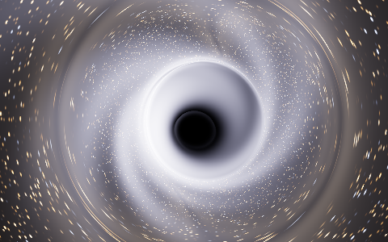
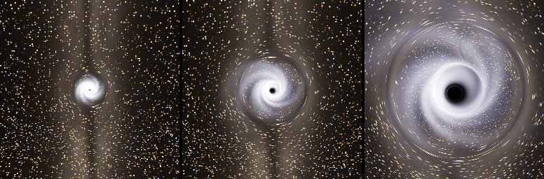
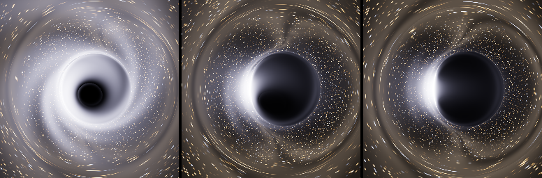
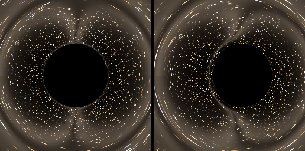
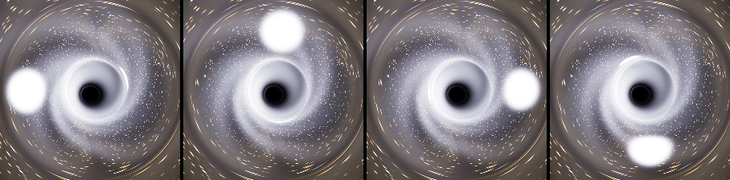
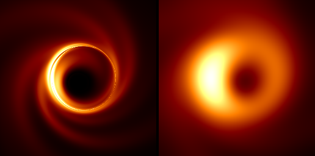

# Design: Sagittarius A*, drawn as physics says it looks

**For review.** Author: Claude Code session with Sean, 2026-09-30. Status:
DESIGN ONLY: nothing in the game changes yet. The reader is assumed to have no
context. Every image is a render of the physics described here, made by
`tools\sgra_optics.py`; every number about the real Sgr A* cites its source;
what is modelled rather than measured is marked. Parent arc:
`docs\black-holes.md`, whose flight 1 comes first.

*Elite's Sagittarius A* from 51 ls (20 M), seen from the side Sol sees it: the
shadow, the photon ring hugging it, the flow's glow sheared into spirals, the
Galactic Centre's sky bent round it. Spin 0.94, eye view.*

## Status

State, 2026-09-30: design only. No code in the game, no flight flown. The
images are renders of the design's own physics by `tools\sgra_optics.py`, whose
self-test is in the build gate.

- Goal: Sgr A* alone, first. The shadow at its true size (37 deg across at
  Elite's 36 ls radius, 1.4 deg from 1,000 ls), the photon ring, the Galactic
  Centre's sky lensed round it, the hot flow that is faint in total but bright
  up close, seen from the side Earth sees it, flares that lap the hole in 7.4
  minutes and show twice, and a radio view that is the EHT's image at infinite
  resolution. Correct in each eye, from every direction.
- Decided (sections below): the Kerr metric at a = 0.94; Elite's mass, the only
  scale that keeps a pilot at Elite's closest approach outside the horizon; the
  spin axis from GRAVITY's flares, clockwise seen from Sol; the glow at its
  physical brightness; one ray table a frame, shared by both eyes.
- Computed: the geometry, lensing, shadow, Doppler and gravitational shifts,
  time delays. Modelled: the flow's profile and structure, the flare's size and
  brightness, the visible colour. "What is known" keeps them apart.
- Depends on: Elite's lens draw (not yet identified) and its constants (the
  hole's position, the km scale); Elite's galaxy-background cube; the journal's
  system name (journal_watch reads event names only today); how Elite's render
  axes sit against galactic ones. A draw replacement, so no VR-runtime
  dependence; the flat profile draws it the same way. GPU budget: 1 ms a frame,
  at Sgr A* only.
- Open: which draw (arc flight 1); whether Sgr A* uses the same draw as the
  stellar holes; the render axes; the glow's calibration against Elite's HDR;
  the cost on the GPU; smear in EDVR's temporal pass (the arc's B4).
- Next: the arc's flight 1 at HIP 63835, no build. Then decode the draw, then
  develop at HIP 63835 B with Sgr A* posed on it, then one trip to Sgr A*.
- Choices waiting on Sean: six, in "Choices"; none blocks flight 1.
- Ruled out: nothing in flight yet. In the tool, the theta form of the Kerr
  equations: stiff within a degree of the spin axis, it lost a ray; replaced by
  cos(theta), which is polynomial there (journal).

## What the pilot sees

Every image here is the eye's view unless it says radio, rendered by `python
tools\sgra_optics.py --assets docs\assets\sgra` (about four minutes on four
cores) from the physics in the next section, over a stand-in for the Galactic
Centre's sky; in the game the sky is Elite's own backdrop, bent the same way.
Brightness is compressed the way a tonemapper does it: the real contrast
between the glow and the sky is far larger (see "What is known").

### Arriving

*From 1,000 ls, 250 ls and 76 ls (400, 100 and 30 M), looking from the
direction of Sol.* Far out Sgr A* is a small bright knot with the stars round
it bent into arcs; the shadow opens as you close in, ringed by the glow of the
flow, until from the closest supercruise distances it fills a third of the
view.

    distance from the hole       r / M    shadow across (from Sol's side)
    20,000 ls                     7,860   0.071 deg
    5,000 ls                      1,965   0.28 deg
    1,000 ls                        393   1.41 deg
    250 ls                         98.3   5.60 deg
    100 ls                         39.3   13.8 deg
    65 ls (reported arrival)       25.5   21.0 deg
    50 ls                          19.7   27.1 deg
    36 ls (Elite's radius)         14.2   36.9 deg

(`python tools\sgra_optics.py --at LS --incl DEG`.) Whether Elite measures its
HUD distance to the centre or to its 36 ls "surface", and how close supercruise
lets a ship come, are measured on the one trip there.

### From every side

*From 20 M (51 ls): from Sol's side, 25 degrees off the axis (left); 60 degrees
off it (middle); nearly in the flow's plane (right).* From Sol's side the flow
is seen almost face-on: a bright ring hugging the shadow, the dark "inner
shadow" where the flow's light is redshifted to nothing as it falls in, and
structure sheared into spirals. Toward the flow's plane one side blazes and the
other dims: the side orbiting toward you is Doppler-boosted, the far side of
the flow is lensed up over the hole, and the foreground flow veils the shadow.

*The shadow alone, edge-on from 30 M: no spin (left), a = 0.94 (right).* A
spinning hole's shadow is displaced and flattened on the side where light
orbits with the spin, and frame dragging twists the lensed sky next to it.
Nothing in Elite shows this; from most directions it is visible.

### A flare

*From 40 M (102 ls) on Sol's side: four moments a quarter-orbit apart (7.4
minutes for the whole orbit at Elite's mass), exposed for the quiet flow, as
the moment before the flare was.* A hot spot of gas at 9 M, where the GRAVITY
instrument tracked the real ones in 2018 and 2023 (8.9 GM/c², an hour's orbit
at the real mass), flares to about ten times the flow's light, laps the hole,
brightens where it moves toward you (gently from Sol's side, where GRAVITY saw
its orbits nearly face-on; sharply from the flow's plane), and shows twice:
once directly and once in light that went round the hole, hugging the shadow's
edge. For a spot directly behind the hole the second image arrives 15 M later:
38 s at Elite's mass (5.3 minutes at the real one), measured with the tool.

### In radio light

*The flow at 1.3 mm, far off and from Sol's side, in the EHT's colour map: at
infinite resolution (left) and blurred to the Event Horizon Telescope's
20-microarcsecond beam (right).* The right panel is the check that the model is
the thing astronomers imaged: a ring about 10 M across with a dark centre and a
brighter side, the same ring-to-beam ratio (2.6) as the 2022 image. The left
panel is what `fix.sagittarius_a = radio` shows in the headset: the thin photon
ring the EHT cannot resolve, from any angle you choose.

## What is known, and what is modelled

| | The real Sgr A* | Source | This design |
|---|---|---|---|
| mass | 4.297 ± 0.012 ± 0.040 million solar masses | GRAVITY 2022 (A&A 657, L12) | Elite's 516,608 (see "Mass") |
| distance | 8,277 ± 9 ± 33 pc; GM/c²D = 5.12 μas | GRAVITY 2022 | - |
| ring | 51.8 ± 2.3 μas across (about 10 GM/c²); shadow 48.7 ± 7.0 μas | EHT 2022, Paper I (ApJL 930, L12) | emerges from the optics |
| spin | not measured. The only two models passing all but the variability tests: magnetically arrested, prograde, a* = 0.5 and 0.94, 30° off the axis; no spin and retrograde disfavoured | EHT 2022, Papers I and V (L16) | a = 0.94 |
| orientation | flares go round clockwise on the sky: radius 8.9 +1.5/−1.3 GM/c², period 60 ± 3 min, inclination 154.9 ± 4.6°; EHT disfavours more than 50° from face-on | GRAVITY 2023 (A&A 677, L10); GRAVITY 2018 (A&A 618, L10) | seen from Sol at 155° from the axis, clockwise |
| accretion | 10⁻⁹ to 10⁻⁷ solar masses a year at the horizon (Faraday rotation); models 5–10 × 10⁻⁹ | EHT 2022 Paper V; Marrone et al. 2007 | a hot flow, no thin disk |
| output | about 10³⁶ erg/s bolometric, 2 × 10⁻⁹ of Eddington | EHT 2022 Paper V | - |
| magnetic field | strong, ordered, spiral; about 30 G in one-zone fits; no jet detected | EHT 2024, Papers VII and VIII (ApJL 964, L25, L26) | structure sheared into spirals (a model) |
| 1.3 mm | 2.4 ± 0.2 Jy; varies about 9% | EHT 2017 data release; Paper I | the radio view, shape only |
| near infrared | median 1.1 ± 0.3 mJy at 2.2 μm (dereddened); flares to about 40 mJy, about 4 a day, rising in minutes, lasting 20 to 30 min | GRAVITY 2020 (arXiv 2004.07185); rates: arXiv 2003.06191, 2011.09582 | sets the glow's brightness |
| infrared slope | F_ν ∝ ν^−0.50 ± 0.08 ± 0.17 from 1.6 to 2.2 μm, the same from 1 to 40 mJy; JWST at 2.1 to 4.8 μm finds it steeper when faint (−1.58) than bright (−0.87) | arXiv 2411.11966; JWST, arXiv 2501.04096 | ν^−0.5 into the visible, flow and flares |
| dust to Earth | A_K ≈ 2.4; A_V above 30 magnitudes | Fritz et al. 2011 | no visible light has ever been seen |

Where this session could reach them, the numbers were read from the papers' own
texts (EHT Paper I, GRAVITY 2023, the JWST paper, EHT's data release); the rest
from abstracts through search. They are cited so a reviewer can check them.

**The glow is not faint up close.** Sgr A* is famously underfed: it radiates
two billionths of what a hole its size could. But it is small, and surface
brightness does not fall with distance. 1.1 mJy at 2.2 μm from a region about
10 GM/c² across (the EHT ring's size, 50 μas) is a brightness temperature of
about 1,300 K there. Carried into the visible on the measured slope it is about
2,600 K at 550 nm (2,300 K on JWST's faint-state slope): 1/250 to 1/1,000 of
the Sun's surface brightness per unit area. That is dim for a star but 600 to
2,600 times the full Moon's face, and, as an order of magnitude, a million
times the diffuse glow of the Galactic Centre's sky. Up close, Sgr A* glows.
The same slope makes the glow a pale, cool blue-white (chromaticity 0.295,
0.299, bluer than daylight white); JWST's faint-state slope would make it a
neutral, faintly pink white. No visible light from it has ever been observed,
so the colour is the least certain thing in the design.

**Modelled, not measured, and marked so in the code:** the flow's emissivity
profile (r^−4 in the visible, r^−3 at 1.3 mm, tapering past 25 M), its
thickness (H/R = 0.45) and the empty funnel along the axis, the sheared-spiral
structure standing in for turbulence, the hot spot's size and brightness, the
colour. The Kerr geometry, the lensing, the shadow, the Doppler and
gravitational shifts and the time delays are not modelled: they are computed.

## Mass: Elite's, on purpose

The picture depends only on distance in units of M. A pilot at 20 M from any
hole sees the same shadow, the same ring and the same flow; M sets only how
many kilometres that is, and how fast the clock runs (GM/c³). So the choice of
mass is a choice of scale, and there is one scale that works:

    Elite's Sgr A* (EDSM)     516,608 solar masses   M = 2.55 ls   GM/c³ = 2.54 s
    the real one (GRAVITY)    4.30 million           M = 21.2 ls   GM/c³ = 21.2 s
    Elite's Radius, 15.55 solar radii = 36.1 ls = 14.2 M (Elite's) = 1.70 M (real)

The real mass puts the real horizon at 42.3 ls, outside Elite's own 36 ls body,
so a pilot parked at Elite's closest approach would be inside the horizon.
Elite's mass keeps the game's geometry whole: its body radius becomes 14.2 M, a
sensible closest approach, and everything the pilot sees is exactly what the
real Sgr A* would look like from the same r/M. The price is the clock: the flow
turns 8.3 times faster than the real one, so a hot spot laps the hole in 7.4
minutes instead of an hour. That is a gain for a visitor.

(Aside, unverified: 36.1 ls is the Schwarzschild radius of 3.66 million solar
masses, the accepted mass around 2003. Elite's Radius may be that, with the
mass field set some other way.)

## Orientation: the way Earth sees it

The flow's spin axis is not a free parameter. The flares GRAVITY tracked in
2018 and 2023 all go round clockwise on our sky, and the 2023 fit puts their
orbit at an inclination of 154.9 ± 4.6°: the flow's angular momentum points
away from Earth, 25° off our line of sight. The EHT's passing models sit 30°
off it, and it disfavours anything past 50°. In Elite, Sol lies in the
direction (-25.2, 20.9, -25,900) from Sgr A*, in galactic light-years. So the
design points the spin axis away from Sol, tilted 25°, and the flow turns
clockwise as seen from Sol's side. The tilt's direction on the sky (the paper's
node angle, 177 ± 24°) waits on its convention being read; with the axis this
close to the line of sight it changes little of what an arriving pilot sees.
One caveat, recorded rather than resolved: one reading of the EHT's 2024
polarimetry (if the Faraday rotation is internal to the flow) would have the
flow turn the other way. The design follows the flares, which are direct
kinematics.

What that means in the game: arriving from the bubble, you meet Sgr A* as
astronomers do, nearly face-on, the flow turning clockwise; go round to its
side and it becomes the lopsided, D-shadowed thing of the middle panels. With
the radio view on and the ship on the line to Sol, the headset shows the EHT's
picture from where the EHT stands.

One unknown: how Elite's render axes relate to galactic ones. Hypothesis: they
are the galactic axes (z toward the centre, y toward galactic north, as the
coordinates are). Test on the trip: target Sol, face its marker, dump the
camera; the marker's direction in render space against (-25.2, 20.9, -25,900)
gives the rotation. Until then a fixed orientation stands in.

## How EDVR draws it

**Where.** At Elite's own lens draw, when the system is Sagittarius A*: the
same point in the frame, the same HDR target, so bodies, ships, cockpit and HUD
drawn after it cover it exactly as they cover Elite's lens today. Which draw
that is, what it samples and whether Sgr A* uses the same one as the stellar
holes is flight 1's job (`docs\black-holes.md`); this design assumes nothing
about it beyond "a draw we can key on".

**Inputs.**

| Input | Where it comes from | State |
|---|---|---|
| each eye's camera | scene constants, VS/PS b1 registers 270 to 275 (view-projection, eye origin) | known |
| the hole's position | the lens draw's constants | flight 1, then decode |
| distance scale (render units per km) | those constants against the HUD's distance | flight 1 step 5 |
| M | constant: 516,608 solar masses = 762,836 km | fixed |
| spin axis in the world | constant in galactic axes; world-to-galactic rotation | calibration, see "Orientation" |
| the sky | Elite's galaxy-background cube, found in the census | flight 1 |
| "this is Sgr A*" | journal StarSystem on FSDJump / Location / CarrierJump | journal_watch reads names only today: add payloads |

**Per frame, one compute dispatch** traces a table of rays in the hole's frame:
a polar grid round the hole's direction, dense in angle at the shadow's edge
where the bending diverges, covering the whole sphere (close in, every
direction is bent). Each entry: the escape direction or "captured", the flow's
glow along the ray, and the hot spot's glow at this frame's time. Both eyes
share it: the eyes are 10^-10 M apart, so the hole is at infinity for stereo
and the two images differ only by each eye's view. **Per pixel**, the
replacement pixel shader turns the view ray into table coordinates,
interpolates, samples Elite's sky cube along the bent direction (with
derivatives from neighbouring table entries, so the compressed rings filter
instead of alias), and adds the glow, in Elite's HDR units.

Tracing per pixel is not affordable: the tool's rays average 150 RK4 steps (p95
270) with the flow on, about 250 flops each, which is ~470 GFLOP a frame at two
2500-pixel-square eyes. A 256 x 512 table is ~5 GFLOP: about 0.3 ms at 20
TFLOP/s before divergence. Budget: 1 ms a frame at Sgr A* only, measured with
EDVR's GPU timers; if over, the table updates at half rate (the camera and the
flow move little in 11 ms) or shrinks.

**Units and brightness.** The glow is written as radiance in Elite's HDR units,
calibrated in flight against a star's surface of known temperature, so Elite's
own exposure and tonemap treat it like any other bright surface. No separate
exposure of our own.

**Motion.** EDVR's temporal pass runs on the tonemapped eye with motion that
knows nothing of lensing. Close in, supercruise moves the camera a sizeable
fraction of M each second (1 c is 0.4 M a second at Elite's mass), which slides
the lensed sky; if flight shows smear there (the arc's B4), the table's
frame-to-frame change is the motion vector to write, since the lensed sky is a
known function of the camera.

**Config.** `fix.sagittarius_a = on | radio | off`: on is what an eye would
see; radio is the Event Horizon Telescope's wavelength, 1.3 mm, in its colour
map, sharper than the EHT can resolve; off is Elite's own. Developer key:
`advanced.black_hole_pose = sagittarius_a` draws whatever hole Elite is drawing
as Sgr A*, at the same r/M and on Sgr A*'s clock, so all but one of the flights
happen at HIP 63835, 275 ly from Sol, instead of 25,900.

## Validation, and where the flights happen

- **The physics** is held in the build: `tools\sgra_optics.py --self-test`
  checks the ray tracer against Bardeen's shadow outline for a distant eye at a
  = 0.9 (1% inside is captured, 1% outside escapes, all round), the equatorial
  photon orbits and innermost stable orbits in closed form, both first
  integrals along ordinary and near-polar rays, Carter's constant against
  Bardeen's image coordinates, the a = 0 limit against the Schwarzschild tool
  (Synge's shadow to 1e-6 rad, the sweep to 1e-5), and the flow's redshift
  against closed-form Keplerian orbits.
- **The shader** will be held to the tool: a WARP rig renders the compute table
  into a sky cube whose texels encode their own direction, and compares
  directions and glow with `trace` ray for ray.
- **The flights.** (1) The arc's flight 1 at HIP 63835: identify Elite's lens
  draw; no build. (2) Development at HIP 63835 B with `advanced.black_hole_pose
  = sagittarius_a`: 360 km from that 15.5 solar-mass hole is the same 15.7 M as
  40 ls from Sgr A*, so every r/M the design cares about is reachable 275 ly
  from Sol, and each iteration costs a short hop, not a day's travel. (3) One
  trip to Sgr A*: confirm it uses the same draw, the closest approach and the
  HUD's distance convention, brightness against Elite's own core sky, and the
  render axes (target Sol).

## Choices that are Sean's

Recommendations first.

1. **Mass: Elite's** (above). The alternative, the real mass, needs the game's
   approach geometry changed, which EDVR cannot do.
2. **Spin: a = 0.94**, one of the EHT's two passing models (the other is 0.5).
   Zero spin would lose the D-shaped shadow and the frame dragging, and the EHT
   disfavours it; the value itself is not measured.
3. **Brightness: physical.** Up close the flow glows like a cool star's surface
   and outshines the Galactic Centre's sky per square degree by about a
   million: with Elite's exposure the stars near the hole will sink. That is
   what being there would look like; a dimmer glow would be a style.
4. **Flares: at the real rate on Elite's clock.** Four a day (± 2) at the real
   Sgr A*, lasting 20 to 30 minutes; on a clock 8.3 times faster that is about
   one every 45 minutes, lasting about 3. A visit sees one more often than not.
   The alternative: one guaranteed within the first minutes of each visit.
5. **Radio view: in**, as `fix.sagittarius_a = radio`. It is the one view of a
   black hole the public has actually seen, and in a headset it can be walked
   round.
6. **The glow's colour** is the least certain thing here: no optical light from
   Sgr A* has ever been seen (30-odd magnitudes of dust), so it is extrapolated
   from the measured infrared slope. Recommended: take the extrapolation and
   say so.

## Not in this design

The stellar-mass holes (the arc, `docs\black-holes.md`, continues on the same
machinery once the lens draw is known). The S-stars and the minispiral of gas
round Sgr A*: Elite's system has no such bodies to draw. Elite's own S2,
"Source 2", a B star on a 668-day orbit about 120 AU out: a body, drawn after
the lens, so not lensed, as today. A jet: none is observed. True
magnetohydrodynamic turbulence: the flow's structure is a sheared-spiral model
with the right look and timescales, not a simulation.

## Journal

### 2026-09-30: designed

Sean: start with Sagittarius A* alone, majestic and physically accurate as we
understand it; a design doc for now. Built `tools\sgra_optics.py` (Kerr ray
tracing through a hot flow, eye and radio views, the images here) with its
self-test in the build.

- The first tracer integrated theta. A ray passing 0.9 deg from the spin axis
  (lambda = 0.08, eta = 24) overshot its turning point; the polar first
  integral drifted from 0 to -3e10 and the ray circled forever, which showed as
  a black spot 3% outside Bardeen's outline. Rewritten in mu = cos(theta),
  whose equation is a cubic polynomial, with steps that bound the change in phi
  as well; the self-test now carries that ray.
- The first renders were grey haze: a guessed gain, an emissivity (r^-3 out to
  60 M) too spread out for what the near-infrared and 1.3 mm images show, and a
  tone curve with no toe. Now: auto-exposure on the flow, r^-4 and r^-3
  tapering past 25 M, a filmic curve.
- Measured with the tool for the doc: rays average 150 RK4 steps with the flow
  on (p95 270); a flare's second image, for a spot behind the hole, trails the
  first by 15 M.
- The literature check (a research subagent; the papers' own texts where it
  could reach them, abstracts through search otherwise) moved three values:
  spin 0.9 to 0.94 (EHT Paper V's passing models are a* = 0.5 and 0.94), the
  view from Sol 150 to 155 deg (GRAVITY 2023: 154.9 ± 4.6), and the glow's
  slope to F_nu ~ nu^-0.5 (the 1.6 to 2.2 um index, flux-independent), which
  makes the glow blue-white rather than grey. It also found Elite's own record
  (EDSM: 516,608 solar masses, 15.548 solar radii, a companion "Source 2").
- My recalled ISCO at a = 0.94 (2.0406 M) was wrong; Bardeen, Press and
  Teukolsky's formula, worked by hand, gives 2.0236, as the tool does. The
  self-test pins 2.0236.
- The flare frames were first exposed each for itself; the spot, ten times the
  flow, then blacked the flow out. They now share the quiet flow's exposure.
