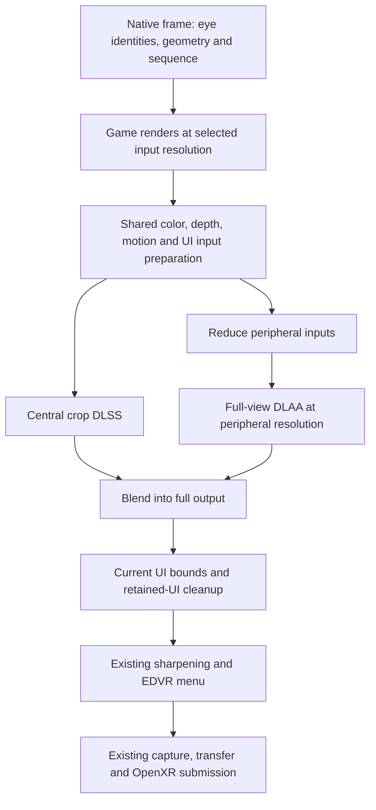

# Foveated DLSS in native OpenXR: feasibility and design

## Status

- **State (2026-09-17 11:00, the lever build v0.17.0-rc.3-76-g9eab046
  FLOWN in FRONTIER; gate NOT MET on the frame):** three Stage 1 flights,
  all in the journal. 09:15 (1947c90, quality): 20/25/7 at 43%, 0.36 ms
  per pair. 09:38 (1947c90, performance): a live sweep 20/25/7 -> 5/5;
  ~1.0 ms per pair at 43%; both trims at 5 = a 99.9% crop, stood down
  silently by the 90% ceiling (a log note since 9eab046). 10:55 (9eab046,
  quality 2646x2206 in, frame 8.9 ms): both levers confirmed (prep 0.57
  vs 0.53 full, the periphery 0.22-0.36 with the skip); pass per pair vs
  full-frame 3.87: 81% 3.93, 67% 3.63, 56% 3.32, 79% 3.91; frame p50 8.9
  -> 8.57 at 56%; the game at 90 fps flat with the CPU waiting 7 ms a
  frame, so nothing could show as frame rate. Sean's ini now: edges,
  vertical 5, outer 20, nasal 7 (79%), edge 0, periphery sharp.
- **Cost model, holding across all three flights:** NVIDIA's price
  follows the rectangle's area (10:55: 2.96 at 100%, 2.53 at 81%, 2.18
  at 67%, 1.7 at 56%; about 0.2 + 2.75 x share); the fovea path's fixed
  costs (periphery + compose + prep's extra) are ~0.55 with the skip. So
  81% saves nothing, 67% 0.24, 56% 0.55, and 43% (20/25/7, unflown on
  this build) about 1.1 ms per pair, 12% of the 8.9 ms frame. The bound:
  DLSS is 3.0 of the 8.9 ms; the game's own 5.9 ms is out of reach. Soft
  periphery costs MORE than sharp and overloads the price timers.
- **Settled before this flight:** Stage 0 (749a4e9): H1 confirmed, H2
  ruled out (reduce + periphery + compose ate 48% of the crop's saving at
  40 deg / 0.5); 40 deg missed Sean's eyes, 80 saved nothing. The masked
  eye-mask circle: NVIDIA prices the bounding rectangle = the FOV trim.
- **Ruled out, do not re-run:** the eye-tracked crop, structural under
  upscaling and against Sean's own objection (performance.md, 2026-09-05:
  eyes jump where heads stream); gaze stays Stage 3, optional. The pooled
  "NVIDIA ms/eye" figure mixes eyes and roles; do not compare. H2, above.
- **Stage 1 leftovers, not in the build:** the reactive mask on the crop
  path; history committed only after a successful evaluation (the two
  HaveHistory flags are set unconditionally each frame); the crop
  branch's unconditional ensureNative and CPU-side stats readback (none
  inside the timed prep); the luma probe's taps dark there; the reduced
  periphery's reduce reading the skipped interior (journal, lever build).
- **Decision (2026-09-17, Sean):** "20 for the top, 25 for the outer and 7
  for inner. Inside that rectangle should be DLSS and outside of it should
  be TAA." Taken as degrees off the headset's field, the FOV trim's
  convention (his nasal FOV trim is 7, so DLSS reaches the nasal edge);
  TAA = EDVR's own resolve, temporal_aa_periphery = sharp. BUILT and on
  main (bb0eb7a, 7d12d9b, 188c10b, 6461eeb, merge c4c1490, doc 1947c90):
  temporal_aa_fovea = edges with temporal_aa_fovea_vertical/outer/nasal
  (plain degrees, live), the interior skip (inactive under upscale), UI
  parity from the current raster alone, a region self-test in smoke; then
  temporal_aa_fovea_top/_bottom (`same` follows vertical; 7cd0b5d, the
  inverted edge mapping caught and fixed in 8e99777, journal).
  Product shape once it pays (Sean): the eye mask toggle and trim give
  way to a DLSS rectangle, wide/narrow presets, one per-headset size;
  gaze later where the headset publishes it; fix.eye_mask keys stay.
- **Next: the head lead (Sean, 2026-09-17 12:00: "Let's build the head
  lead"), IN PROGRESS on the branch:** temporal_aa_fovea_lead = frames of
  head motion the rectangle slides toward a turn (design + evidence +
  failure signatures in the journal's head-lead entry; upstream's
  crop_motion.hpp MV offset is the recipe). Then a flight: 20/25/7 or
  15/20/7, lead 6 against 0 flipped live, the blend band back to 6-10
  deg, head turns at several speeds; his picture verdict on the leading
  edge. Performance stands as measured: ~1.1 ms per pair at 43%,
  visible only GPU-bound. Owed: retire temporal_aa_fovea_vertical; Stage 2.

## Investigation (2026-09-14)

Status: investigation and proposed design, 2026-09-14. No rendering code,
settings, installed DLLs or runtime registrations were changed for this
investigation. EDVR baseline:
[`d160499`](https://github.com/characterecho-sean/edvr-unofficial-patch/commit/d160499f44ded472dc38ac54f152482d94810c7c).
Upstream inspected: CheekyFoveatedDLSS
[`a830c74`](https://github.com/ClarkCheekyKent/CheekyFoveatedDLSS/commit/a830c74d7ef7c150168328b9fd657caee9e1655d),
committed September 11. Upstream source was read, not installed or executed.

## Recommendation

The concept is feasible and deserves a bounded experiment in EDVR's existing
DLSS implementation. It reduces NVIDIA reconstruction work, which our VRS
experiment did not touch. However, EDVR already contains an experimental
crop-plus-periphery implementation, and its earlier flights found the same
fundamental quality tradeoff. This is a proposal to modernize and qualify that
path, not evidence of a newly solved problem.

Start with fixed placement under native OpenXR, preserving current full-frame
DLSS as the default and quality reference. First bring the experimental path up
to date with the UI and motion pipeline, then measure the complete cost and the
image during movement. Eye tracking is a later stage through standard OpenXR,
conditional on useful gaze from the Windows-selected runtime. Do not promise
full-frame sharpness everywhere, an invisible transition, or a particular FPS
gain.

If the requirement remains “no loss of sharpness wherever the eyes move,”
retain full-frame DLSS. A small crop cannot reconstruct unseen history
immediately after a large look. The experiment is justified only as an
optional, measurable quality/performance trade that the user accepts.

## What the concept changes

| Technique | Work reduced | Work still paid |
| --- | --- | --- |
| Existing VRS foveation | Pixel-shader invocations in selected game draws | Full-resolution targets, substantial memory traffic, compute work and EDVR's DLSS evaluation |
| Lower render resolution plus full-frame DLSS | Game rendering and render-size input preparation | Reconstruction across the complete output |
| Foveated DLSS | Reconstruction outside a central region | Game rendering at the selected input size, input preparation, peripheral reconstruction, final composition and OpenXR submission |

The proposed frame has two reconstructions: DLSS for a central crop, and DLAA
for a smaller image covering the entire view. The smaller image supplies the
visible periphery and remains temporally active beneath the center. A blend
joins their outputs. It is not a second high-resolution render of the scene,
and does not require quad views.

Cheeky implements this through NGX/Streamline interception, with D3D11/D3D12
backends and ReShade/UEVR integrations. Its documented default center occupies
55% by 45% of the image; peripheral DLAA uses 75% of the **input render
dimensions**. Its published FPS claims are upstream reports, not Elite
measurements. [Upstream
overview](https://github.com/ClarkCheekyKent/CheekyFoveatedDLSS/blob/a830c74d7ef7c150168328b9fd657caee9e1655d/README.md),
[settings](https://github.com/ClarkCheekyKent/CheekyFoveatedDLSS/blob/a830c74d7ef7c150168328b9fd657caee9e1655d/USAGE.md).

For example, at a 65% linear render scale, that peripheral setting is
approximately 48.75% of output width and height. Its area is about 23.8% of the
output, alongside a 24.75% central rectangle. This is a pixel-work
illustration, not a predicted 51% time saving: the two evaluations have fixed
costs, different modes, overlapping coverage and extra passes. An elliptical
blend does not reduce the rectangular NGX evaluation area.

## What our previous experiments actually established

The [historical performance
investigation](performance.md#feature-2--fixed-foveation-by-variable-rate-shading)
records working VRS on the RTX 5090/Pimax rig, with roughly 0.5 ms of
frame-time benefit and little difference between presets. Some runs were
limited by the 90 Hz cap or submission, so FPS alone hid savings. Those results
do not establish a current native-OpenXR budget, nor isolate every source of
GPU cost. In particular, a cull experiment is not a clean measurement of
vertex, bandwidth or compute cost individually.

The same document's [DLSS crop
investigation](performance.md#feature-6--dlss-where-you-look) already
considered Cheeky on September 5 and implemented the central technique. Its
important results are:

- A small DLAA crop could be much cheaper than a full-frame evaluation on that
  rig. The complete path saved less than the crop-only timing suggested because
  the periphery and preparation still cost time.
- Combining the crop with EDVR's own temporal periphery produced shimmering,
  smearing and a visible change during head movement. Switching to
  reduced-resolution DLAA improved continuity but did not guarantee an
  invisible seam.
- A noninteger reduction originally shifted samples; an area-weighted reduction
  corrected that. Crop/output rounding also needed care to avoid a stereo depth
  step.
- Fast motion brought content into the crop without the history available to
  full-frame reconstruction. The experiments recorded slower convergence and a
  visible change in texture. The subsequent design review rejected eye tracking
  as a cure for history missing after a large gaze jump; an integrated
  eye-tracked DLSS flight was not established by that work.

These are recorded historical measurements, observations and design
conclusions, not new tests. The older document also contains superseded design
claims, including an optimistic explanation involving saccadic suppression
followed by a later rejection of that proposal. Neither suppression nor a
history fade is an acceptance criterion here.

A later [September 10 DLSS
review](review-dlss-performance-2026-09-10.md#measured-baseline) reported 1.82
ms per eye inside NGX and 2.22 ms per eye for the enclosing pass, averaged
across two render sizes. That supports investigating reconstruction cost, but
is not a same-scene benchmark for today's build. Preparation has since been
optimized; recapture the baseline rather than combining numbers from different
flights.

## What has changed upstream

The September 5 assessment that Cheeky could not handle OpenVR-only games is
obsolete. The inspected version documents OpenVR as well as OpenXR stereo
calibration, including separate, packed and array-slice paths. Its shared
OpenXR layer supplies mapping and alignment even without eye tracking. EDVR's
new native OpenXR route is also materially different from the old integration
context. Standalone Cheeky compatibility with EDVR's NGX calls remains
untested. [Calibration
contract](https://github.com/ClarkCheekyKent/CheekyFoveatedDLSS/blob/a830c74d7ef7c150168328b9fd657caee9e1655d/EYE-CALIBRATION.md).

Useful implementation ideas in the inspected source:

| Upstream behavior | Application to EDVR |
| --- | --- |
| Crop extents stay constant while placement moves | Avoid recreating NGX features because edge rounding changed the dimensions by one pixel |
| Private motion vectors compensate for a moved crop | Preserve overlapping history without modifying the vectors used by the periphery |
| Explicit reset reasons and stale-gaze policy | Distinguish a normal crop translation from a discontinuity or lost tracker |
| Shared-forward alignment accounts for eye cant and asymmetric FOV | Use the geometry EDVR already owns, rather than manual stereo offsets |
| Independent peripheral preset and scale | Benchmark peripheral quality and cost independently; do not assume an old preset is supported or fastest |

Sources: [crop
geometry](https://github.com/ClarkCheekyKent/CheekyFoveatedDLSS/blob/a830c74d7ef7c150168328b9fd657caee9e1655d/src/foveation.cpp),
[crop
motion](https://github.com/ClarkCheekyKent/CheekyFoveatedDLSS/blob/a830c74d7ef7c150168328b9fd657caee9e1655d/src/crop_motion.hpp),
[gaze
policy](https://github.com/ClarkCheekyKent/CheekyFoveatedDLSS/blob/a830c74d7ef7c150168328b9fd657caee9e1655d/src/gaze_policy.cpp),
[D3D11
periphery](https://github.com/ClarkCheekyKent/CheekyFoveatedDLSS/blob/a830c74d7ef7c150168328b9fd657caee9e1655d/src/d3d11_peripheral_dlaa.cpp).

Upstream also offers center output supersampling and experimental DLSS-NR.
Neither belongs in this experiment. Increasing reconstruction output size does
not make Elite render additional scene samples, and NR/D3D12 transport adds a
separate feature and synchronization problem. Its automated tests explicitly do
not evaluate NVIDIA DLSS, so their success cannot resolve our temporal-quality
question. [Development and validation
scope](https://github.com/ClarkCheekyKent/CheekyFoveatedDLSS/blob/a830c74d7ef7c150168328b9fd657caee9e1655d/DEVELOPMENT.md).

## Existing EDVR implementation and gaps

| Area | Current code | Required work before a meaningful flight |
| --- | --- | --- |
| NGX evaluation | [dlaa.cpp](../src/d3d11/dlaa.cpp): `evaluateCrop`, `dlssEvaluateFovea`, `dlaaEvaluatePeriphery`; separate full, crop and peripheral histories per eye | Reuse these interfaces, audit complete input contracts and distinguish timing by region |
| Crop/reduction/composition | [temporal_pass.cpp](../src/d3d11/temporal_pass.cpp): `foveaWanted`, `cropOf`, reduction and composition shaders | Separate geometry policy from rendering; preserve exact registration and stable extents |
| Native producer path | [native_temporal.cpp](../src/d3d11/native_temporal.cpp) calls the same `edvrTemporalAa` path | Fixed cropping is reachable through shared configuration; this is not yet a qualified native feature |
| Motion and changing UI | Full-frame DLSS passes `reactive` to NGX; crop/periphery function signatures do not | Carry compatible masks and preserve their dimensions, bases and meaning on both reconstructions |
| Post-DLSS UI treatment | The current `uiResolve` block is inside the full-frame branch | Apply equivalent current-raster bounds and retained-UI cleanup to the final foveated output |
| Periphery input preparation | Existing reduction uses area-weighted color, selected depth and associated scaled motion | Keep tested sample registration; extend it to required masks and content-change evidence |
| Normal-play cost | Crop branch selects `motionShader(ctx, true)` and enters `ensureNative` before skipping the own pass | Remove unnecessary diagnostic work and unused native-TAA allocations after correctness is established |
| Center geometry | Existing crop uses tangents and optional eye translation/fixation distance | Use full per-eye rotation as well, and retain the exact unjittered projection convention |
| Gaze | Native host has no gaze action acquisition; [temporal frame ABI](../src/common/native_temporal.h) has no gaze sample | Add optional native gaze ownership and a versioned snapshot only in the later stage |

The crop implementation uses a fixed center. The old OpenVR gaze producer for
VRS is not evidence that DLSS crops follow gaze, and cannot supply the new
native runtime automatically.

The fixed path's current configuration is already read by the shared temporal
pass: `advanced.temporal_aa_fovea` defaults to 0; shape, edge, fixation
distance, periphery type and periphery scale are live settings. Existing
periphery scale means a fraction of **output**, capped at input dimensions.
Setting it to 0.75 does not reproduce Cheeky's 0.75-of-input setting. Preserve
that meaning; use explicit dimension conversions in benchmarks and document any
future new setting separately.

## Integration choice

Implement inside EDVR's producer-side temporal pass. EDVR creates the NGX
inputs and knows each submitted eye, its bounds, frame sequence, render size,
projection and reference generation. An external add-on would have to
rediscover those contracts while intercepting our evaluations. The native host
can provide alignment directly without installing a global OpenXR layer or
using marker readbacks.

Cheeky is GPL-3.0; EDVR's project license is MIT. This proposal imports no
Cheeky source, shaders or binaries. Reuse EDVR's existing implementation and
documented SDK interfaces, with independently implemented geometry and tests.
Any future direct code adoption needs a separate licensing decision before it
is included. [Cheeky
license](https://github.com/ClarkCheekyKent/CheekyFoveatedDLSS/blob/a830c74d7ef7c150168328b9fd657caee9e1655d/LICENSE),
[EDVR license](../LICENSE).

DLSS remains an NVIDIA RTX feature. Headset/runtime selection remains portable:
Windows chooses OpenXR; fixed placement requires no tracker, and gaze uses a
standard extension rather than a vendor SDK. This work does not reintroduce
SteamVR or LibOVR as alternate backends.

## Proposed frame pipeline



The drawing expresses data dependencies; the two reconstructions execute
serially on the existing game-device immediate context. It does not propose
parallel GPU queues. The XR owner publishes CPU metadata; GPU work stays on the
producer through the current native bridge. Preserve context state and all
existing shutdown ownership rules.

Prepare inputs once. Pass the central region through a per-eye NGX feature
created for its input/output dimensions with output subrectangles enabled.
Process the full view at peripheral resolution, including the portion beneath
the center, to maintain peripheral history across crop movement. Composite into
an owned output in the current submission format and color-space convention.
Keep EDVR's menu/monitor after reconstruction; Elite's own UI is already in the
eye image and needs the shared UI protections above. NVIDIA exposes the
subrectangle creation option in its [NGX
parameters](https://github.com/NVIDIA/DLSS/blob/main/include/nvsdk_ngx_params.h);
use the shipped SDK's full evaluation contract.

Keep the baseline at exactly the same game input and submitted output
dimensions. Otherwise resolution changes can be mistaken for savings from
foveation. Do not add a new cross-device transfer: the final image follows the
existing native transfer/composition path.

### Geometry and stereo

Use the eye identity and generation supplied by the native bridge. Never infer
left/right from call parity or pointer reuse. Derive both crops from one
frame's unjittered head/eye geometry; handle asymmetric FOV and eye cant using
full eye-to-head rotations. Fixed placement projects the same head-forward
direction into each eye. It is independent of seated yaw and recentering,
although a reference discontinuity still invalidates temporal history.

Compute an angular visible region and an optional surrounding history margin,
then convert to render pixels. Derive the output rectangle through one
consistent mapping from that input region. Account explicitly for noninteger
scale, texel centers, submitted bounds and rounding. A mask may be round while
the enclosing evaluation rectangle remains rectangular. Move the origin within
bounds without changing feature extents; if valid coverage cannot be
maintained, choose the complete reference path for the pair rather than
silently clipping the quality region.

A history margin is input to the quality/cost experiment, not a cure. It can
hide some newly entering content, but a sufficiently fast turn or gaze jump
exceeds any affordable margin. Do not resize the NGX feature every frame in
response to head speed.

### History and motion

Retain independent histories for each eye and each reconstruction. Key
resources by device/session generation, actual dimensions, format, preset and
geometry policy. Commit previous crop origins only after a successful
evaluation; rejected or withheld frames do not advance history.

For motion expressed as current-to-previous displacement in input pixels, the
crop-local relation is:

```text
previous_local = current_local + scene_motion
                 + current_crop_origin - previous_crop_origin
```

Apply the origin correction only to private central vectors. The periphery
retains scene motion, scaled to its grid, and jitter scales with the same
coordinate conversion. Do not apply crop motion to the shared scene vectors,
add the raster jitter twice, or average unrelated object velocities across a
depth boundary. Verify sign and units against EDVR's moving-crop probe and the
actual NGX flags, including odd input/output ratios.

Reset on first use, feature recreation, a real frame/reference discontinuity or
a crop jump whose overlap is insufficient. Ordinary translation with valid
overlap must not reset every frame. Record reset reasons and crop age. Resizing
and preset changes reset both affected eyes at a frame boundary. Feature
recreation can hitch even though it needs no game restart.

A previously inactive full-frame NGX feature has stale history. Returning to it
requires a reset and a measured convergence period. Running it every frame
solely to keep history warm would erase most of the intended saving; do not
hide that cost in a fallback strategy.

### UI and failure behavior

The modern full-frame UI contract is a prerequisite. Updating timers alone
around the old crop code would benchmark a different image-processing feature.
Reuse shared preparation and UI resolve logic rather than maintaining two
progressively different copies. Audit which NGX masks each shipped preset
actually consumes, and use explicit postprocessing where current full-frame
behavior already requires it.

Foveation must not output partially composed eyes, stale peripheral images or
an uninitialized crop. Validate both eyes and select settings before processing
the pair. Latch feature failures to prevent per-frame allocation/retry loops.
Retain originals and make pair-level recovery explicit: if the second eye fails
after the first succeeds, recompute or select a consistent supported treatment
for both, preserving the native jitter/FOV contract. Exercise this in the host
harness before flying it.

Recovery stays inside the native OpenXR path. A DLSS optimization failure does
not select another VR runtime. If reconstruction itself becomes unavailable,
preserve the existing native pass-through/stand-down behavior and its truthful
status, rather than introducing another VR backend.

### Optional gaze stage

Add `XR_EXT_eye_gaze_interaction` capability negotiation to the native host.
Build an action set, pose action and action space, attach once per session, and
synchronize/locate on the XR owner. Publish a generation- and sequence-tagged
immutable sample for the producer. Extend the private temporal ABI with a new
version or separately negotiated capability; do not enlarge a version-1 struct
in place.

The standard exposes one gaze pose, not independent per-eye vergence or a
guaranteed fixation distance. Project its direction separately through each
eye's geometry; do not invent two eye measurements. Require active input,
valid/tracked pose and acceptable timing; extension presence alone is
insufficient. The sample timestamp can be unavailable or express a predicted
pose, so request/receipt time must remain distinguishable from sample age.
[Khronos gaze
contract](https://raw.githubusercontent.com/KhronosGroup/OpenXR-Docs/main/specification/sources/chapters/extensions/ext/ext_eye_gaze_interaction.adoc),
[sample
timestamp](https://registry.khronos.org/OpenXR/specs/1.0/man/html/XrEyeGazeSampleTimeEXT.html).

Start with simulated center movement in the GPU harness. On real hardware,
measure smoothing delay, sample freshness, blink behavior, large jumps and
eye-first/head-following movements. A brief hold and a bounded return to the
tested fixed region are candidate policies, not qualified defaults. On focus
loss, session stop, reference change or persistently invalid input, clear gaze
ownership and use the documented fixed/full-frame policy. Log validity and age
summaries without routinely recording a user's gaze trace.

Negotiate support at instance creation and create optional action resources at
session setup if live gaze switching is desired. Switching between prepared
fixed/gaze modes can then be live; enabling previously unnegotiated support or
changing the Windows runtime requires restarting the session/game. Quest 3
fixed placement remains a complete test target; a working Pimax headset session
alone does not prove its selected runtime supplies gaze.

## Controls and resource budget

Keep current full-frame DLSS selected by default. Use existing advanced crop
settings for the development experiment, with their present meanings. A later
user-facing control should distinguish `Full frame`, `Fixed region` and, only
when supported, `Eye tracked`. Report the active treatment, center/peripheral
dimensions, and why a requested mode is unavailable. Preserve the concise
floating `GPU` and `CPU` labels; detailed costs belong in F8 and logs.

Crop width/edge, peripheral scale and supported preset changes can be applied
live at a paired-frame boundary, with history reset and a possible one-time
allocation hitch. They do not change the game's rendering resolution. Gate new
gaze settings and any new public control on the completed validation; this
document neither renames existing keys nor enables experimental VRS.

Track allocated bytes, feature count and retired resources. A single 4404x4348
four-byte output is about 73 MiB per eye, before NGX's private allocations.
Avoid retaining full, crop, peripheral and unused native-TAA surfaces
unnecessarily. Cap scratch storage and retire it through the existing context
ownership rules. Compile any new shaders through the established build/cache
path; do not restore the startup black-screen problem by synchronously
compiling several large shaders on the first visible frame.

## Measurement plan and decision gates

Use current asynchronous GPU timers and associate samples with original frame
sequence and eye. Break the temporal region into shared preparation, peripheral
reduction, peripheral NGX, central NGX, composition/UI resolve, and total.
Preserve the enclosing timer to catch uncategorized work. Existing aggregate
NGX averages mix calls; two evaluations per eye must not be reported as a
single-eye saving merely because the average call got shorter.

The accounting target is:

```text
delta = full_frame_temporal_cost
        - (shared_preparation + peripheral_reduction + peripheral_NGX
           + central_NGX + composition_and_UI + additional_copies)
```

Compare stereo sums for matching valid samples. CPU submission time, submit
wall time, render GPU time and runtime compositor work are different
quantities; do not add nested scopes or infer compositor GPU cost from
`xrEndFrame`. GPU utilization or an unchanged capped FPS is not a substitute
for measured time. No new vendor timing dependency is needed.

Record build, GPU/driver, DLSS runtime hash/preset, OpenXR runtime, headset,
refresh/reprojection state, actual input/output sizes, HMD quality, mip bias,
sharpness and scene. Capture matched A/B/A windows after feature creation and
temporal warm-up, with VRS and other foveation disabled. Start with the Pimax
at a representative high resolution and repeat fixed placement on Quest
3/Virtual Desktop. Compare against both same-resolution full-frame DLSS and a
modestly lower-resolution full-frame option: the latter may provide a better
quality/time trade without a seam.

Proposed acceptance thresholds, to make the experiment falsifiable:

- At least 0.5 ms reduction in stereo render GPU time **and** 5% of the
  matching baseline median in representative GPU-limited scenes, reproduced
  across three A/B/A windows and larger than measured run-to-run variation.
- No persistent increase greater than 2% in p95 render GPU time after warm-up,
  and no new recurring CPU stalls. Report allocation/preset-switch stalls
  separately instead of discarding them from the usability result.
- User accepts peripheral softness and cannot identify an objectionable stereo
  seam, pulsing, delayed sharpness or damaged UI during the movement tests
  below. Timing success cannot override a quality failure.

These are proposed project gates, not measured outcomes. If benefits occur only
on the highest-resolution rig, scope the feature accordingly. Stop if
affordable margins do not pass quality checks, if gaze quality is inadequate,
or if preparation/periphery cost consumes the useful saving.

## Implementation sequence

| Stage | Deliverable | Exit condition |
| --- | --- | --- |
| 0. Reproduce and price | Extend existing crop/motion/cost harnesses; record the current full-frame baseline and old experimental result | Actual NGX measurements separate from WARP/math checks; current quality failures reproducible |
| 1. Restore pipeline parity | Shared input/mask preparation and UI resolve; stable fixed crop geometry; explicit per-eye timing | Foveation off preserves baseline output; cropped path passes UI, motion, format and failure tests |
| 2. Fixed-region pilot | Native producer integration, paired live changes, bounded resources and optional history margin | One combined headset checklist plus repeated timing windows passes; otherwise stop here |
| 3. Optional native gaze | Standard action lifecycle, versioned snapshots, origin correction and loss policy | Simulated motion tests pass first, then real tracker quality/latency and reconnect tests |
| 4. Product decision | Supported controls, diagnostics and documentation based on measured profiles | Ship opt-in only if benefit and accepted image quality justify ongoing support |

Do not turn each checkbox into a separate flight. Complete desktop checks,
gather all discriminating counters/captures, then run one prepared headset
session for each stage that needs perception. No implementation or flight is
required to review this design.

## Tests required before adoption

Desktop checks should extend the existing `tools/temporal_test`,
`tools/native_temporal_test`, `tools/temporal_switch_test` and `tools/smoke`
coverage, adding a focused crop-policy test where appropriate. CPU/WARP tests
validate geometry, state and pixels; they do not qualify a proprietary DLSS
model. A dedicated NVIDIA validation mode must execute actual crop, peripheral
and full-frame evaluations and record a skip honestly when unavailable.

| Test group | Required cases |
| --- | --- |
| Registration | Asymmetric/canted eyes, vertical offset, crop near each edge, 1:1 and noninteger scaling, odd dimensions, nonzero bounds, supported formats; unsupported flipped/array/MSAA inputs keep the documented behavior |
| Temporal quality | Static fine lines, moving text/geometry, slow and fast head-like pans, rapid nods, stopping, large crop jumps, new content at the leading edge; measure crop age and settling against a full-frame reference |
| UI parity | Changing digits, target chevrons, orbital lines, cockpit panels, retained-text removal, smoke/transparent overlap, on-foot tool/HUD and FSS transitions |
| State and lifetime | Off/on and full/crop switches, preset changes, live render scaling, projection/reference change, skipped or duplicate eye, right-eye failure, device/session restart and normal shutdown |
| Isolation and cost | Original inputs unchanged, guard pixels outside subrectangles, context state restored, no busy-wait/readback in play, bounded resources after repeated changes, correct two-eye/two-region timing |
| Gaze, later | No extension/device support, inactive/denied input, stale/zero/future timestamps, blink, focus loss, recenter, tracker recovery, simulated and actual gaze clearly distinguished |

The eventual headset session should cover menu text, cockpit instruments,
on-foot text/tools, ship surfaces and orbital lines; slow turns, fast nods,
eye-first glances, and holding still afterward. Include FSS, a scene
transition, live settings changes, recenter, and normal exit. Confirm both eyes
agree and the menu remains visible. Use Insert eye dumps for registration and a
short sequence for temporal defects: a stationary screenshot cannot demonstrate
that a seam is stable during movement.

## Open questions to settle with evidence

1. How much NGX time remains in the current native build at the user's actual
   resolution, and what is the complete incremental peripheral/composition
   cost?
2. Does the modern UI path keep text readable outside the center, or does
   reduced peripheral resolution itself make the trade unacceptable?
3. What fixed region and history margin survive natural head/eye motion without
   erasing the saving?
4. Which peripheral presets actually work with the shipped DLSS runtime, and
   how do their settling behavior and cost compare? Upstream's preset E label
   is not a local performance guarantee.
5. Does the selected OpenXR runtime supply gaze with sufficient freshness and
   accuracy for a smaller region, including near cockpit text where one
   combined direction does not provide measured vergence?

The recommended next action is Stage 0, followed by pipeline parity if the
renewed measurements justify it. The existing full-frame mode remains the
reference throughout.

## Journal

### 2026-09-15: Stage 0 instrumentation built, reviewed, fixed, traced

**Built** (branch `claude/dlss-foveation-design-e02cfe`, rebased onto main
96902e6, measurement only):

- `temporal_pass.cpp`: seven region timers (prep, reduce, periphery, centre,
  full, compose, ui) nested inside each ring slot's existing total timer, so
  a region never opens a DisjointClock record of its own; "other" is the
  total less the seven, taken per pair before the percentile. Eyes pair by
  the per-frame row counter; pairs sum into windows of 600 keyed by
  treatment, output size, format and config generation; each closed window
  writes one `temporal aa price` line. The treatment label is what ran
  (composited fovea, full-frame NGX, or own history), not what was asked.
  The `ui` region times whichever UI route ran after NGX: the legacy
  resolve, or the deferred replay of the captured UI that main's e97e2fe
  made the live route when it succeeds (the two are exclusive, so the
  region begins once per slot). Without that the deferred route's cost
  would have sat in "other" with `ui` reading 0.00 in the field.
- `dlaa.cpp`: NGX evaluate totals per role (full, centre, periphery) and
  per eye; the adapter name stamped once at the first DLAA/DLSS ask. Nothing
  measured off the old pooled figure compares with these.
- `menu.cpp`: a "Temporal AA price" F8 line from the last closed window.
- `tools/smoke/smoke.cpp`: a stereo price-report probe, six full-frame
  DLAA frames, six steady-periphery fovea frames, three own-history frames,
  both eyes each, asserting each closed window's medians and zero drops.
  `build.bat` compiles `smoke.exe` but does not run it; it was run by hand
  as `build\smoke.exe build\d3d11.dll`.

**Review of the first diff** (main session) found four measurement-integrity
defects and one gap, fixed in a second round:

1. Unmeasured totals priced at 0 ms (no lease, failed end, Invalid poll).
   Now a per-slot validity flag; a pair with an unmeasured eye is dropped
   and counted.
2. A lone eye evicted from the pairing ring was priced as a stereo pair.
   Now dropped and counted; the ring drains at shutdown before the flush.
3. The arms sampled at different rates: full-frame DLSS took a timing slot
   one frame in 32 without diagnostics, the fovea every frame, so a 60 s A
   window would never have filled. Now a slot every frame the timing owner
   accepts, ring 8 to 16 slots, staging readback gate unchanged. The pooled
   F8 "temporal AA ms" average samples every frame as a side effect.
4. The treatment label recorded the intent; a persistent stand-down would
   have labelled own-history frames "foveated ngx".
5. No NGX stereo pair had ever formed on the desk: every smoke probe called
   eye 0 only. Hence the stereo probe above.

**Smoke evidence** (`build\edvr_logs\edvr_gfx_20260915_190533.log`, RTX
5090, 400x304 desk source, both lines verbatim; this is the build of the
same code before the rebase onto 96902e6, and the rebased build is smoked
again before it is installed, that run's lines going in the flight entry):

```
temporal aa price: full-frame ngx, 400x304, 8 stereo pairs (window closed), ms per pair median/p95: prep 0.03/0.04 reduce 0.00/0.00 periphery 0.00/0.00 centre 0.00/0.00 full 0.46/15.12 compose 0.00/0.00 ui 0.00/0.00 other 0.00/0.01 dropped 0 unmeasured pairs, 0 lone eyes, 0 no-slot frames, 0 region leases
temporal aa price: foveated ngx, 400x304, 6 stereo pairs (window closed), ms per pair median/p95: prep 0.02/0.03 reduce 0.01/0.02 periphery 0.41/24.37 centre 0.41/4.40 full 0.00/0.00 compose 0.01/0.02 ui 0.00/0.00 other 0.00/0.00 dropped 0 unmeasured pairs, 0 lone eyes, 0 no-slot frames, 0 region leases
```

The regions land where they should (full only under full-frame; reduce,
periphery, centre and compose only under the fovea) with zero drops. The
p95 outliers are first-frame NGX warm-up inside a six-frame window; the
medians are the figure. Absolute values at 400x304 say nothing about the
flight.

**Whole-frame GPU needs no new code.** Under native OpenXR
`perf_monitor.cpp` runs a recurring native benchmark whenever the native
session is present: 2 s warm-up, 30 s sample, 2 s drain, then one
`native benchmark: ... gpu p50/p95/p99 ...` line carrying sizes, AA and
DLSS mode and the build. An ini reload, an NGX re-create or a menu event
bumps its scope and restarts the window, so A/B/A arms separate by
construction; each arm must last at least 75 s to hold one full cycle.
That line is the acceptance metric; the price line explains where the
difference came from. Folding frame GPU into the price line was dropped
as redundant.

**Known gaps, deliberately left:** the fovea's geometry (degrees, crop
size) is not on the price line, only on the one-shot "DLSS where you look
ENGAGED" line; the door GPU figure reaches the log only on dropped or long
frames (the benchmark line supersedes it); driver and DLSS DLL versions are
not stamped; the fovea arm does a per-frame 208-byte stats readback outside
the timed span that the full-frame arm does not (negligible, but it is a
B-arm-only difference); in the smoke the row counter never advances, so its
pairing relies on the forced GPU completion after every call.

### 2026-09-15: Stage 0 flown in Frontier, A/B/A on the Pimax

**Build, smoke, install.** The rebased build (749a4e9, = main) was smoked
on the desk before the install, `build\edvr_logs\edvr_gfx_20260915_193143.log`,
the lines the entry above promised, verbatim:

```
temporal aa price: full-frame ngx, 400x304, 8 stereo pairs (window closed), ms per pair median/p95: prep 0.03/0.03 reduce 0.00/0.00 periphery 0.00/0.00 centre 0.00/0.00 full 0.37/14.71 compose 0.00/0.00 ui 0.00/0.00 other 0.00/0.01 dropped 0 unmeasured pairs, 0 lone eyes, 0 no-slot frames, 0 region leases
temporal aa price: foveated ngx, 400x304, 6 stereo pairs (window closed), ms per pair median/p95: prep 0.02/0.03 reduce 0.01/0.02 periphery 0.43/22.76 centre 0.41/3.00 full 0.00/0.00 compose 0.01/0.02 ui 0.00/0.00 other 0.00/0.00 dropped 0 unmeasured pairs, 0 lone eyes, 0 no-slot frames, 0 region leases
```

Installed into the Frontier directory with `install_edvr.py --target
frontier` and verified with `--verify-only`. Sean flew it the same
evening: log `edvr_gfx_20260915_195200.log`, 19:52:00 to 19:56:01,
version line `v0.17.0-rc.2-5-g749a4e9 (build 6AA9F0B0)`, and
`--expect-build HEAD` answered "build matches" while HEAD was 749a4e9
(from any later commit ask for `--expect-build 749a4e9`). Pimax Crystal
Super on
"Pimax OpenXR", 2576x2544 per eye in, 3964x3913 out, 90 Hz, aa dlss,
model k, RTX 5090. (The price line says 3964x3914 for the same output:
the two instruments take the height from different places; one pixel,
ignore.)

**What was flown** is not quite the brief. The arms were switched with
the F8 menu, not the ini (same hot reload, same effect on the pass), and
the angle was swept inside B: temporal_aa_fovea 0 -> 40 at 19:54:37,
40 -> 80 at 19:55:02, 80 -> 49 at 19:55:16, 49 -> 40 at 19:55:19, 40 -> 0
at 19:55:36; the game closed at 19:56:02. So A 157 s, B40 25 s, B80 13 s,
B49 4 s, B40 17 s, A 25 s. The first 90 s of A were a different workload
(benchmark cpu p50 0.7-2.6 ms, gpu p50 4.7-6.9 ms: still loading in), and
the five price windows from 19:52:26 to 19:52:54 had 32-150 region-lease
refusals each (of 3600 region begins a window; a refused region prices at
0 for that eye), so both are discounted. From 19:53:32 the benchmark's CPU
p50 held at 3.6-3.9 ms in every window whatever the arm, and no price
window dropped anything: 0 unmeasured pairs, 0 lone eyes, 0 no-slot
frames, 0 lease refusals. The stereo pairing works in the field.

Every menu open or close restarts the benchmark scope
(perfMonitorNoteEvent, kEvMenu), so no B window completed its 30 s: the
longest, 17.4 s, ran while the menu stayed open from 19:54:43 to
19:55:02. The trailing A lasted 25 s against a 34 s cycle and has no
benchmark line at all.

**The lines**, verbatim. Benchmark windows 5 and 7 are A, 9 and 14 are B
at 40 deg, 10 is B at 80; the price lines at 19:54:16 and 19:55:50 are A
(leading and trailing), 19:54:51 B40, 19:55:09 B80, 19:55:19 B49:

```
[19:54:09.693] native benchmark: window 5, scope 3334388546740028794, status completed, sample 30000 ms [103151296..103181296], drain 2000 ms (finished 103183296), cpu p50/p95/p99 3.682/5.074/5.962 ms valid 2688 invalid 2 missing 0, gpu p50/p95/p99 8.841/9.908/10.817 ms valid 2687 invalid 3 missing 0, input 2576x2544/2576x2544 output 3964x3913/3964x3913 refresh 90000 mHz, runtime="Pimax OpenXR" headset="Pimax Crystal Super" aa="dlss" dlss="k" build="v0.17.0-rc.2-5-g749a4e9"; elapsed windows are independent CPU/GPU samples.
[19:54:37.359] native benchmark: window 7, scope 5566703953707618203, status scope-changed, sample 15890 ms [103195078..103210968], drain 0 ms (finished 103210968), cpu p50/p95/p99 3.607/4.898/5.354 ms valid 1430 invalid 0 missing 0, gpu p50/p95/p99 9.099/10.333/10.847 ms valid 1429 invalid 0 missing 1, input 2576x2544/2576x2544 output 3964x3913/3964x3913 refresh 90000 mHz, runtime="Pimax OpenXR" headset="Pimax Crystal Super" aa="dlss" dlss="k" build="v0.17.0-rc.2-5-g749a4e9"; elapsed windows are independent CPU/GPU samples.
[19:55:02.826] native benchmark: window 9, scope 14495965581577975839, status scope-changed, sample 17391 ms [103219046..103236437], drain 0 ms (finished 103236437), cpu p50/p95/p99 3.849/5.177/5.738 ms valid 1564 invalid 0 missing 0, gpu p50/p95/p99 8.082/9.283/9.895 ms valid 1563 invalid 0 missing 1, input 2576x2544/2576x2544 output 3964x3913/3964x3913 refresh 90000 mHz, runtime="Pimax OpenXR" headset="Pimax Crystal Super" aa="dlss" dlss="k" build="v0.17.0-rc.2-5-g749a4e9"; elapsed windows are independent CPU/GPU samples.
[19:55:33.337] native benchmark: window 14, scope 46199368742522664, status scope-changed, sample 9250 ms [103257687..103266937], drain 0 ms (finished 103266937), cpu p50/p95/p99 3.896/5.172/5.894 ms valid 832 invalid 0 missing 0, gpu p50/p95/p99 8.129/9.361/10.105 ms valid 831 invalid 0 missing 1, input 2576x2544/2576x2544 output 3964x3913/3964x3913 refresh 90000 mHz, runtime="Pimax OpenXR" headset="Pimax Crystal Super" aa="dlss" dlss="k" build="v0.17.0-rc.2-5-g749a4e9"; elapsed windows are independent CPU/GPU samples.
[19:55:12.514] native benchmark: window 10, scope 3922609364708865138, status scope-changed, sample 6391 ms [103239734..103246125], drain 0 ms (finished 103246125), cpu p50/p95/p99 3.902/5.250/5.746 ms valid 575 invalid 0 missing 0, gpu p50/p95/p99 8.987/10.277/10.973 ms valid 574 invalid 0 missing 1, input 2576x2544/2576x2544 output 3964x3913/3964x3913 refresh 90000 mHz, runtime="Pimax OpenXR" headset="Pimax Crystal Super" aa="dlss" dlss="k" build="v0.17.0-rc.2-5-g749a4e9"; elapsed windows are independent CPU/GPU samples.
[19:54:16.169] temporal aa price: full-frame ngx, 3964x3914, 600 stereo pairs (600 pairs), ms per pair median/p95: prep 0.50/0.84 reduce 0.00/0.00 periphery 0.00/0.00 centre 0.00/0.00 full 3.34/3.84 compose 0.00/0.00 ui 0.25/0.69 other 0.00/0.00 dropped 0 unmeasured pairs, 0 lone eyes, 0 no-slot frames, 0 region leases
[19:54:51.148] temporal aa price: foveated ngx, 3964x3914, 600 stereo pairs (600 pairs), ms per pair median/p95: prep 0.68/1.03 reduce 0.09/0.09 periphery 0.99/1.51 centre 0.60/0.92 full 0.00/0.00 compose 0.25/0.54 ui 0.00/0.00 other 0.00/0.00 dropped 0 unmeasured pairs, 0 lone eyes, 0 no-slot frames, 0 region leases
[19:55:09.579] temporal aa price: foveated ngx, 3964x3914, 600 stereo pairs (600 pairs), ms per pair median/p95: prep 0.67/1.02 reduce 0.08/0.09 periphery 0.99/1.53 centre 1.73/2.30 full 0.00/0.00 compose 0.25/0.56 ui 0.00/0.00 other 0.00/0.00 dropped 0 unmeasured pairs, 0 lone eyes, 0 no-slot frames, 0 region leases
[19:55:19.965] temporal aa price: foveated ngx, 3964x3914, 331 stereo pairs (window closed), ms per pair median/p95: prep 0.68/1.02 reduce 0.09/0.10 periphery 0.99/1.51 centre 0.71/1.04 full 0.00/0.00 compose 0.25/0.55 ui 0.00/0.00 other 0.00/0.00 dropped 0 unmeasured pairs, 0 lone eyes, 0 no-slot frames, 0 region leases
[19:55:50.181] temporal aa price: full-frame ngx, 3964x3914, 600 stereo pairs (600 pairs), ms per pair median/p95: prep 0.50/0.85 reduce 0.00/0.00 periphery 0.00/0.00 centre 0.00/0.00 full 3.34/3.84 compose 0.00/0.00 ui 0.25/0.57 other 0.00/0.00 dropped 0 unmeasured pairs, 0 lone eyes, 0 no-slot frames, 0 region leases
[19:54:37.752] temporal aa: DLSS where you look ENGAGED -- NVIDIA runs on a 734x734->1128x1128 crop (DLSS, 40 deg, round) around the straight-ahead point (the discs meet at infinity) at (2364, 1954) of the 3964x3914 output, 8.2% of its pixels; the periphery is NVIDIA's too -- DLAA on a 1982x1956 copy (50% of the output each way), upscaled bicubically; the pass's own history stands aside; blended over 6 deg (162 px). NVIDIA's price is in the DLAA totals.
[19:54:37.816] monitor: LONG FRAME -- 444.9 ms between Presents (runtime predicted period 11.1 ms), no WaitGetPoses, CPU busy, compositor, reprojection, or door samples; game creations: 41 textures, 36 buffers, 2 shaders (786.6 MB); EDVR events: reload (303 ms), shader compile (303 ms), raster upload. This is frame 15965; the flip timeline is not armed, so there are no table changes to order against it.
```

**The numbers**, medians; the pass is ms per stereo pair, the frame is
the benchmark's gpu p50 / p95 per frame:

| Arm | Benchmark windows (s) | gpu p50 / p95 | cpu p50 | Pass per pair |
| --- | --- | --- | --- | --- |
| A leading | 5 (30), 6 (7.8), 7 (15.9) | 8.84-9.10 / 9.91-10.37 | 3.61-3.68 | 4.10 = prep 0.50 + full 3.35 + ui 0.25 |
| B 40 deg, periphery 0.5 | 8 (2.2), 9 (17.4), 14 (9.3), 15 (1.5) | 7.95-8.13 / 9.22-9.55 | 3.80-3.90 | 2.61 = prep 0.68 + reduce 0.09 + periphery 0.99 + centre 0.60 + compose 0.25 + ui 0 |
| B 80 deg | 10 (6.4), 11 (1.6) | 8.99-9.00 / 10.28-10.39 | 3.77-3.90 | 3.74, centre 1.73 |
| B 49 deg | 12 (1.7) | 8.20 / 9.67 | 3.88 | 2.72, centre 0.71 |
| A trailing | none (25 s) | | | 4.10 = prep 0.50 + full 3.35 + ui 0.25 |

Inside the leading A the p50 drifted 0.26 ms (window 5 to 7); inside B40
the four windows spread 0.18 ms. In the steady stretch (price windows from
19:53:56 on) full held at 3.34-3.38 and ui at 0.25 window to window, and
every foveated region held to 0.01 ms across the B40 windows; the earlier
A windows ranged full 2.99-3.59 and ui 0.24-0.49 while the scene was still
loading. Prep's median in A sat at either 0.23-0.33 or 0.48-0.55 from
window to window while its p95 stayed at 0.84-0.85 throughout: something
in prep runs on some frames and not others, unexplained, and the 0.50 used
above is the steady-stretch value.

**Against the gates.**

- At least 0.5 ms and 5% off the baseline median: B40 against the
  adjacent A window (7) is -1.02 ms p50, -11.2%; against the one completed
  A window (5) -0.76 ms, -8.6%; both above the drift inside A. PASSED
  against the leading arm. Not reproduced across three A/B/A windows: the
  trailing A has no benchmark window, only price lines, and those match
  the leading A to the hundredth (prep 0.50, full 3.34, ui 0.25), so the
  pass came back to baseline but the frame's return is unmeasured.
- No p95 rise over 2%: B40 p95 9.28 against 9.91-10.37, down 6-10%.
  PASSED.
- No new recurring CPU stalls: none; but the benchmark's cpu p50 sat
  0.2 ms higher in every B window (3.77-3.90 against 3.61-3.68, about 6%),
  a steady price rather than a stall. Candidates: the second NGX
  evaluation per eye, the reduce and compose dispatches, and the per-frame
  208-byte stats readback the entry above listed as B-only. The frame is
  GPU-bound (8-9 ms of 11.1) so it does not offset the GPU saving today;
  Stage 1 removes the readback and measures again. The engage cost one
  444.9 ms frame (the LONG FRAME line: two NGX features per eye, a 303 ms
  shader compile, 41 textures of 786.6 MB), the preset-switch stall the
  gates say to report separately.
- Quality: no verdict yet from Sean, and B did not run the UI route (next
  paragraph), so its UI is not the product's UI in any case.

**The accounting**, the doc's delta at 40 deg / 0.5:

```text
delta = 4.10 - (0.68 prep + 0.09 reduce + 0.99 periphery + 0.60 centre
               + 0.25 compose + 0.00 ui + 0.00 other) = 1.49 ms per pair
```

The crop replaces full 3.35 with centre 0.60, 2.75 ms saved; reduce,
periphery and compose take 1.33 of it (48%), prep another 0.18, and ui's
0.25 is not paid at all. With UI parity the pass nets about 1.25 ms. The
frame nets 0.76-1.02 ms; the gap to the pass figure sits inside the
run-to-run band, and medians do not add exactly. H1 stands confirmed on
both figures. ruled out: H2 (reduce + periphery + compose eat most of the
crop's saving), because they eat 48% at periphery scale 0.5 and the pass
still nets 1.5 ms; a larger periphery scale would move that number.

**The UI route is absent under the fovea, by construction.** `ui` reads
0.00 in every foveated window because nothing ran: in temporal_pass.cpp
the UI resolve dispatch and the deferred replay (`uiDeferredApply`) both
live inside the full-frame NGX block, after `dlaaEvaluate`; the fovea
branch (prep, reduce, periphery, centre, then the compose dispatch into
`foveaOut`) has neither, and `foveaOut` is what goes out. So B's UI was
the periphery's 1982x1956 DLAA upscaled bicubically, with the crop's DLSS
over the centre: c27fe74 and e97e2fe put the UI replay on the full-frame
branch only, as the baseline-drift note said. That makes UI parity the
first Stage 1 deliverable and means the 40 deg picture Sean saw is not the
one that would ship. The instrument is right: 0.00 is the true price of a
route that did not run, and "other" stayed 0.00 so nothing hid elsewhere.

**Angle.** The centre role scales with the crop: 0.60 ms at 40 deg (8.2%
of the output, 1128x1128), 0.71 at 49, 1.73 at 80, where the frame's p50
(8.99-9.00) is back at A's (9.05-9.10). The periphery, reduce and compose
costs did not move with the angle. On this rig the saving lives at the
small angles, which is also where the seam sits nearest the centre of the
view; that is the trade the picture verdict decides.

**Next.** Stage 1 parity (the Status block lists it, UI first), then the
same A/B/A on the parity build with the trailing A held 75 s, arms changed
through the ini so the menu does not restart the benchmark, and the seam
verdict written into this journal. One flight, not two.

### 2026-09-16: Sean's coverage verdict on the 40 deg crop

Sean, after the 19:52 flight: "40 still looks like a smallish circle in
the middle of my screen, does not cover my total eye area at all". That is
the picture half of the gate, and at the angle that pays it fails. The
crop the flight priced at 40 deg is 1128x1128 output pixels in the
3964x3913 frame (the feature-creation line at 19:54:37.751): 28% of the
width, 8.2% of the area. performance.md's 2026-09-05 record said the same
before any of this was priced: a fixed crop that covers where the eyes
might look needs 60 deg and more, at which point it is the frame.

**What the flight already says about the covering angles.** cropOf in
temporal_pass.cpp makes the crop's half-width tan(deg/2) times the frame
width over the projection's tangent span; on this projection that span is
2.56 (about 103 deg per eye, horizontally and vertically), so the diameter
is 2 x tan(deg/2) x 1550 px: 1128 at 40, 1412 at 49, 2596 at 80, as the
log's feature lines show. The three flown angles fit one cost per NVIDIA
evaluation: about 0.18 ms fixed plus 0.097 ms per output megapixel, per
eye (full 15.5 MP: 1.68 predicted, 1.68 measured; 40 deg 1.27 MP: 0.30 vs
0.30; 49 deg 2.0 MP: 0.37 vs 0.36; 80 deg 6.7 MP: 0.83 vs 0.87; the 0.5
periphery 3.9 MP: 0.56 vs 0.50). With the UI route restored (Stage 1) the
pass saving per stereo pair is about 2.11 - 3 s^2 - 0.194 MP, s the
periphery scale, MP the crop's output megapixels:

| fovea | crop px | % width | MP (% area) | s 0.5 | s 0.35 | s 0.3 |
|---|---|---|---|---|---|---|
| 40 | 1128 | 28 | 1.3 (8) | 1.1 | 1.5 | 1.6 |
| 50 | 1445 | 36 | 2.1 (13) | 0.95 | 1.3 | 1.4 |
| 60 | 1790 | 45 | 3.2 (21) | 0.75 | 1.1 | 1.2 |
| 70 | 2170 | 55 | 4.7 (30) | 0.45 | 0.85 | 0.95 |
| 80 | 2600 | 66 | 6.8 (44) | 0.05 | 0.45 | 0.55 |
| 90 | 3100 | 78 | 9.6 (62) | -0.5 | -0.1 | 0 |

Measured points for scale: 40 deg / 0.5 saved 1.49 ms on the pass without
the UI route (1.24 with it); 80 deg / 0.5 saved 0.36 without it (0.11 with
it) and the frame's p50 was back at A's. The model runs about 0.1 ms
pessimistic at 40 deg because the periphery came in under it. Two
cautions: the frame saved 0.5-0.7 ms less than the pass at 40 deg, so a
pass figure near 1.0 is what the gate's 0.5 ms and 5% need; and a
periphery at 0.35 is a 2.9x per-axis downscale of everything outside the
crop, a picture question the table cannot answer.

**What this means.** For a fixed crop, coverage and saving trade one for
one: the angle Sean finds too small is the one that pays, and the one that
covers (80 deg, measured) does not pay at periphery 0.5. The one lever the
flight did not test is a covering angle with a smaller periphery, and it
needs no build: the FRONTIER install now carries v0.17.0-rc.2-13-g16adaae
(the EDHM session's luma probe; it contains 749a4e9, so the price and
benchmark lines are in it; its 05:14 flight on 2026-09-16 ran no fovea).
Do not reinstall over it.

**Next, in order of cost.**

1. Sean finds the smallest temporal_aa_fovea that covers where his eyes
   go, by eye in the F8 menu (it is live), then holds that angle with the
   menu closed for 40 s at temporal_aa_periphery_scale 0.5 and again at
   0.35, with 40 s of fovea 0 before and after, and leaves it at 0 for the
   EDHM flights. Read with `--expect-build 16adaae`. If the covering angle
   is 60 deg the table puts the crop at the gate's edge and only the
   periphery scale holds it there; at 70 deg or more the fixed crop is
   finished as a perf trade.
2. Stage 3, the gaze-following crop: the Crystal Super tracks eyes, the
   plumbing exists and the crop shift folded into the motion vectors was
   desk-validated on 2026-09-04, but performance.md's 2026-09-05 record
   took it off the plan on Sean's own objections (eyes jump where heads
   stream, so every large look starts on the post-saccade resolve, which no
   crop under upscaling hides). It comes back only if Sean now weighs a
   perf trade differently from a sharpness fix.
3. Stage 4: full-frame DLSS stays, the instrument stays on main behind
   fovea 0, and this doc records why.

### 2026-09-16: Sean's eye-mask idea, and what the rectangle does to it

Sean, after main was merged into this branch (e08e899, bringing the same
day's eye mask arc, docs/eye-mask-2026-09-16.md, and the FOV trim): "I'd
like to take over the eye mask functionality for this work ... for a given
eye mask radius, only apply DLSS to that circular area."

**What the eye mask is.** fix.eye_mask draws a depth-only ring into each
eye's depth buffer so nothing is shaded outside an ellipse centred on the
optical axis with radius R = R0 - eye_mask_trim degrees, R0 the widest of
the four frustum half-angles (eye_mask.h). On the Crystal Super R0 is 56.8
deg (outer) untrimmed and 51.8 with Sean's Pimax FOV trims (outer 5, nasal
7, vertical 5, his Frontier ini), where the nasal half-angle is 38.9 and
the vertical 46.7. That doc's Status already found the mask cannot touch
the DLSS cost and ruled out multi-rectangle evaluations.

**The circle and the crop are the same shape.** cropOf centres the fovea
on the optical axis when temporal_aa_fovea_distance is 0 and makes it a
circle in tangent space, the ring's ellipse exactly; a ring at trim t is
the crop at temporal_aa_fovea = 2 (R0 - t) degrees across. So the ring is
a way to SEE the crop's boundary (black outside, no seam to hunt for) and
its live trim is the knob that sizes it: with the Pimax entries, trim 10 is
84 deg and trim 15 is 74.

**NVIDIA is priced by the rectangle, and the FOV trim owns it.** One
feature evaluates one rectangle, the circle's bounding box clamped to the
frame. At trim 0-4 that box is the whole frame (the ring runs past the
nasal and vertical edges), so DLSS inside the circle costs full-frame
DLSS. As the trim grows the box shrinks: by t on the outer side, by t - 5
vertically once t passes 5, by t - 13 nasally once t passes 13.
fix.fov_trim_outer, _vertical and _nasal set exactly that box, make the
game render only it, and leave NVIDIA the same rectangle the crop path
would; for the same DLSS cost the trim shows more (the corners) and saves
raster and every full-screen pass besides. ruled out: the eye-mask circle
as a DLSS region with the outside masked, because a circle costs NVIDIA
its bounding rectangle and the FOV trim already sets that rectangle while
shrinking the render as well. Sean runs both today.

**What the idea does buy: no periphery.** The 80 deg crop failed on the
frame because the periphery cost 1.33 ms per pair (DLAA on the reduced
copy 0.99, reduce 0.09, compose 0.25) for the pixels outside a crop that
already covered 44% of the frame; DLAA is priced by its rectangle too and
cannot skip the middle. If the outside of the circle needs no treatment,
a covering angle pays. The outside needs none in two cases: masked black
(the FOV trim wins, above) or shown raw: the render itself, 65% of the
output under balanced (the 0.5 periphery was 50%), upscaled bicubically in
the compose as the periphery already is, with the frame's raster jitter
taken back out (the input is jittered for NVIDIA; shown as is, the
periphery would wobble by a pixel every frame). The resolution Sean saw
outside the crop, no anti-aliasing, for about 1.3 ms per pair less. Model
per stereo pair on the flown frame, UI route restored, saving = 2.56 -
0.194 MP with no periphery:

| fovea | periphery none | 0.3 | 0.5 |
|---|---|---|---|
| 60 | 1.9 | 1.2 | 0.75 |
| 70 | 1.65 | 0.95 | 0.45 |
| 80 | 1.25 | 0.55 | 0.05 (measured 0.11) |
| 90 | 0.7 | 0 | none |
| 100 | 0.1 | none | none |

The frame saved 0.26 ms less than the pass at 80 deg and 0.5-0.7 less at
40, so a periphery-free 80 deg crop lands near 1.0 ms on the frame and 90
near 0.4.

**Next.** No build: Sean sets fix.eye_mask = lens and raises eye_mask_trim
in the performance menu until the black edge sits where DLSS may stop, and
reports the trim. The Frontier install carries the FSS session's build:
its 17:09 gfx log names v0.17.0-rc.3-3-g0522215-dirty, and both DLLs were
replaced again at 17:16, after that flight, by the same session (10705da
by its memory note; the installer's state.ini still says v0.15.0 from
2026-09-11 and is no guide). Both are rc.3-based and carry the ring, the
trim and the price instrument (git merge-base checked); do not reinstall
over it, and read any flight with --expect-build set to whatever version
line its log prints.
Then the fork: black outside means the FOV trim is the tool and this arc
stops at Stage 4; periphery visible means the one Stage 1 build is
temporal_aa_periphery = off (the raw render, de-jittered, bicubic) plus
the UI route on the crop path, flown A/B/A at 2 (R0 - trim) degrees.

### 2026-09-17: Sean's decision: the 20/25/7 rectangle, DLSS inside, TAA outside

Sean, on the entry above: "Let's go with 20 for the top, 25 for the outer
and 7 for inner. Inside that rectangle should be DLSS and out side of it
should be TAA."

**Reading the numbers.** Three edges named the way fix.fov_trim_vertical,
_outer and _nasal are, so they are taken in that key's convention: degrees
off the headset's field at each edge, top and bottom both for the vertical
one. His nasal FOV trim is already 7, so "7 for inner" puts DLSS out to the
nasal edge of the frame with no periphery strip on the nose side, the
reading that makes the number a choice rather than a coincidence. Had he
meant degrees off the rendered frame's edges, the same intent is 15/20/0
under his 5/5/7 trims; the keys take either, only the numbers change.
"TAA" is EDVR's own temporal resolve (temporal_aa = on), which the fovea
path already offers as temporal_aa_periphery = sharp.

**The region.** On the Crystal Super (outer 56.8, nasal 45.9, vertical
51.7 degrees) the rectangle's edges sit at outer 31.8, nasal 38.9,
vertical 31.7 degrees: 1.43 by 1.24 in tangent units against the field's
2.56 by 2.53, 27% of the untrimmed field's area and 40% of the frame his
5/5/7 trims leave (2.08 by 2.12). Against the circles flown, it reaches as
far as a 64 degree disc up, down and out and as far as a 78 degree one
toward the nose. At the Stage 0 output density (1548 px per unit tangent)
it is about 2210 x 1910 output pixels per eye, 4.2 MP.

**Why a TAA periphery can pay where the DLAA one could not.** DLAA is an
NVIDIA feature priced by its rectangle and cannot skip the middle (the 80
degree crop's 1.33 ms per pair, above). The own resolve is EDVR's compute
pass: it can leave the interior to the compose, so its cost scales with
the periphery's area, at render size (the compose upscales it bicubically
under temporal_aa = dlss, as it does the steady one). Cost model per
stereo pair on his trimmed frame at balanced (render 68% of 2576x2544 per
eye, 4.4 MP; output 10.6 MP): NGX full frame 2.42 -> rectangle 1.18, a
saving of 1.24; the own resolve over the outer 60% of the render, at the
0.077 ms per MP the "TAA costs the same as DLSS" measurement implies (2.4
ms per pair over 31 MP with the registration instrument compiled in),
0.41; compose 0.25; the UI route 0.25 either way. Net about 0.6 ms per
pair on the pass and 0.3-0.4 on the frame: under the 0.5 ms frame gate on
paper, with the periphery's own cost the number nobody has measured (the
lean resolve on the parity branch, if it halves it, puts the frame near
0.6). Without the FOV trims the same rectangle nets about 1.2 on the pass.
The flight decides; the model's error is the size of the answer.

**Known quality risk.** The 2026-09-05 flights: the sharp periphery blurs
while the head moves and re-sharpens when it stops, and against a fovea
that does neither the boundary showed as a pulsing outline;
temporal_aa_periphery_calm (0.4) eases the history toward the edge. With
the boundary at 32-39 degrees instead of 20 it is further from where the
eyes rest. Sean judges.

**Design, building on this branch.**
- temporal_aa_fovea = edges, with temporal_aa_fovea_vertical, _outer and
  _nasal in plain degrees (0..45, live, not per-headset lists yet); the
  region is the field trimmed by them, reduced per edge by whatever
  fix.fov_trim already took, since the temporal pass sees only the trimmed
  frustum and native_frame.cpp lends the requested trims. Width mode is
  untouched and bit-identical. temporal_aa_fovea_shape and _edge apply
  (square = the rectangle; round = the inscribed ellipse); _distance is
  not applied in edges mode.
- The region computation leaves the cropOf lambda for a pure function with
  a desk self-test (edvrFoveaRegionSelftest, run by tools/smoke): the 40
  degree width case unchanged, the 20/25/7 case at 31.8/38.9/31.7 degrees,
  the eyes mirrored, the fallback to full-frame.
- The own resolve, as the fovea's periphery, skips the interior where the
  compose weight is 1 (a skip rectangle in its cbuffer: the crop shrunk by
  the band, or the inner ellipse's inscribed rectangle), only once every
  per-pixel state it writes there is shown to be never read or handed off
  by the compose; timed under the price line's periphery role, so centre +
  periphery + compose + ui is the whole fovea pass.
- UI parity: the deferred UI route allowed under the fovea, the UI resolve
  and the deferred replay run on the composed output (second and third
  commits). Which route is Sean's, from the Stage 0 log: the deferred
  route never engaged ("Deferred UI: totals captured=0" on every totals
  line) and the legacy UI resolve did ("UI resolve: current-raster bounds
  applied after DLSS", 19:52:05.707), so the 0.25 ms `ui` in arm A is the
  resolve, and the fovea path runs it from the composite with the same
  helper the full frame uses.
- ui_deferred.cpp no longer stands the deferred route down when a fovea is
  configured: the crop path runs the same capture and replay, so the route
  is enabled whenever it is requested and has not failed.

**Product direction (Sean, 2026-09-17, for after the fixed piece works).**
"Ideally we replace the eye mask toggle and trim with a DLSS foveated
square/rectangle, maybe have some presets like wide (rectangle) or narrow
(square). And then a single value which allows the user to size the area
(maintaining its aspect ratio). This setting should be tracked per headset
as well. Additionally once we get the fixed piece working, I want to
optionally enable eye tracking for headsets that support it." So the
Stage 2 pilot's shape is: one preset key (off / wide / narrow) and one
per-headset size value (runtime/system:value lists, the fov_trim parser),
on the Performance page where the eye mask's row is now; the three edge
keys of this build stay the underlying, advanced form. Open for Stage 2,
Sean's call after the flight: the presets' aspect ratios (his 20/25/7
rectangle is 1.15:1 and off-centre, the nasal edge 7 degrees further out
than the outer, and the nose side is the cheap side to cover, so "wide"
may mean "to the nasal edge" rather than a symmetric ratio); whether the
size is degrees of vertical half-angle or a fraction of the field; and
what becomes of fix.eye_mask / eye_mask_trim (a different mechanism, a
raster-only saving on lenses without a hidden-area mesh: their menu row
goes, whether the code stays is a separate question to ask before
removing anything). Stage 3, optional, per headset: the same rectangle
following gaze where the runtime publishes it, with the post-saccade
resolve caveat of 2026-09-05 (the crop's history restarts where it lands)
and a TAA periphery under it, so what the eyes land on is at least
anti-aliased at full resolution while NVIDIA's history rebuilds.

**Flight brief (FRONTIER; ask Sean before installing, other sessions'
builds live there).** Arms by editing the live ini, never the menu (a menu
open or close restarts the benchmark scope), each held 75 s: A =
temporal_aa_fovea 0; B = temporal_aa_fovea edges, _vertical 20, _outer 25,
_nasal 7, temporal_aa_periphery sharp, temporal_aa_fovea_shape square; A
again. Evidence: the version line names the build (--expect-build <hash>);
the creation log line names the region per eye and the trims it was
reduced by; the "temporal aa price" line shows centre near 0.6 per eye,
periphery (the own resolve) with its first measured number, compose, ui
above 0 (parity), drops near zero; the native benchmark gpu p50/p95 per
arm. Gates as before: 0.5 ms and 5% on the frame, no p95 rise over 2%, and
Sean's verdict on the seam and the periphery. Then the fork: pays and
looks right -> Stage 2 pilot (defaults, per-headset entries, the Stage 1
leftovers); pays and the periphery pulses -> the steady periphery at a
small scale as the A/B; does not pay -> ruled out, Stage 4.

**Built, merged, installed (2026-09-17, evening).** Four commits on the
branch, reviewed diff by diff: bb0eb7a (edges mode, the region function
and its self-test, the interior skip, the periphery timing), 7d12d9b (the
deferred route no longer stands down; capture and replay on the crop
path), 188c10b (the legacy UI resolve on the composite, one helper shared
with the trained path), 6461eeb (that resolve runs from the current raster
alone on the crop path: the UI history texture has one writer per frame
by design, the own resolve's periphery pass, so a second writer there
would have invalidated the periphery's history each frame). Then main
merged in as c4c1490: the lean own resolve (the periphery now runs the
lean shader unless advanced.temporal_aa_diagnostics = 1, so the 0.41 ms
per pair forecast, taken from the instrumented shader, is the ceiling),
the fsr engine (the fovea keys are NVIDIA-only and fsr runs the full
frame; the warm-up and the treat both say so), the corona-smear hold
(carried into the shared UI resolve helper, so both routes get it) and
the supersample retirement. Two things the flight should be read with:
- The interior skip is INACTIVE in Sean's configuration. The compose
  hands its colour back into the own resolve's history only at 1:1, so
  under temporal_aa = dlss (an upscale) a skipped interior's history would
  go stale with nothing to refresh it; and with the movers on, the
  resolve's depth carry is read back next frame over the whole frame.
  Either alone disables the skip. The ENGAGED (edges) line prints "the
  own resolve does not skip the interior (NVIDIA is upscaling)", and the
  periphery column prices the resolve over the whole render frame (about
  0.68 ms per pair at the instrumented shader's rate, not 0.41). A
  render-size history hand-off under upscale, and the carry limited to
  the periphery, are the next levers if the frame gate is missed narrowly.
- The UI resolve on the crop path reads no UI history (the treatment
  string on the ENGAGED line says so). The full-frame route blends the
  current raster with the previous frame's UI history; the crop path's
  UI text is therefore resolved from one raster, which is what the
  Stage 0 periphery-only picture also was for text. If B's HUD text
  reads worse than A's, this gap is the first suspect, before the crop.
Build v0.17.0-rc.3-64-gc4c1490 (green, smoke PASSED including the region
self-test), rebuilt clean-stamped on the 1947c90 commit and installed
into FRONTIER with tools/install_edvr.py (dry run, install, verify) as
v0.17.0-rc.3-65-g1947c90, read with `--expect-build 1947c90`. On Sean's
ask the Frontier ini was then edited (Edit tool, diffed against a
snapshot, CRLF kept, four hunks): [fix] temporal_aa fsr -> dlss (the FSR
session's setting; its flights are done), [advanced]
temporal_aa_fovea_vertical 20, _outer 25 and _nasal 7 added under
temporal_aa_fovea = 0, temporal_aa_fovea_shape = square and
temporal_aa_periphery = sharp set. The arms are one key:
temporal_aa_fovea 0, edges, 0.

### 2026-09-17: Stage 1 flight: the 20/25/7 rectangle, measured

**Evidence.** FRONTIER, edvr_gfx_20260917_091516.log, version line
v0.17.0-rc.3-65-g1947c90 (matches; `--expect-build 1947c90`). Pimax
Crystal Super on Pimax OpenXR, 90 Hz, temporal_aa = dlss, model K, at an
HMD Quality that puts NVIDIA on its quality preset: 3461x2884 rendered
per eye into a 4072x3394 output under the 5/5/7 FOV trims. Stage 0 flew
2576x2544 -> 3964x3913, a smaller frame, so the two flights' absolute
numbers are not comparable. Arms by live change of temporal_aa_fovea: A
from the trimmed frame's first window (09:16:03) to 09:17:41, with a
save reading "edge" at 09:17:20 that parsed as 0 (still A); B (edges)
09:17:41 to 09:19:13; then 0 again and the game quit 7 s later, so there
is no trailing A window.

**What engaged.** Both eyes: "DLSS where you look ENGAGED (edges) -- eye
0 requested vertical 20, outer 25, nasal 7 deg, reduced by the FOV trim's
5/5/7; region 1042,708-4070,2682 of 4072x3394 (43.2% of the frame)", eye
1 at 0,708-3028,2682; NVIDIA's feature per eye "crop 2574x1678 in ->
3028x1974 out (quality, preset K, output sub-rectangles)"; "the periphery
is the pass's own history (3461x2884 render, upscaled bicubically to the
output)"; "the own resolve does not skip the interior (NVIDIA is
upscaling)"; "UI treatment: the UI resolve (from the current raster
alone: the UI history stays the periphery's)". The lean own shader's
note printed at the same moment, its first run in the field (under
full-frame DLSS the own resolve never runs). The deferred UI route
stayed at captured=0 throughout, so the ui column is the legacy resolve
in both arms. Drops zero in every price window, 150 region leases per
window; no faults or refusals; NVIDIA's history reset on 10 eye-frames,
all asked by the openvr half. One compiler line at engage, "internal
warning: optimization did not converge", from a shader compiled at that
moment (the lean own resolve or the fovea compose): a warning, both ran.

**Pass, ms per stereo pair, medians over 600-pair windows.**
- A (full-frame ngx): prep 0.49-0.60 (0.51 typical), full 2.99-3.22
  (3.04), ui 0.52-0.54; total about 4.07.
- B (foveated ngx): prep 0.66-0.68, periphery 0.72-0.79 (0.72), centre
  1.54-1.65 (1.55), compose 0.23, ui 0.53, other 0.01; total about 3.71.
- Saving 0.36 ms per pair: 9% of the pass, 3.3% of an 11 ms frame.

**Frame, native benchmark gpu p50/p95/p99 ms.** A: window 3 (30 s)
10.77/11.52/13.03, window 4 (20 s) 10.91/11.68/13.10, window 5 (23 s)
10.93/11.61/13.22, window 7 (14 s, after the "edge" save) 11.05/11.79/
13.96. B: windows 9 and 10 (30 s each) 10.96/11.78/12.24 and
10.96/11.85/12.26, window 11 (17 s) 10.96/11.77/12.23. The game held 90
fps in both arms (vScreen totals) with the GPU at 97-99% of the 11.1 ms
period. A rose 0.28 ms over its 96 s while the scene got heavier (the
particle billboard count went from 12.6k to 16.8k draws per 10 s, and
17.4k in B); B sat flat at 10.96. Against the adjacent A window B is
0.09 ms lower, against the first A window 0.19 higher. Without a
trailing A the frame-level saving is not separable from the drift:
inconclusive, and the pass-level 0.36 is the number to reason from. B's
p95 matched window 7's; B's p99 was 0.8-1.7 lower (fewer spikes, or a
calmer stretch of scene).

**Against the forecast (the decision entry above).**
- Centre: 0.18 + 0.097 per output MP per eye gives 0.18 + 0.097 x 5.98 =
  0.76 per eye, 1.52 per pair; measured 1.55. The cost model holds.
- Full frame: 3.04 measured for 13.8 MP per eye against the 2.42 forecast
  from the Stage 0 frame; the crop saved 1.49 of NGX, more than the 1.24
  forecast, because this frame is bigger.
- Periphery: 0.72 against 0.41. The forecast assumed the skip (57% of the
  render) at the instrumented rate; the flight ran the lean shader over
  the whole render, 3461x2884 x 2 = 20 MP: 0.036 ms per MP, about half
  the 0.077 the instrumented shader measured on 2026-09-16 at another
  size, so "about half" is the finding. With the skip at that rate the
  periphery would be about 0.41.
- Compose 0.23 (0.25 forecast). UI 0.53 in both arms: parity holds and
  costs nothing extra.
- Prep +0.16 on the crop path, left out of the forecast although Stage 0
  showed the same rise (0.50 -> 0.68): the crop branch's own prep work,
  GPU-timed, so not the CPU-side leftovers unless one of them carries a
  copy or a readback inside the timed region. To be read from the code
  before the next build, not guessed.
- Net 1.49 - 0.72 - 0.23 - 0.16 = 0.38, the measured 0.36.

**Where the gate stands.** Not met: 0.36 < 0.5 ms on the pass, 3.3% <
5%, the frame inconclusive and p95 unjudgeable for the same reason. Not
ruled out either: both shortfalls are named and each has a lever. (1)
The interior skip under upscale, worth about 0.31: the compose must hand
NVIDIA's crop into the own history's interior at render size (the
counterpart of the 1:1 hand-off it has today, without which a skipped
interior's history goes stale), and the skipped interior must keep
writing the mover carry and the UI-evidence history it feeds next frame
(the two other reasons the skip stands down), so the skip covers the
colour resolve alone. (2) The +0.16 prep. Together about 0.83 ms per
pair, 7.5% of this frame, past both numeric gates on paper; the frame
must then show it in an A-B-A with the trailing A held before quitting.

**Sean's picture verdict** is the other half of the gate and is not in
the log: the seam at 32-39 degrees, the sharp periphery while the head
moves (the 2026-09-05 pulsing), HUD text under the raster-only UI
resolve. Asked.

**Leftover found:** the luma probe's stage taps print "-" for game,
clean_hdr, dlss_in and dlss_out on the crop path (final only) and come
back when the fovea is off. A diagnostics gap, not a fault.

### 2026-09-17: the plan to ship, the four-edge keys, and an inverted edge caught on the desk

**Sean, after the flight:** "I'd really like to get this optimized and
shipped, also can you provide the ability to tweak nasal/outer/top/bottom
values for the fovea size?" Then two design questions, answered in the
chat and recorded here because they will come back. Radial blur instead
of TAA outside the rectangle: cheaper (about 0.15 ms per pair against the
own resolve's 0.72 unskipped, about 0.41 skipped) and worse, because with
DLSS on the game's raw frame is jittered and un-antialiased, and the
periphery of the eye is flicker- and motion-sensitive and resolution
blind: a blur lowers the contrast of twinkling stars and crawling lines
but cannot remove them, a temporal filter can. What survives of the idea
is a radial softening blended over the TAA periphery in the compose (a
few taps) as a seam and pulse hider, to be added only if the flight shows
the seam or the sharp periphery's pulse bothers him; and a
temporal_aa_periphery = soft arm (de-jittered raw + the reduced copy) if
he wants to judge by eye. "Only run TAA on the periphery": that is the
interior skip, already built, standing down under upscale; the build
below makes it run.

**The plan.** (1) This build: the four-edge keys; the prep fix; the
partial skip. (2) One A-B-A flight in FRONTIER, 75 s per arm, the
trailing A held before quitting, gates as before plus his picture
verdict. (3) Ship, Stage 2: per-headset lists for the edge keys (the
fov_trim form), Performance-page menu rows for the mode and the four
edges, user docs and release notes, an rc.4 pre-release with full-frame
DLSS still the default; the fix.eye_mask / eye_mask_trim question quoted
and asked before any removal; the presets and the single size value
after he has tuned the edges by hand, since the tuning is what defines
"wide" and "narrow". (4) Gaze, per headset, optional, after all of it.

**The reader's report on the two levers** (a read-only pass over
temporalInner and the shader, exact lines in its report, the design
consequence here). Prep: the fovea path's prep block is the same copy
and the same motion-vector dispatch at the same size as the full-frame
path's, but it picks its shader with `motionShader(ctx, true)`, a literal
true, so it always runs the instrumented motion-vector shader (the
registration probe, a groupshared counter array, an atomics path whose
u2 target is not even bound), where the full-frame path passes the
shared `diagnostics` bool and runs the lean one. No readback in either
timed block. That is the +0.16 ms, seen in Stage 0 as well. Skip: the
three writes next frame reads back (UN, the UI evidence; N, the colour
history; ZC, the depth carry) all sit inside the one block under the
single `!inSkip` test with the colour work, and the two cheap ones are a
single sample and a store each. So the partial skip is a sibling branch
for skipped pixels: UN and ZC written as today, N refreshed from the raw
current frame (one load, one store), no colour work, no O write; the
existing block untouched. Hand-off: the compose's HIST write covers the
interior only at 1:1; under upscale the own history is render size and
the composite output size, so a proper hand-off would be a down()-shaped
resample of NVIDIA's crop into the history, confined to the crop. The
raw-frame refresh is taken first as the simplest safe option: the only
readers of the interior history are band pixels whose motion points
inward, and the resolve's neighbourhood clip bounds a raw sample's
effect. The resample is the upgrade if the seam misbehaves in motion.

**The four-edge keys (7cd0b5d, then 8e99777).** temporal_aa_fovea_top
and _bottom, read as strings with the default `same` (also blank), which
follows temporal_aa_fovea_vertical; any other value is degrees 0..45,
parsed and capped like the others, reduced against fix.fov_trim_vertical
for both edges (that trim is symmetric). temporal_aa_fovea_vertical
stays: removing a key is Sean's call, asked in chat. The ENGAGED line
prints top, bottom, outer, nasal. Self-test bit 16 covers the split.

**Caught on the desk, would have cost a flight.** The first commit wired
"top" to the third tangent and "bottom" to the fourth, following
computeFoveaRegion's parameter names t and b, and the implementer
flagged that the arithmetic then made the top key move y+h. The names
were OpenVR's raw naming, where the negative value is called top;
EDVR's frusta are native_temporal.h's {left, right, down, up}
(projection_math.h fills them as tan(angleLeft), tan(angleRight),
tan(angleDown), tan(angleUp)), and temporalInner's own pixel projection
puts row 0 at the up tangent. So the third tangent is the DOWN edge and
bounds the bottom row, the fourth is UP and bounds row 0. Every flight
so far trimmed top and bottom equally, so nothing could have shown it.
8e99777 renames the parameters down/up, states the order above the
function, fixes a mislabeled comment on the FSR fovY sum that repeated
the old naming, and asserts in the self-test that the bottom key moves
only y+h and the top key only y (three cases, hand-derived from
tan(atan(E) - D) = (E - tan D) / (1 + E tan D); unmoved 784,522
1792x1498; bottom at 30: y 522 held, h 1254; top at 30: y 766, y+h 2020
held). Reviewed diff by diff before the skip work started on top.

### 2026-09-17: the lever build, reviewed, merged, installed (v0.17.0-rc.3-75-g4eaff31)

**f96990b, the two levers** (an opus implementer on the brief above,
the diff reviewed line by line here). The fovea prep's motion-vector
dispatch picks `motionShader(ctx, diagnostics)` like the full-frame
path; that dispatch binds u2 (the stats buffer) null on purpose, so the
instrumented entry's counters were dropped there in any case. The own
resolve gets a sibling branch after the `!inSkip` block, for in-bounds
skipped pixels only: the UI evidence write under its probe bit, the
depth-carry write under `movers.w`, and the colour history refreshed
from the resolve's own centre tap of the raw frame, stored the way the
resolve stores a pure pass-through (saturate of the loaded RGB); no O
write, no colour work, no counters. The existing block is byte
identical, the barriers sit outside both branches, neither returns. The
C++ gate is `foveaMode && foveaEvalOk && compositeReady`; the ENGAGED
line's note is now "skips the interior's colour resolve (history
refreshed from the raw frame there)", and the one stand-down left is
"the crop is too small for the band's margin".

**Checked before merging.** The compose runs whenever the gate is true:
the skip is reachable only under `ownNeeded`, which sets `ownRan`, and
the compose's condition is the gate's three terms plus `(periphOk ||
ownRan)`; it sets `foveaComposited`, and the submit is `foveaComposited
? foveaSubmit : e.outTex`, with the crop path's UI resolve reading
`e.foveaOutSrv` (the composite), never the own output's interior. The
skip rectangle stays inside the compose's weight-1 region under an
upscale too: the compose band is `g_foveaEdgeDeg` at the output's pixel
scale, the skip band the same degrees at the render's, both over the
same tangent span, and the skip's extra render pixel of margin covers
the two integer truncations of the crop's edges (the low edge floors
down, the high edge rounds) for any scale >= 1. ZC (u4, `e.dlDepth`)
and ZP (t3, `e.zPrev`) are distinct textures swapped at frame end. No
rig dispatches this entry point (screen_consumer_test compiles it and
says so), so the flight is the skip branch's first run; the build's
gate on it is the shader compile.

**Known limit, recorded not fixed:** a REDUCED periphery (perW < w,
the small-scale periphery) reduces the own output including the
interior the sibling branch no longer writes, and the reduce's
footprint reaches up to the reduce factor's pixels into the skip
rectangle at its edge, where the compose weight is already near 1 but
not 1. A faint ring of stale colour could show at the seam in that mode
only. Sean's arm (sharp, 1:1) is untouched. If the soft arm is built:
refresh O too in the sibling branch (one more store) or inset the skip
by the factor.

**Merged origin/main** (ced3f9d, 00c27ed, 8fb4b6a: weapon point lights,
the intro panel; no shared files) as 4eaff31; build green (all gates),
smoke passed (fovea self-test 31); pushed, origin/main = 4eaff31.
**Installed to FRONTIER** 10:28 (dry run, install, verify-only):
version line v0.17.0-rc.3-75-g4eaff31. The Frontier ini was found with
Sean's own live edits from the morning (temporal_aa_fovea = edges, the
trims 5/7/7, which the FOV trims 5/5/7 reduce to 2/2/2, nearly the whole
frame) and left as he set them; only temporal_aa_fovea_top = same and
temporal_aa_fovea_bottom = same were added under nasal, with a comment,
by the Edit tool with a snapshot and a diff (six lines added, nothing
else changed).

**Expected on the flight, 20/25/7:** prep back to about 0.51; periphery
about 0.72 x (1 - the rectangle's 43% share) + the sibling's stores,
about 0.45; centre 1.55, compose 0.23, ui 0.53: pass B about 3.3
against A's 4.07, a saving of about 0.8 ms per pair, 7% of the 10.8 ms
frame. Confirmation lines: the ENGAGED note above on both eyes; the
periodic pass summary's periphery figure near 0.45 and prep near 0.51.
Failure signatures: a periphery figure still near 0.72 (the skip did
not arm: read the note); a seam artefact in motion (band pixels whose
history reads land in the raw interior: the render-size hand-off is the
upgrade). At 5/7/7 the rectangle is nearly the frame: DLSS costs nearly
its full-frame figure and the ring is thin, so that setting is a
picture check, not the measurement.

### 2026-09-17: the second Stage 1 flight (09:38), read after the fact: Sean's size sweep, and a silent stand-down

**Evidence:** edvr_gfx_20260917_093817.log, 09:38:17 to 09:43:10 (293
s), build v0.17.0-rc.3-65-g1947c90 (right for the time; read with
`--expect-build 1947c90`). Not seen before the lever build went in; a
sonnet reader pulled the numbers, the diagnosis is this entry. Same
headset and FOV trims (5/5/7), 90 Hz, but DLSS in the PERFORMANCE mode
this time: 2036x1697 in, 4072x3394 out (50% per axis), settled at
09:39:03 after two re-creations at start-up; the 09:15 flight was
quality (3461x2884 in). The frame is 7-8 ms here, not 10.8. No faults,
drops zero on every price line but one lease miss at 09:39:25. 25 long
frames, the largest 70.7 ms at a live edit.

**What he flew:** 14 live edits, all in the [advanced] fovea keys.
Full-frame from launch for 67 s; edges at 20/25/7 from 09:39:24 (shape
toggled square/round/square, nasal 7 -> 0: no region change, the nasal
FOV trim is already 7); then the rectangle pushed OUT: outer 25 -> 20
(46%), vertical 20 -> 5 (79%), outer 20 -> 5, vertical 5 -> 10 (84%),
nasal 0 -> 5 (no change), vertical 10 -> 5; edges -> 0 at 09:41:50 for
17 s; 0 -> edges at 09:42:07 at 5/5/5, then outer 7, nasal 7, quit at
09:43:10 with the ini at edges 5/7/7. No period reached 75 s.

**The silent stand-down.** Every window where the rectangle had both
vertical and outer at 5 (the region 0,0-4072,3392, 99.9% of the frame)
ran FULL-FRAME DLSS: the price lines say "full-frame ngx" at
09:40:59-09:41:06, 09:41:36-09:41:50 and from 09:42:07 to the end (the
whole second edges period, 63 s, including the 5/7/7 he quit on), with
no ENGAGED line and no other line at all. The cause is deterministic,
in temporalInner's sizesOk (the crop must be at least 128 px each way
and at most 90% of the output's pixels, else foveaMode stays false):
at 5 against a 5 degree FOV trim the reduced trim is 0 and
foveaEdgeRegionDeg puts the region AT the frame's edge (no periphery
strip; the 2 degree floor is on the region's half-angle, not on the
strip). The ceiling itself is right, a 90% crop cannot pay for the
periphery and the compose, but it said nothing. So his impression of
"5/7/7" is an impression of full-frame DLSS, and his ini would have
flown the same way again. The three earlier findings all stand:
mechanism, parity, zero drops.

**The numbers, per the price lines (ms per stereo pair) and the
benchmark windows (frame gpu):** full-frame (67 s, UI still settling
early): prep 0.18-0.59, full 3.00-3.40, ui 0.24-0.52 late; frame p50
6.9-8.1 while the resolution settled, 7.5-7.9 in the two later
full-frame windows. Edges at 20/25/7 (43%): prep 0.28, periphery
0.31-0.53, centre 1.51-1.71, compose 0.23, ui 0.24 -> pass about 2.6
against about 3.6 full-frame, 1.0 ms per pair; frame p50 6.7-6.9. At 84%
(vertical 10, outer 5): centre 2.90-2.99, pass about 3.9, nothing saved,
frame p50 7.4-7.9. The trade is the cost model's: DLSS's price follows
the rectangle's area, the periphery and the compose are a fixed 0.55,
so the saving is the rectangle's complement minus 0.55, and it is gone
at about 80%. At 20/25/7 in the performance mode the frame ran about
0.7-1.0 ms under full-frame, 9-13%, in the same session but not in an
A-B-A order (the scene and the UI settled during arm A), so the gate is
still unproven, only pointed at.

**Fix, built here:** a note, once per eye per config load like the
ENGAGED line, whenever the size gate stands the fovea down: "DLSS
where you look (edges) is asked for, but eye N's rectangle at top T,
bottom B, outer O, nasal N deg (reduced by the FOV trim's v/o/n) is
WxH of the output, P% of the frame: above the 90% ceiling, where a
periphery could not pay for itself. Full-frame DLSS runs instead (the
price line says so). Larger trims make a smaller rectangle; 20/25/7 was
43%." (and the under-128-px variant, and a width-mode variant). No
behaviour change. Unflown by construction until someone asks for an
oversize rectangle; the log signature is the note itself.

**Questions this raises for Sean, asked in chat:** whether the push to
5/5 was the picture (the TAA periphery or the seam looked worse than
DLSS, so he wanted DLSS everywhere) or a sweep; and whether the
performance mode is now his setting. Ruled out: nothing new; the
ceiling is a design choice, not a fault.

### 2026-09-17: the third flight (10:55), on the lever build: both levers work, the rectangles were too big, and the frame was under budget

**Sean:** "Ran it, still not seeing much of a performance gain and I'm
not understanding why." Then: the DLSS area takes a noticeable time to
catch up when he moves his head; could the fovea move with the head's
direction?

**Evidence:** edvr_gfx_20260917_105526.log, 10:55:26 to 11:00:07,
build v0.17.0-rc.3-76-g9eab046 (right; `--expect-build 9eab046`). DLSS
quality, 2646x2206 in / 4072x3394 out, preset K, 90 Hz, the same
scene load in every window (17-18k particle draws per 10 s, 750-780
draws per frame). Zero faults. The stand-down note fired at launch
(his ini at edges 5/7/7: 96% of the frame) and again after his
edges -> 0 -> edges, so the first 80 s ran full-frame DLSS; then he
swept live: vertical 10 (81%), periphery soft, periphery scale 0,
outer 20 (67%), periphery sharp, vertical 15 (56%), vertical 10 (67%),
edge 0, vertical 5 (79%). No return to 0 after 10:56:32, so the only
full-frame windows are the first 80 s after launch.

**Pass per stereo pair, ms, medians of the price lines per window:**

| rectangle (top/outer/nasal) | periphery | prep | periphery | centre | compose | ui | total | vs full |
|---|---|---|---|---|---|---|---|---|
| full-frame (W1, W2) | - | 0.53 | - | full 2.96 | - | 0.37 | 3.87 | - |
| 81% (10/7/7) | sharp | 0.56 | 0.26 | 2.53 | 0.22 | 0.36 | 3.93 | +0.06 |
| 81% (10/7/7) | soft, 50% then 25% copy | 0.34 | 0.92 / 0.55 (+0.1 reduce) | 2.75 | 0.23 | 0.39 | 4.7 / 4.3 | +0.8 / +0.4 (partial, below) |
| 67% (10/20/7) | sharp | 0.57 | 0.27-0.32 | 2.18 | 0.22 | 0.37 | 3.63 | -0.24 |
| 56% (15/20/7) | sharp | 0.57 | 0.36 | 1.6-1.8 | 0.22 | 0.37 | 3.32 | -0.55 |
| 79% (5/20/7) | sharp | 0.57 | 0.22 | 2.52 | 0.22 | 0.37 | 3.91 | -0 |

Frame gpu p50/p95 (native benchmark windows): full-frame 8.89-8.94 /
9.4-9.5; 81% sharp 9.09-9.14; 81% soft 9.5-9.9; 67% 8.73-8.87 / 9.23;
56% 8.55-8.60 / 9.02-9.11; 79% 8.87-9.05. CPU p50 2.8 ms in every
window, the render thread's submits 0.7-0.8, and the runtime wait
6.5-7.5 ms per frame; the game reported 90 fps flat in every foveated
window (85-88 in the launch windows, with load-in long frames).

**Both levers confirmed.** Prep 0.57 on the crop path against 0.53
full-frame: the +0.16 is gone (0.67 before). Periphery 0.22-0.36 with
the skip note on every ENGAGED line, where the unskipped lean resolve
over this 5.8 MP render would be about 0.42 and was 0.72 at 09:15 over
10 MP; less than proportional to the skipped area because the sibling
branch still stores three writes per skipped pixel and the band
pixels do the whole resolve. Compose 0.22 as always.

**Why he saw nothing, three reasons, all in the numbers.** (1) The
rectangles were 56-81% of the frame. NVIDIA's price follows the area
(2.96 at 100%, 2.53 at 81%, 2.18 at 67%, 1.7 at 56%: about 0.2 + 2.75
x share), and the fovea path's fixed costs, periphery + compose +
prep's extra, are about 0.55; so 81% saves nothing, 67% saves 0.24,
56% saves 0.55. At 20/25/7 (43%) the fit gives a centre of 1.38 and a
pass of about 2.8, a saving of 1.1 ms per pair, 12% of this frame,
past both numeric gates; he did not fly that size. (2) The bound:
DLSS is 3.0 of the 8.9 ms frame. The other 5.9 ms is the game's own
rendering, which the fovea cannot touch; removing DLSS entirely would
save 3 ms, a 43% rectangle about 1.1. (3) The frame was under budget:
8.9 ms against 11.1 at 90 Hz, the CPU waiting 7 ms a frame for the
runtime, 90 fps flat either way. A saving here is headroom, not frame
rate; it only shows as frame rate when the GPU is the limit (a heavier
scene, a higher HMD quality). The gate (0.5 ms and 5% on frame p50) is
met on the pass at 56% and not on the frame (0.33 ms, 3.7%).

**The soft periphery costs more than sharp** (NVIDIA's DLAA on the
copy, 0.55-0.92 plus the reduce) and its windows lost the price
report's timer leases ("dropped 200 unmeasured pairs, 0 region
leases", the centre reading 2.75 against 2.53 sharp for the same
crop): leftover, the price report's lease budget does not cover the
soft mode's extra regions, so its numbers are partial. Sharp stays.

**The catch-up at the leading edge (his second observation).** NGX's
history is crop-local: whatever enters the rectangle from the
periphery during a head turn has no DLSS history and is soft or
aliased for its first 4-8 frames (45-90 ms at 90 Hz). Full-frame DLSS
has the same band at the frame's edge, out of sight; the rectangle
puts it 20-30 degrees off-axis, where the eyes are during a turn (the
eyes reach the target before the head). His edge = 0 made the step a
hard line. Options given in chat: the blend band back (6-10 deg); his
idea, a head lead (slide the rectangle toward the turn by head speed,
capped at a few degrees, back when the head stops; same area; the
crop offset is already a per-frame evaluate parameter in dlaa.cpp, and
the slide is added to the motion vectors NGX reads so its history
stays registered; sign wrong = a doubled image during turns, the
picture's own signature); a hidden DLSS halo (costs area); not the
eye-tracked crop. The trade is structural: the saving needs a small
rectangle, the band wants a big one; the lead moves the band, it does
not remove it. His call.

### 2026-09-17: CheekyFoveatedDLSS re-read against this week's three findings

**Sean:** "Is there anything useful in this repo for our own solution?"
(the local clone at projects\CheekyFoveatedDLSS, HEAD 16 commits past
a830c74, the version inspected on the 14th; all 16 are on their UEVR
frame-warp arc, five touch region/history logic, none changes the
answers below). A sonnet reader answered seven questions with
file:line citations; its report is condensed here.

**Useful, one thing, and it is the head lead's recipe (finding b).**
Their crop moves every frame with the gaze and the DLSS feature is
never rebuilt for a move: the re-create key is size, quality, flags
and presets only (d3d11_backend.cpp:360-382, 501-511). History
survives the move because a compute shader adds the crop's per-frame
delta to the motion vectors NGX reads, into a private buffer:
offset = (currentOrigin - previousOrigin) / MV.Scale, "previousLocal =
currentLocal + sceneMotion + currentOrigin - previousOrigin"
(crop_motion.hpp:13-29, crop_motion_shader.hpp:16-22, wired at
d3d11_backend.cpp:1043-1098). They fall back to Reset = 1 on a large
jump, max(64 px, 12.5% of the crop's dimension) (gaze_policy.cpp:
178-220), on a size change, or on a lost tracker. The 14th's table
had already named the mechanism; the lines are now on record. For
EDVR it is simpler still: the crop's motion vectors are our own, so the
offset is one cbuffer value in the fovea prep, and a head lead slides
smoothly, so no reset policy is needed beyond the size-change one we
have.

**Not there: a fix for the fresh leading edge.** Nothing predicts
("Late observation only; never predict a future eye", hooks.cpp:250);
the "next jump" feature draws a debug outline of the next gaze cell
and pre-renders nothing; there is no halo, no warm-up, no doc or
comment about convergence, catch-up or edge ghosting. Their
eye-tracked crop meets the same fresh band at every saccade, which is
Sean's own objection to gaze from the 5th. So a head lead would be new
ground, not a rediscovery.

**Nothing for the bound (finding a) or the periphery (finding c).**
Their periphery is NVIDIA's DLAA on a 0.75 copy (peripheral_dlaa.cpp:
773-787, 916-1017): the soft mode we measured on the 10:55 flight and
rejected (0.55-0.92 ms plus the reduce, against 0.22-0.36 for our own
resolve with the skip). Their one performance figure, "20%+ with DLSS
Performance", comes with no GPU, resolution or breakdown (README.md:3)
and with their default region of 0.55 x 0.45 = 25% of the frame
(settings.hpp:59-67), which is the arithmetic we have: only a small
region pays, and a small screen-fixed rectangle is what shows the
fresh edge. Their seam is ours in other clothes (a smoothstep feather,
4% of the frame by default, rectangle-to-ellipse by a roundness
lerp, d3d11_composite_shader.hpp:39-50, 163-171). They floor the
region at 20% per dimension (settings.cpp:244-245, restored in
29d146d after a try at 10%) and have no ceiling like our 90%.

**Taken:** the MV-offset recipe and the reset threshold, for the head
lead if Sean wants it. **Ruled out again:** the DLAA periphery, because
we measured it; gaze, unchanged.

### 2026-09-17: the head lead, designed and briefed (Sean: "Let's build the head lead")

**What it does.** The rectangle slides toward a head turn by N frames'
worth of head motion, so the strip of freshly entered content at its
leading edge (no DLSS history for its first several frames) sits
further out, ahead of where the eyes are during the turn. It does not
remove the strip; it moves it. One key, `advanced.temporal_aa_fovea_lead`
= frames (0 off, default; 6 the first value to fly; 0..12; live).
Frames, not seconds, because DLSS converges in frames.

**Design, as briefed to the implementer (opus).**
- Lead in render pixels = N x MV_centre, where MV_centre is the far
  (rotation-only) motion vector at the frame's centre in the same
  convention and units the MV shader writes for NGX (previous = current
  + MV, render pixels; NGX reads them at scale 1). Computed on the CPU
  from the same per-eye camera data the shader's cbuffer gets, by the
  shader's own formula. Turning right: content moves left, the centre's
  content WAS to the right, MV_centre.x > 0, the rectangle moves right.
  Pitching up: content moves down the screen (row 0 is the UP tangent),
  MV_centre.y < 0, the rectangle moves up. No separate sign reasoning.
- The rectangle's EXTENTS never change: computeFoveaRegion gives the
  unshifted rectangle, the lead is an integer offset to the base only,
  rounded to even pixels, clamped so the rectangle stays in the frame
  (at the edge, whatever fits). A size change would re-create NGX's
  feature (tens of ms); upstream's key excludes position for the same
  reason. Smoothed per eye by a one-pole filter (0.25 per frame) against
  tracker noise times N. Reset when the fovea is off or the config
  reloads.
- NGX's history stays registered because the crop's per-frame
  displacement, delta = base_now - base_prev, is added to every motion
  vector NGX reads (MV_crop = MV + delta), through the MV shader's
  cbuffer on the fovea prep's dispatch only; (0,0) everywhere else, so
  the full-frame path is untouched. If anything besides NGX reads the
  crop's MV texture, the offset goes into a second texture instead.
  Jitter untouched; no reset for a smooth slide.
- The compose parameters and the interior skip rectangle are computed
  per frame from the crop, so they follow; the brief asks for a check
  that nothing caches the base across frames.

**Evidence, before flying.** The ENGAGED line carries "head lead N
frames"; a per-window line prints the eye's peak lead in degrees and
pixels, the mean, the frames held at the frame's edge and the frames
with a motion-vector offset (zeros when the head never moved, absent
when the key is 0). Self-test bit 32: the base offset's rounding and
clamping, and the direction from a hand case (MV +10 px, N 6: +60).
**Failure signatures for the flight:** a doubled or smeared image
INSIDE the rectangle during turns = the offset's sign or scale (the
picture, not the log); "feature is created" lines during turns = the
extents changed (rounding); the seam jumping = the smoothing; a soft
strip at the TRAILING edge as the rectangle slides back = the own
history's raw refresh under the skip (known; a watch item). **What
would show if it never ran:** the lead line absent with the key set,
or peak 0 while the head moved.
