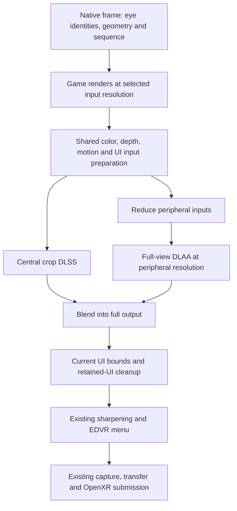

# Foveated DLSS in native OpenXR: feasibility and design

## Status

- **State (2026-09-15, evening):** Stage 0, reproduce and price,
  instrumentation BUILT, REVIEWED and FIXED on branch
  `claude/dlss-foveation-design-e02cfe`, merged to main: per-region GPU
  timing of the temporal pass per eye (prep, reduce, periphery, centre,
  full, compose, ui, other, total), stereo pairs summed into 600-pair
  windows, one "temporal aa price" log line per closed window (median/p95
  per region per stereo pair plus the pairs dropped as unmeasured, lone,
  no-slot or lease-refused), the same figures on F8, per-role and per-eye
  NGX totals, and a GPU-name stamp at the first DLAA/DLSS ask. A window
  closes on 600 pairs or whenever the treatment, output shape or a live
  temporal_aa_* setting changes. Traced end to end on build\smoke.exe with
  a stereo probe: the "full-frame ngx" and "foveated ngx" lines both fire
  with the right regions non-zero and zero drops (journal, 2026-09-15).
  The acceptance metric (whole-frame GPU per arm) needs no new code: the
  native benchmark line already logs gpu p50/p95/p99 every 34 s under
  native OpenXR and restarts on every setting change (journal). NOT DONE:
  the field flight below. Measurement only; no rendering behaviour changes.
- **Baseline drift:** written against d160499; three commits since touched
  the crop-path files (d08f536 target sprites out of world history, c27fe74
  scene UI replayed at native resolution after DLSS, c5e88dc display
  properties and hidden-area masks). All three landed in the full-frame
  branch only; the crop branch still has no reactive mask, no uiResolve and
  no UI replay.
- **Reachable:** the fixed crop runs under native OpenXR through the existing
  advanced.temporal_aa_fovea* keys (native_temporal.cpp treat() ->
  edvrTemporalAa -> temporalInner); nothing gates it off. Its "DLSS where
  you look ENGAGED" and "the fovea was asked for, but" log lines are the
  evidence it ran or stood down.
- **Open hypotheses for the first flight:** H1 stereo temporal-pass time
  drops by at least 0.5 ms and 5% with the fovea on at unchanged sizes; H2
  reduce + periphery + compose eat most of the centre crop's saving, as the
  2026-09-05 flights found; H3 the seam pulses under head motion on the
  native build (temporal, not spatial).
- **Ruled out, do not re-run:** the eye-tracked crop as "no blur where I
  look", structural under upscaling (performance.md, 2026-09-05); gaze stays
  Stage 3 and optional. The pooled "NVIDIA ms/eye" figure (dlaa.cpp
  dlaaTotals) mixes both eyes and all three roles; nothing measured off it
  compares with the new per-role numbers.
- **Not yet built (Stage 1):** the crop-policy unit test (cropOf is a lambda
  inside temporalInner and must be extracted first), the reactive mask and
  uiResolve on the crop path, history committed only after a successful
  evaluation (foveaHaveHistory and prHaveHistory are set unconditionally
  each frame), and the crop branch's unconditional ensureNative and
  diagnostic motion shader, which Stage 0 times rather than removes.
- **Next flight (Stage 0 is installed in the FRONTIER directory):** Pimax
  at the usual settings, temporal_aa = dlss. Windows: A full frame, B
  temporal_aa_fovea = 40 with temporal_aa_periphery = steady and
  temporal_aa_periphery_scale = 0.5, A again, each at least 75 s after
  warm-up so every arm holds one full 34 s native benchmark cycle; edit the
  live edvr.ini between arms (hot reload within 1 s, which also closes the
  price window and restarts the benchmark). During B slow turns, fast nods,
  then hold still and watch the seam. Optional C: full frame one
  HMD-quality step lower. Read with
  `python tools\edvr_log.py --target frontier --expect-build HEAD --grep "temporal aa price"`
  and the same with `--grep "native benchmark"`. A price line counts only
  when its drop counters are near zero; a line with lone eyes close to its
  pair count means the stereo pairing failed in the field and the numbers
  are not evidence.

## Investigation (2026-09-14)

Status: investigation and proposed design, 2026-09-14. No rendering code,
settings, installed DLLs or runtime registrations were changed for this
investigation. EDVR baseline:
[`d160499`](https://github.com/characterecho-sean/edvr-unofficial-patch/commit/d160499f44ded472dc38ac54f152482d94810c7c).
Upstream inspected: CheekyFoveatedDLSS
[`a830c74`](https://github.com/ClarkCheekyKent/CheekyFoveatedDLSS/commit/a830c74d7ef7c150168328b9fd657caee9e1655d),
committed September 11. Upstream source was read, not installed or executed.

## Recommendation

The concept is feasible and deserves a bounded experiment in EDVR's existing
DLSS implementation. It reduces NVIDIA reconstruction work, which our VRS
experiment did not touch. However, EDVR already contains an experimental
crop-plus-periphery implementation, and its earlier flights found the same
fundamental quality tradeoff. This is a proposal to modernize and qualify that
path, not evidence of a newly solved problem.

Start with fixed placement under native OpenXR, preserving current full-frame
DLSS as the default and quality reference. First bring the experimental path up
to date with the UI and motion pipeline, then measure the complete cost and the
image during movement. Eye tracking is a later stage through standard OpenXR,
conditional on useful gaze from the Windows-selected runtime. Do not promise
full-frame sharpness everywhere, an invisible transition, or a particular FPS
gain.

If the requirement remains “no loss of sharpness wherever the eyes move,”
retain full-frame DLSS. A small crop cannot reconstruct unseen history
immediately after a large look. The experiment is justified only as an
optional, measurable quality/performance trade that the user accepts.

## What the concept changes

| Technique | Work reduced | Work still paid |
| --- | --- | --- |
| Existing VRS foveation | Pixel-shader invocations in selected game draws | Full-resolution targets, substantial memory traffic, compute work and EDVR's DLSS evaluation |
| Lower render resolution plus full-frame DLSS | Game rendering and render-size input preparation | Reconstruction across the complete output |
| Foveated DLSS | Reconstruction outside a central region | Game rendering at the selected input size, input preparation, peripheral reconstruction, final composition and OpenXR submission |

The proposed frame has two reconstructions: DLSS for a central crop, and DLAA
for a smaller image covering the entire view. The smaller image supplies the
visible periphery and remains temporally active beneath the center. A blend
joins their outputs. It is not a second high-resolution render of the scene,
and does not require quad views.

Cheeky implements this through NGX/Streamline interception, with D3D11/D3D12
backends and ReShade/UEVR integrations. Its documented default center occupies
55% by 45% of the image; peripheral DLAA uses 75% of the **input render
dimensions**. Its published FPS claims are upstream reports, not Elite
measurements. [Upstream
overview](https://github.com/ClarkCheekyKent/CheekyFoveatedDLSS/blob/a830c74d7ef7c150168328b9fd657caee9e1655d/README.md),
[settings](https://github.com/ClarkCheekyKent/CheekyFoveatedDLSS/blob/a830c74d7ef7c150168328b9fd657caee9e1655d/USAGE.md).

For example, at a 65% linear render scale, that peripheral setting is
approximately 48.75% of output width and height. Its area is about 23.8% of the
output, alongside a 24.75% central rectangle. This is a pixel-work
illustration, not a predicted 51% time saving: the two evaluations have fixed
costs, different modes, overlapping coverage and extra passes. An elliptical
blend does not reduce the rectangular NGX evaluation area.

## What our previous experiments actually established

The [historical performance
investigation](performance.md#feature-2--fixed-foveation-by-variable-rate-shading)
records working VRS on the RTX 5090/Pimax rig, with roughly 0.5 ms of
frame-time benefit and little difference between presets. Some runs were
limited by the 90 Hz cap or submission, so FPS alone hid savings. Those results
do not establish a current native-OpenXR budget, nor isolate every source of
GPU cost. In particular, a cull experiment is not a clean measurement of
vertex, bandwidth or compute cost individually.

The same document's [DLSS crop
investigation](performance.md#feature-6--dlss-where-you-look) already
considered Cheeky on September 5 and implemented the central technique. Its
important results are:

- A small DLAA crop could be much cheaper than a full-frame evaluation on that
  rig. The complete path saved less than the crop-only timing suggested because
  the periphery and preparation still cost time.
- Combining the crop with EDVR's own temporal periphery produced shimmering,
  smearing and a visible change during head movement. Switching to
  reduced-resolution DLAA improved continuity but did not guarantee an
  invisible seam.
- A noninteger reduction originally shifted samples; an area-weighted reduction
  corrected that. Crop/output rounding also needed care to avoid a stereo depth
  step.
- Fast motion brought content into the crop without the history available to
  full-frame reconstruction. The experiments recorded slower convergence and a
  visible change in texture. The subsequent design review rejected eye tracking
  as a cure for history missing after a large gaze jump; an integrated
  eye-tracked DLSS flight was not established by that work.

These are recorded historical measurements, observations and design
conclusions, not new tests. The older document also contains superseded design
claims, including an optimistic explanation involving saccadic suppression
followed by a later rejection of that proposal. Neither suppression nor a
history fade is an acceptance criterion here.

A later [September 10 DLSS
review](review-dlss-performance-2026-09-10.md#measured-baseline) reported 1.82
ms per eye inside NGX and 2.22 ms per eye for the enclosing pass, averaged
across two render sizes. That supports investigating reconstruction cost, but
is not a same-scene benchmark for today's build. Preparation has since been
optimized; recapture the baseline rather than combining numbers from different
flights.

## What has changed upstream

The September 5 assessment that Cheeky could not handle OpenVR-only games is
obsolete. The inspected version documents OpenVR as well as OpenXR stereo
calibration, including separate, packed and array-slice paths. Its shared
OpenXR layer supplies mapping and alignment even without eye tracking. EDVR's
new native OpenXR route is also materially different from the old integration
context. Standalone Cheeky compatibility with EDVR's NGX calls remains
untested. [Calibration
contract](https://github.com/ClarkCheekyKent/CheekyFoveatedDLSS/blob/a830c74d7ef7c150168328b9fd657caee9e1655d/EYE-CALIBRATION.md).

Useful implementation ideas in the inspected source:

| Upstream behavior | Application to EDVR |
| --- | --- |
| Crop extents stay constant while placement moves | Avoid recreating NGX features because edge rounding changed the dimensions by one pixel |
| Private motion vectors compensate for a moved crop | Preserve overlapping history without modifying the vectors used by the periphery |
| Explicit reset reasons and stale-gaze policy | Distinguish a normal crop translation from a discontinuity or lost tracker |
| Shared-forward alignment accounts for eye cant and asymmetric FOV | Use the geometry EDVR already owns, rather than manual stereo offsets |
| Independent peripheral preset and scale | Benchmark peripheral quality and cost independently; do not assume an old preset is supported or fastest |

Sources: [crop
geometry](https://github.com/ClarkCheekyKent/CheekyFoveatedDLSS/blob/a830c74d7ef7c150168328b9fd657caee9e1655d/src/foveation.cpp),
[crop
motion](https://github.com/ClarkCheekyKent/CheekyFoveatedDLSS/blob/a830c74d7ef7c150168328b9fd657caee9e1655d/src/crop_motion.hpp),
[gaze
policy](https://github.com/ClarkCheekyKent/CheekyFoveatedDLSS/blob/a830c74d7ef7c150168328b9fd657caee9e1655d/src/gaze_policy.cpp),
[D3D11
periphery](https://github.com/ClarkCheekyKent/CheekyFoveatedDLSS/blob/a830c74d7ef7c150168328b9fd657caee9e1655d/src/d3d11_peripheral_dlaa.cpp).

Upstream also offers center output supersampling and experimental DLSS-NR.
Neither belongs in this experiment. Increasing reconstruction output size does
not make Elite render additional scene samples, and NR/D3D12 transport adds a
separate feature and synchronization problem. Its automated tests explicitly do
not evaluate NVIDIA DLSS, so their success cannot resolve our temporal-quality
question. [Development and validation
scope](https://github.com/ClarkCheekyKent/CheekyFoveatedDLSS/blob/a830c74d7ef7c150168328b9fd657caee9e1655d/DEVELOPMENT.md).

## Existing EDVR implementation and gaps

| Area | Current code | Required work before a meaningful flight |
| --- | --- | --- |
| NGX evaluation | [dlaa.cpp](../src/d3d11/dlaa.cpp): `evaluateCrop`, `dlssEvaluateFovea`, `dlaaEvaluatePeriphery`; separate full, crop and peripheral histories per eye | Reuse these interfaces, audit complete input contracts and distinguish timing by region |
| Crop/reduction/composition | [temporal_pass.cpp](../src/d3d11/temporal_pass.cpp): `foveaWanted`, `cropOf`, reduction and composition shaders | Separate geometry policy from rendering; preserve exact registration and stable extents |
| Native producer path | [native_temporal.cpp](../src/d3d11/native_temporal.cpp) calls the same `edvrTemporalAa` path | Fixed cropping is reachable through shared configuration; this is not yet a qualified native feature |
| Motion and changing UI | Full-frame DLSS passes `reactive` to NGX; crop/periphery function signatures do not | Carry compatible masks and preserve their dimensions, bases and meaning on both reconstructions |
| Post-DLSS UI treatment | The current `uiResolve` block is inside the full-frame branch | Apply equivalent current-raster bounds and retained-UI cleanup to the final foveated output |
| Periphery input preparation | Existing reduction uses area-weighted color, selected depth and associated scaled motion | Keep tested sample registration; extend it to required masks and content-change evidence |
| Normal-play cost | Crop branch selects `motionShader(ctx, true)` and enters `ensureNative` before skipping the own pass | Remove unnecessary diagnostic work and unused native-TAA allocations after correctness is established |
| Center geometry | Existing crop uses tangents and optional eye translation/fixation distance | Use full per-eye rotation as well, and retain the exact unjittered projection convention |
| Gaze | Native host has no gaze action acquisition; [temporal frame ABI](../src/common/native_temporal.h) has no gaze sample | Add optional native gaze ownership and a versioned snapshot only in the later stage |

The crop implementation uses a fixed center. The old OpenVR gaze producer for
VRS is not evidence that DLSS crops follow gaze, and cannot supply the new
native runtime automatically.

The fixed path's current configuration is already read by the shared temporal
pass: `advanced.temporal_aa_fovea` defaults to 0; shape, edge, fixation
distance, periphery type and periphery scale are live settings. Existing
periphery scale means a fraction of **output**, capped at input dimensions.
Setting it to 0.75 does not reproduce Cheeky's 0.75-of-input setting. Preserve
that meaning; use explicit dimension conversions in benchmarks and document any
future new setting separately.

## Integration choice

Implement inside EDVR's producer-side temporal pass. EDVR creates the NGX
inputs and knows each submitted eye, its bounds, frame sequence, render size,
projection and reference generation. An external add-on would have to
rediscover those contracts while intercepting our evaluations. The native host
can provide alignment directly without installing a global OpenXR layer or
using marker readbacks.

Cheeky is GPL-3.0; EDVR's project license is MIT. This proposal imports no
Cheeky source, shaders or binaries. Reuse EDVR's existing implementation and
documented SDK interfaces, with independently implemented geometry and tests.
Any future direct code adoption needs a separate licensing decision before it
is included. [Cheeky
license](https://github.com/ClarkCheekyKent/CheekyFoveatedDLSS/blob/a830c74d7ef7c150168328b9fd657caee9e1655d/LICENSE),
[EDVR license](../LICENSE).

DLSS remains an NVIDIA RTX feature. Headset/runtime selection remains portable:
Windows chooses OpenXR; fixed placement requires no tracker, and gaze uses a
standard extension rather than a vendor SDK. This work does not reintroduce
SteamVR or LibOVR as alternate backends.

## Proposed frame pipeline



The drawing expresses data dependencies; the two reconstructions execute
serially on the existing game-device immediate context. It does not propose
parallel GPU queues. The XR owner publishes CPU metadata; GPU work stays on the
producer through the current native bridge. Preserve context state and all
existing shutdown ownership rules.

Prepare inputs once. Pass the central region through a per-eye NGX feature
created for its input/output dimensions with output subrectangles enabled.
Process the full view at peripheral resolution, including the portion beneath
the center, to maintain peripheral history across crop movement. Composite into
an owned output in the current submission format and color-space convention.
Keep EDVR's menu/monitor after reconstruction; Elite's own UI is already in the
eye image and needs the shared UI protections above. NVIDIA exposes the
subrectangle creation option in its [NGX
parameters](https://github.com/NVIDIA/DLSS/blob/main/include/nvsdk_ngx_params.h);
use the shipped SDK's full evaluation contract.

Keep the baseline at exactly the same game input and submitted output
dimensions. Otherwise resolution changes can be mistaken for savings from
foveation. Do not add a new cross-device transfer: the final image follows the
existing native transfer/composition path.

### Geometry and stereo

Use the eye identity and generation supplied by the native bridge. Never infer
left/right from call parity or pointer reuse. Derive both crops from one
frame's unjittered head/eye geometry; handle asymmetric FOV and eye cant using
full eye-to-head rotations. Fixed placement projects the same head-forward
direction into each eye. It is independent of seated yaw and recentering,
although a reference discontinuity still invalidates temporal history.

Compute an angular visible region and an optional surrounding history margin,
then convert to render pixels. Derive the output rectangle through one
consistent mapping from that input region. Account explicitly for noninteger
scale, texel centers, submitted bounds and rounding. A mask may be round while
the enclosing evaluation rectangle remains rectangular. Move the origin within
bounds without changing feature extents; if valid coverage cannot be
maintained, choose the complete reference path for the pair rather than
silently clipping the quality region.

A history margin is input to the quality/cost experiment, not a cure. It can
hide some newly entering content, but a sufficiently fast turn or gaze jump
exceeds any affordable margin. Do not resize the NGX feature every frame in
response to head speed.

### History and motion

Retain independent histories for each eye and each reconstruction. Key
resources by device/session generation, actual dimensions, format, preset and
geometry policy. Commit previous crop origins only after a successful
evaluation; rejected or withheld frames do not advance history.

For motion expressed as current-to-previous displacement in input pixels, the
crop-local relation is:

```text
previous_local = current_local + scene_motion
                 + current_crop_origin - previous_crop_origin
```

Apply the origin correction only to private central vectors. The periphery
retains scene motion, scaled to its grid, and jitter scales with the same
coordinate conversion. Do not apply crop motion to the shared scene vectors,
add the raster jitter twice, or average unrelated object velocities across a
depth boundary. Verify sign and units against EDVR's moving-crop probe and the
actual NGX flags, including odd input/output ratios.

Reset on first use, feature recreation, a real frame/reference discontinuity or
a crop jump whose overlap is insufficient. Ordinary translation with valid
overlap must not reset every frame. Record reset reasons and crop age. Resizing
and preset changes reset both affected eyes at a frame boundary. Feature
recreation can hitch even though it needs no game restart.

A previously inactive full-frame NGX feature has stale history. Returning to it
requires a reset and a measured convergence period. Running it every frame
solely to keep history warm would erase most of the intended saving; do not
hide that cost in a fallback strategy.

### UI and failure behavior

The modern full-frame UI contract is a prerequisite. Updating timers alone
around the old crop code would benchmark a different image-processing feature.
Reuse shared preparation and UI resolve logic rather than maintaining two
progressively different copies. Audit which NGX masks each shipped preset
actually consumes, and use explicit postprocessing where current full-frame
behavior already requires it.

Foveation must not output partially composed eyes, stale peripheral images or
an uninitialized crop. Validate both eyes and select settings before processing
the pair. Latch feature failures to prevent per-frame allocation/retry loops.
Retain originals and make pair-level recovery explicit: if the second eye fails
after the first succeeds, recompute or select a consistent supported treatment
for both, preserving the native jitter/FOV contract. Exercise this in the host
harness before flying it.

Recovery stays inside the native OpenXR path. A DLSS optimization failure does
not select another VR runtime. If reconstruction itself becomes unavailable,
preserve the existing native pass-through/stand-down behavior and its truthful
status, rather than introducing another VR backend.

### Optional gaze stage

Add `XR_EXT_eye_gaze_interaction` capability negotiation to the native host.
Build an action set, pose action and action space, attach once per session, and
synchronize/locate on the XR owner. Publish a generation- and sequence-tagged
immutable sample for the producer. Extend the private temporal ABI with a new
version or separately negotiated capability; do not enlarge a version-1 struct
in place.

The standard exposes one gaze pose, not independent per-eye vergence or a
guaranteed fixation distance. Project its direction separately through each
eye's geometry; do not invent two eye measurements. Require active input,
valid/tracked pose and acceptable timing; extension presence alone is
insufficient. The sample timestamp can be unavailable or express a predicted
pose, so request/receipt time must remain distinguishable from sample age.
[Khronos gaze
contract](https://raw.githubusercontent.com/KhronosGroup/OpenXR-Docs/main/specification/sources/chapters/extensions/ext/ext_eye_gaze_interaction.adoc),
[sample
timestamp](https://registry.khronos.org/OpenXR/specs/1.0/man/html/XrEyeGazeSampleTimeEXT.html).

Start with simulated center movement in the GPU harness. On real hardware,
measure smoothing delay, sample freshness, blink behavior, large jumps and
eye-first/head-following movements. A brief hold and a bounded return to the
tested fixed region are candidate policies, not qualified defaults. On focus
loss, session stop, reference change or persistently invalid input, clear gaze
ownership and use the documented fixed/full-frame policy. Log validity and age
summaries without routinely recording a user's gaze trace.

Negotiate support at instance creation and create optional action resources at
session setup if live gaze switching is desired. Switching between prepared
fixed/gaze modes can then be live; enabling previously unnegotiated support or
changing the Windows runtime requires restarting the session/game. Quest 3
fixed placement remains a complete test target; a working Pimax headset session
alone does not prove its selected runtime supplies gaze.

## Controls and resource budget

Keep current full-frame DLSS selected by default. Use existing advanced crop
settings for the development experiment, with their present meanings. A later
user-facing control should distinguish `Full frame`, `Fixed region` and, only
when supported, `Eye tracked`. Report the active treatment, center/peripheral
dimensions, and why a requested mode is unavailable. Preserve the concise
floating `GPU` and `CPU` labels; detailed costs belong in F8 and logs.

Crop width/edge, peripheral scale and supported preset changes can be applied
live at a paired-frame boundary, with history reset and a possible one-time
allocation hitch. They do not change the game's rendering resolution. Gate new
gaze settings and any new public control on the completed validation; this
document neither renames existing keys nor enables experimental VRS.

Track allocated bytes, feature count and retired resources. A single 4404x4348
four-byte output is about 73 MiB per eye, before NGX's private allocations.
Avoid retaining full, crop, peripheral and unused native-TAA surfaces
unnecessarily. Cap scratch storage and retire it through the existing context
ownership rules. Compile any new shaders through the established build/cache
path; do not restore the startup black-screen problem by synchronously
compiling several large shaders on the first visible frame.

## Measurement plan and decision gates

Use current asynchronous GPU timers and associate samples with original frame
sequence and eye. Break the temporal region into shared preparation, peripheral
reduction, peripheral NGX, central NGX, composition/UI resolve, and total.
Preserve the enclosing timer to catch uncategorized work. Existing aggregate
NGX averages mix calls; two evaluations per eye must not be reported as a
single-eye saving merely because the average call got shorter.

The accounting target is:

```text
delta = full_frame_temporal_cost
        - (shared_preparation + peripheral_reduction + peripheral_NGX
           + central_NGX + composition_and_UI + additional_copies)
```

Compare stereo sums for matching valid samples. CPU submission time, submit
wall time, render GPU time and runtime compositor work are different
quantities; do not add nested scopes or infer compositor GPU cost from
`xrEndFrame`. GPU utilization or an unchanged capped FPS is not a substitute
for measured time. No new vendor timing dependency is needed.

Record build, GPU/driver, DLSS runtime hash/preset, OpenXR runtime, headset,
refresh/reprojection state, actual input/output sizes, HMD quality, mip bias,
sharpness and scene. Capture matched A/B/A windows after feature creation and
temporal warm-up, with VRS and other foveation disabled. Start with the Pimax
at a representative high resolution and repeat fixed placement on Quest
3/Virtual Desktop. Compare against both same-resolution full-frame DLSS and a
modestly lower-resolution full-frame option: the latter may provide a better
quality/time trade without a seam.

Proposed acceptance thresholds, to make the experiment falsifiable:

- At least 0.5 ms reduction in stereo render GPU time **and** 5% of the
  matching baseline median in representative GPU-limited scenes, reproduced
  across three A/B/A windows and larger than measured run-to-run variation.
- No persistent increase greater than 2% in p95 render GPU time after warm-up,
  and no new recurring CPU stalls. Report allocation/preset-switch stalls
  separately instead of discarding them from the usability result.
- User accepts peripheral softness and cannot identify an objectionable stereo
  seam, pulsing, delayed sharpness or damaged UI during the movement tests
  below. Timing success cannot override a quality failure.

These are proposed project gates, not measured outcomes. If benefits occur only
on the highest-resolution rig, scope the feature accordingly. Stop if
affordable margins do not pass quality checks, if gaze quality is inadequate,
or if preparation/periphery cost consumes the useful saving.

## Implementation sequence

| Stage | Deliverable | Exit condition |
| --- | --- | --- |
| 0. Reproduce and price | Extend existing crop/motion/cost harnesses; record the current full-frame baseline and old experimental result | Actual NGX measurements separate from WARP/math checks; current quality failures reproducible |
| 1. Restore pipeline parity | Shared input/mask preparation and UI resolve; stable fixed crop geometry; explicit per-eye timing | Foveation off preserves baseline output; cropped path passes UI, motion, format and failure tests |
| 2. Fixed-region pilot | Native producer integration, paired live changes, bounded resources and optional history margin | One combined headset checklist plus repeated timing windows passes; otherwise stop here |
| 3. Optional native gaze | Standard action lifecycle, versioned snapshots, origin correction and loss policy | Simulated motion tests pass first, then real tracker quality/latency and reconnect tests |
| 4. Product decision | Supported controls, diagnostics and documentation based on measured profiles | Ship opt-in only if benefit and accepted image quality justify ongoing support |

Do not turn each checkbox into a separate flight. Complete desktop checks,
gather all discriminating counters/captures, then run one prepared headset
session for each stage that needs perception. No implementation or flight is
required to review this design.

## Tests required before adoption

Desktop checks should extend the existing `tools/temporal_test`,
`tools/native_temporal_test`, `tools/temporal_switch_test` and `tools/smoke`
coverage, adding a focused crop-policy test where appropriate. CPU/WARP tests
validate geometry, state and pixels; they do not qualify a proprietary DLSS
model. A dedicated NVIDIA validation mode must execute actual crop, peripheral
and full-frame evaluations and record a skip honestly when unavailable.

| Test group | Required cases |
| --- | --- |
| Registration | Asymmetric/canted eyes, vertical offset, crop near each edge, 1:1 and noninteger scaling, odd dimensions, nonzero bounds, supported formats; unsupported flipped/array/MSAA inputs keep the documented behavior |
| Temporal quality | Static fine lines, moving text/geometry, slow and fast head-like pans, rapid nods, stopping, large crop jumps, new content at the leading edge; measure crop age and settling against a full-frame reference |
| UI parity | Changing digits, target chevrons, orbital lines, cockpit panels, retained-text removal, smoke/transparent overlap, on-foot tool/HUD and FSS transitions |
| State and lifetime | Off/on and full/crop switches, preset changes, live render scaling, projection/reference change, skipped or duplicate eye, right-eye failure, device/session restart and normal shutdown |
| Isolation and cost | Original inputs unchanged, guard pixels outside subrectangles, context state restored, no busy-wait/readback in play, bounded resources after repeated changes, correct two-eye/two-region timing |
| Gaze, later | No extension/device support, inactive/denied input, stale/zero/future timestamps, blink, focus loss, recenter, tracker recovery, simulated and actual gaze clearly distinguished |

The eventual headset session should cover menu text, cockpit instruments,
on-foot text/tools, ship surfaces and orbital lines; slow turns, fast nods,
eye-first glances, and holding still afterward. Include FSS, a scene
transition, live settings changes, recenter, and normal exit. Confirm both eyes
agree and the menu remains visible. Use Insert eye dumps for registration and a
short sequence for temporal defects: a stationary screenshot cannot demonstrate
that a seam is stable during movement.

## Open questions to settle with evidence

1. How much NGX time remains in the current native build at the user's actual
   resolution, and what is the complete incremental peripheral/composition
   cost?
2. Does the modern UI path keep text readable outside the center, or does
   reduced peripheral resolution itself make the trade unacceptable?
3. What fixed region and history margin survive natural head/eye motion without
   erasing the saving?
4. Which peripheral presets actually work with the shipped DLSS runtime, and
   how do their settling behavior and cost compare? Upstream's preset E label
   is not a local performance guarantee.
5. Does the selected OpenXR runtime supply gaze with sufficient freshness and
   accuracy for a smaller region, including near cockpit text where one
   combined direction does not provide measured vergence?

The recommended next action is Stage 0, followed by pipeline parity if the
renewed measurements justify it. The existing full-frame mode remains the
reference throughout.

## Journal

### 2026-09-15: Stage 0 instrumentation built, reviewed, fixed, traced

**Built** (branch `claude/dlss-foveation-design-e02cfe`, rebased onto main
96902e6, measurement only):

- `temporal_pass.cpp`: seven region timers (prep, reduce, periphery, centre,
  full, compose, ui) nested inside each ring slot's existing total timer, so
  a region never opens a DisjointClock record of its own; "other" is the
  total less the seven, taken per pair before the percentile. Eyes pair by
  the per-frame row counter; pairs sum into windows of 600 keyed by
  treatment, output size, format and config generation; each closed window
  writes one `temporal aa price` line. The treatment label is what ran
  (composited fovea, full-frame NGX, or own history), not what was asked.
  The `ui` region times whichever UI route ran after NGX: the legacy
  resolve, or the deferred replay of the captured UI that main's e97e2fe
  made the live route when it succeeds (the two are exclusive, so the
  region begins once per slot). Without that the deferred route's cost
  would have sat in "other" with `ui` reading 0.00 in the field.
- `dlaa.cpp`: NGX evaluate totals per role (full, centre, periphery) and
  per eye; the adapter name stamped once at the first DLAA/DLSS ask. Nothing
  measured off the old pooled figure compares with these.
- `menu.cpp`: a "Temporal AA price" F8 line from the last closed window.
- `tools/smoke/smoke.cpp`: a stereo price-report probe, six full-frame
  DLAA frames, six steady-periphery fovea frames, three own-history frames,
  both eyes each, asserting each closed window's medians and zero drops.
  `build.bat` compiles `smoke.exe` but does not run it; it was run by hand
  as `build\smoke.exe build\d3d11.dll`.

**Review of the first diff** (main session) found four measurement-integrity
defects and one gap, fixed in a second round:

1. Unmeasured totals priced at 0 ms (no lease, failed end, Invalid poll).
   Now a per-slot validity flag; a pair with an unmeasured eye is dropped
   and counted.
2. A lone eye evicted from the pairing ring was priced as a stereo pair.
   Now dropped and counted; the ring drains at shutdown before the flush.
3. The arms sampled at different rates: full-frame DLSS took a timing slot
   one frame in 32 without diagnostics, the fovea every frame, so a 60 s A
   window would never have filled. Now a slot every frame the timing owner
   accepts, ring 8 to 16 slots, staging readback gate unchanged. The pooled
   F8 "temporal AA ms" average samples every frame as a side effect.
4. The treatment label recorded the intent; a persistent stand-down would
   have labelled own-history frames "foveated ngx".
5. No NGX stereo pair had ever formed on the desk: every smoke probe called
   eye 0 only. Hence the stereo probe above.

**Smoke evidence** (`build\edvr_logs\edvr_gfx_20260915_190533.log`, RTX
5090, 400x304 desk source, both lines verbatim; this is the build of the
same code before the rebase onto 96902e6, and the rebased build is smoked
again before it is installed, that run's lines going in the flight entry):

```
temporal aa price: full-frame ngx, 400x304, 8 stereo pairs (window closed), ms per pair median/p95: prep 0.03/0.04 reduce 0.00/0.00 periphery 0.00/0.00 centre 0.00/0.00 full 0.46/15.12 compose 0.00/0.00 ui 0.00/0.00 other 0.00/0.01 dropped 0 unmeasured pairs, 0 lone eyes, 0 no-slot frames, 0 region leases
temporal aa price: foveated ngx, 400x304, 6 stereo pairs (window closed), ms per pair median/p95: prep 0.02/0.03 reduce 0.01/0.02 periphery 0.41/24.37 centre 0.41/4.40 full 0.00/0.00 compose 0.01/0.02 ui 0.00/0.00 other 0.00/0.00 dropped 0 unmeasured pairs, 0 lone eyes, 0 no-slot frames, 0 region leases
```

The regions land where they should (full only under full-frame; reduce,
periphery, centre and compose only under the fovea) with zero drops. The
p95 outliers are first-frame NGX warm-up inside a six-frame window; the
medians are the figure. Absolute values at 400x304 say nothing about the
flight.

**Whole-frame GPU needs no new code.** Under native OpenXR
`perf_monitor.cpp` runs a recurring native benchmark whenever the native
session is present: 2 s warm-up, 30 s sample, 2 s drain, then one
`native benchmark: ... gpu p50/p95/p99 ...` line carrying sizes, AA and
DLSS mode and the build. An ini reload, an NGX re-create or a menu event
bumps its scope and restarts the window, so A/B/A arms separate by
construction; each arm must last at least 75 s to hold one full cycle.
That line is the acceptance metric; the price line explains where the
difference came from. Folding frame GPU into the price line was dropped
as redundant.

**Known gaps, deliberately left:** the fovea's geometry (degrees, crop
size) is not on the price line, only on the one-shot "DLSS where you look
ENGAGED" line; the door GPU figure reaches the log only on dropped or long
frames (the benchmark line supersedes it); driver and DLSS DLL versions are
not stamped; the fovea arm does a per-frame 208-byte stats readback outside
the timed span that the full-frame arm does not (negligible, but it is a
B-arm-only difference); in the smoke the row counter never advances, so its
pairing relies on the forced GPU completion after every call.
